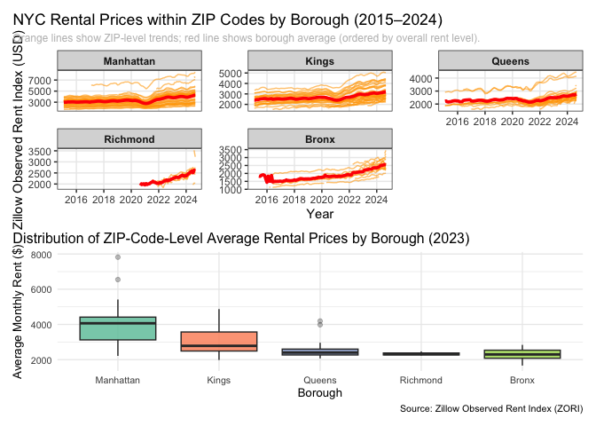

p8105_hw3_zn2220
================
Ziang Niu
2025-10-02

``` r
library(tidyverse)
library(p8105.datasets)
library(lubridate)
library(janitor)
library(knitr)
library(patchwork)
library(RNHANES)
```

# Problem 1

## 1.0

### To that end, write a short description of the dataset, noting the size and structure of the data, describing some key variables, and giving illstrative examples of observations.

Introducing data.

``` r
data("instacart")
instacart <- janitor::clean_names(instacart)
```

Monitor the data. It has 1384617 rows and 15 cols. Let’s glimpse at it
and make a slice. Some key variables and example are shown in the kable.

``` r
glimpse(instacart)
```

    ## Rows: 1,384,617
    ## Columns: 15
    ## $ order_id               <int> 1, 1, 1, 1, 1, 1, 1, 1, 36, 36, 36, 36, 36, 36,…
    ## $ product_id             <int> 49302, 11109, 10246, 49683, 43633, 13176, 47209…
    ## $ add_to_cart_order      <int> 1, 2, 3, 4, 5, 6, 7, 8, 1, 2, 3, 4, 5, 6, 7, 8,…
    ## $ reordered              <int> 1, 1, 0, 0, 1, 0, 0, 1, 0, 1, 0, 1, 1, 1, 1, 1,…
    ## $ user_id                <int> 112108, 112108, 112108, 112108, 112108, 112108,…
    ## $ eval_set               <chr> "train", "train", "train", "train", "train", "t…
    ## $ order_number           <int> 4, 4, 4, 4, 4, 4, 4, 4, 23, 23, 23, 23, 23, 23,…
    ## $ order_dow              <int> 4, 4, 4, 4, 4, 4, 4, 4, 6, 6, 6, 6, 6, 6, 6, 6,…
    ## $ order_hour_of_day      <int> 10, 10, 10, 10, 10, 10, 10, 10, 18, 18, 18, 18,…
    ## $ days_since_prior_order <int> 9, 9, 9, 9, 9, 9, 9, 9, 30, 30, 30, 30, 30, 30,…
    ## $ product_name           <chr> "Bulgarian Yogurt", "Organic 4% Milk Fat Whole …
    ## $ aisle_id               <int> 120, 108, 83, 83, 95, 24, 24, 21, 2, 115, 53, 1…
    ## $ department_id          <int> 16, 16, 4, 4, 15, 4, 4, 16, 16, 7, 16, 4, 16, 2…
    ## $ aisle                  <chr> "yogurt", "other creams cheeses", "fresh vegeta…
    ## $ department             <chr> "dairy eggs", "dairy eggs", "produce", "produce…

``` r
set.seed(235)
instacart_examples <- instacart %>% 
  slice_sample(n = 5) %>% 
  select(order_id, product_name, aisle, department, order_dow, order_hour_of_day)

knitr::kable(instacart_examples, caption = "Illustrative sample of Instacart orders")
```

| order_id | product_name | aisle | department | order_dow | order_hour_of_day |
|---:|:---|:---|:---|---:|---:|
| 3258129 | Organic Extra Firm Tofu | tofu meat alternatives | deli | 0 | 15 |
| 2741482 | Organic Powdered Sugar | baking ingredients | pantry | 3 | 11 |
| 651769 | Special K Protein Milk Chocolate Protein Shakes | protein meal replacements | personal care | 3 | 17 |
| 859477 | Variety Pack | food storage | household | 2 | 9 |
| 1788253 | Organic Grape Tomatoes | packaged vegetables fruits | produce | 0 | 16 |

Illustrative sample of Instacart orders

Important variables include order_id (unique identifier for each order),
product_name (the specific item purchased), aisle (store aisle),
department (broader store department), order_dow (day of week; 0 =
Sunday, 6 = Saturday), and order_hour_of_day (hour of day). Illustrative
examples highlight how these variables describe customer behavior:

In order 3258129, the customer purchased Organic Extra Firm Tofu from
the tofu meat alternatives aisle in the deli department, placed on
Sunday (day 0) at 3 PM.

In order 2741482, Organic Powdered Sugar was bought from the baking
ingredients aisle in the pantry department, placed on Wednesday (day 3)
at 11 AM.

In order 651769, Special K Protein Milk Chocolate Protein Shakes came
from the protein meal replacements aisle in the personal care
department, placed on Wednesday (day 3) at 5 PM.

In order 859477, Variety Pack was purchased from the food storage aisle
in the household department, placed on Tuesday (day 2) at 9 AM.

In order 1788253, Organic Grape Tomatoes came from the packaged
vegetables fruits aisle in the produce department, placed on Sunday (day
0) at 4 PM.

## 1.1

### How many aisles are there, and which aisles are the most items ordered from?

Count the total number of aisles and identify the one with the most
items ordered.

``` r
aisle_counts <- instacart %>%
  count(aisle, name = "n_items") %>%
  arrange(desc(n_items))

n_aisles <- nrow(aisle_counts)

top_aisle <- aisle_counts %>%
  slice(1)
```

It has 134 aisles, the tibble below shows the the one with the most
items ordered.

``` r
top_aisle
```

    ## # A tibble: 1 × 2
    ##   aisle            n_items
    ##   <chr>              <int>
    ## 1 fresh vegetables  150609

## 1.2

### Make a plot that shows the number of items ordered in each aisle, limiting this to aisles with more than 10000 items ordered. Arrange aisles sensibly, and organize your plot so others can read it.

``` r
aisle_counts %>%
  filter(n_items > 10000) %>%
  ggplot(aes(
    x = fct_reorder(aisle, n_items), 
    y = n_items
  )) +
  geom_col(fill = "navy", alpha = 0.9) +
  coord_flip() +
  labs(
    title = "Top Instacart Aisles by Number of Items Ordered (> 10,000)",
    x = "Aisle Name (Sorted by Order Count)",
    y = "Total Number of Items Ordered",
    caption = "Source: Instacart Data"
  ) +
  scale_y_continuous(labels = scales::comma) +
  theme_minimal(base_size = 10) +
  theme(
    plot.title = element_text(hjust = 0.5),
    plot.title.position = "plot",
    panel.grid.minor = element_blank(),
    plot.caption = element_text(color = "grey")
  )
```

<!-- -->

## 1.3

### Make a table showing the three most popular items in each of the aisles “baking ingredients”, “dog food care”, and “packaged vegetables fruits”. Include the number of times each item is ordered in your table.

``` r
target_aisles <- c("baking ingredients", "dog food care", "packaged vegetables fruits")

popular_items <- instacart %>%
  filter(aisle %in% target_aisles) %>%
  count(aisle, product_name, name = "order_count") %>%
  group_by(aisle) %>%
  slice_max(order_count, n = 3, with_ties = FALSE) %>%
  ungroup() %>%
  arrange(aisle, desc(order_count))

kable(popular_items, caption = "Top 3 Most Popular Items in Selected Aisles")
```

| aisle | product_name | order_count |
|:---|:---|---:|
| baking ingredients | Light Brown Sugar | 499 |
| baking ingredients | Pure Baking Soda | 387 |
| baking ingredients | Cane Sugar | 336 |
| dog food care | Snack Sticks Chicken & Rice Recipe Dog Treats | 30 |
| dog food care | Organix Chicken & Brown Rice Recipe | 28 |
| dog food care | Small Dog Biscuits | 26 |
| packaged vegetables fruits | Organic Baby Spinach | 9784 |
| packaged vegetables fruits | Organic Raspberries | 5546 |
| packaged vegetables fruits | Organic Blueberries | 4966 |

Top 3 Most Popular Items in Selected Aisles

## 1.4

### Make a table showing the mean hour of the day at which Pink Lady Apples and Coffee Ice Cream are ordered on each day of the week; format this table for human readers (i.e. produce a 2 x 7 table).

``` r
target_products <- c("Pink Lady Apples", "Coffee Ice Cream")

mean_hour_table <- instacart %>%
  filter(product_name %in% target_products) %>%
  group_by(product_name, order_dow) %>%
  summarize(mean_order_hour = mean(order_hour_of_day, na.rm = TRUE), .groups = 'drop') %>%
  pivot_wider(
    names_from = order_dow,
    values_from = mean_order_hour
  ) %>%
  mutate(across(where(is.numeric), ~round(., 2)))

day_names <- c("Sun", "Mon", "Tue", "Wed", "Thu", "Fri", "Sat")

colnames(mean_hour_table)[2:8] <- day_names

kable(mean_hour_table, caption = "Mean Order Hour of Day by Product and Day of Week")
```

| product_name     |   Sun |   Mon |   Tue |   Wed |   Thu |   Fri |   Sat |
|:-----------------|------:|------:|------:|------:|------:|------:|------:|
| Coffee Ice Cream | 13.77 | 14.32 | 15.38 | 15.32 | 15.22 | 12.26 | 13.83 |
| Pink Lady Apples | 13.44 | 11.36 | 11.70 | 14.25 | 11.55 | 12.78 | 11.94 |

Mean Order Hour of Day by Product and Day of Week

# Problem 2

## 2.0

Clean and see, Transformation and Combination.

``` r
zillow_rent_data <- read_csv("zillow_data/Zip_zori_uc_sfrcondomfr_sm_month_NYC.csv")
zip_code_info <- read_csv("zillow_data/Zip Codes.csv")

final_zillow_data <- zillow_rent_data %>%
  pivot_longer(
    cols = starts_with("20"),
    names_to = "period",
    values_to = "value"
  ) %>%
  clean_names() %>%
  mutate(
    county = str_remove(county_name, " County$"),
    postal_code = as.character(region_name),
    period = ymd(period)
  ) %>%
  left_join(
    zip_code_info %>%
      clean_names() %>%
      mutate(postal_code = as.character(zip_code)),
    by = c("postal_code", "county")
  ) %>%
  select(
    postal_code,
    borough = county,
    area = neighborhood,
    period,
    value
  ) %>%
  mutate(borough = if_else(borough == "New York", "Manhattan", borough)) %>%
  arrange(postal_code, period)

write_csv(final_zillow_data, "final_zillow_data.csv")
```

## 2.1

### There are 116 months between January 2015 and August 2024. How many ZIP codes are observed 116 times? How many are observed fewer than 10 times? Why are some ZIP codes are observed rarely and others observed in each month?

``` r
fz_df <- read_csv("final_zillow_data.csv")

counts <- fz_df %>%
  filter(!is.na(value)) %>% 
  group_by(postal_code) %>%
  summarize(n_months = n_distinct(period), .groups = "drop")

n_116 <- sum(counts$n_months == 116)
n_less_10 <- sum(counts$n_months < 10)

n_116
```

    ## [1] 48

``` r
n_less_10
```

    ## [1] 26

Some ZIP codes are observed in all 116 months because Zillow
consistently tracks rental data for those stable, well-established
areas. Others appear rarely because data collection began later, ended
earlier, or the ZIP codes represent small, newly developed, or
discontinued regions. Missing or incomplete data may also result from
changes in ZIP boundaries or limited housing market activity.

## 2.2

### Create a reader-friendly table showing the average rental price in each borough and year (not month). Comment on trends in this table.

``` r
borough_year_table <- fz_df %>%
  mutate(year = year(period)) %>%
  group_by(borough, year) %>%
  summarize(mean_rent = mean(value, na.rm = TRUE), .groups = "drop") %>%
  arrange(borough, year) %>%
  pivot_wider(
    names_from = year,
    values_from = mean_rent
  )

kable(
  borough_year_table,
  digits = 0,
  caption = "Average Rental Price by Borough and Year"
)
```

| borough   | 2015 | 2016 | 2017 | 2018 | 2019 | 2020 | 2021 | 2022 | 2023 | 2024 |
|:----------|-----:|-----:|-----:|-----:|-----:|-----:|-----:|-----:|-----:|-----:|
| Bronx     | 1760 | 1520 | 1544 | 1639 | 1706 | 1811 | 1858 | 2054 | 2285 | 2497 |
| Kings     | 2493 | 2520 | 2546 | 2547 | 2631 | 2555 | 2550 | 2868 | 3015 | 3127 |
| Manhattan | 3022 | 3039 | 3134 | 3184 | 3310 | 3107 | 3137 | 3778 | 3933 | 4078 |
| Queens    | 2215 | 2272 | 2263 | 2292 | 2388 | 2316 | 2211 | 2406 | 2562 | 2694 |
| Richmond  |  NaN |  NaN |  NaN |  NaN |  NaN | 1978 | 2045 | 2147 | 2333 | 2536 |

Average Rental Price by Borough and Year

From 2015 to 2024, all NYC boroughs show overall growth, with a slight
dip around 2020 likely due to the pandemic followed by strong rebounds.
Manhattan remains the highest throughout, rising sharply after 2021.
Brooklyn and Queens show steady, moderate increases, while Staten
Island—available only from 2020—grows quickly in recent years. The
Bronx, though lowest in absolute value, experiences the fastest relative
gain, indicating gradual convergence among outer boroughs.

## 2.3

### Make a plot showing NYC Rental Prices within ZIP codes for all available years. Your plot should facilitate comparisons across boroughs. Comment on any significant elements of this plot.

``` r
borough_order <- fz_df %>%
  group_by(borough) %>%
  summarize(mean_rent = mean(value, na.rm = TRUE)) %>%
  arrange(desc(mean_rent)) %>%
  pull(borough)

fz_df <- fz_df %>%
  mutate(borough = factor(borough, levels = borough_order))

ggplot(fz_df, aes(x = period, y = value, group = postal_code)) +
  geom_line(color = "orange", alpha = 0.6, linewidth = 0.5) +
  stat_summary(
    fun = mean,
    geom = "line",
    aes(group = borough),
    color = "red", linewidth = 1.3
  ) +
  facet_wrap(~borough, scales = "free_y") +
  labs(
    title = "NYC Rental Prices within ZIP Codes by Borough (2015–2024)",
    subtitle = "Gray lines are individual ZIP codes; Red line shows borough average (ordered by overall rent level).",
    x = "Year",
    y = "Zillow Observed Rent Index (USD)"
  ) +
  theme_bw(base_size = 11) +
  theme(
    plot.title.position = "plot",
    plot.subtitle = element_text(size = 9, color = "gray"),
    strip.text = element_text(face = "bold"),
    panel.grid.minor = element_blank(),
    panel.spacing = unit(1, "lines")
  )
```

    ## Warning: Removed 6834 rows containing non-finite outside the scale range
    ## (`stat_summary()`).

    ## Warning: Removed 6804 rows containing missing values or values outside the scale range
    ## (`geom_line()`).

<!-- -->

Across all boroughs, rents dipped around 2020, likely reflecting
pandemic impacts, and then rose sharply through 2024. Manhattan
consistently has the highest rents and the widest ZIP-code spread,
indicating large within-borough variation. Brooklyn and Queens follow
similar trends at lower levels, with a strong post-2021 rebound. The
Bronx and Staten Island start from much lower rent levels but display
the steepest proportional increases, suggesting faster growth in outer
areas. Overall, the plot highlights both persistent spatial inequality
and citywide rent escalation after 2021.

## 2.4

### Compute the average rental price within each ZIP code over each month in 2023. Make a reader-friendly plot showing the distribution of ZIP-code-level rental prices across boroughs; put differently, your plot should facilitate the comparison of the distribution of average rental prices across boroughs. Comment on this plot.

``` r
rent_2023 <- fz_df %>%
  filter(year(period) == 2023) %>%
  group_by(borough, postal_code) %>%
  summarize(avg_rent_2023 = mean(value, na.rm = TRUE), .groups = "drop") %>%
  group_by(borough) %>%
  mutate(borough_mean = mean(avg_rent_2023, na.rm = TRUE)) %>%
  ungroup() %>%
  mutate(borough = fct_reorder(borough, borough_mean, .desc = TRUE))

ggplot(rent_2023, aes(x = borough, y = avg_rent_2023, fill = borough)) +
  geom_boxplot(alpha = 0.8, outlier.alpha = 0.3) +
  labs(
    title = "Distribution of ZIP-Code-Level Average Rental Prices by Borough (2023)",
    x = "Borough",
    y = "Average Monthly Rent ($)",
    caption = "Source: Zillow Observed Rent Index (ZORI)"
  ) +
  scale_fill_brewer(palette = "Set2") +
  theme_minimal(base_size = 10) +
  theme(
    legend.position = "none",
    plot.title.position = "plot"
  )
```

    ## Warning: Removed 24 rows containing non-finite outside the scale range
    ## (`stat_boxplot()`).

<!-- -->

Manhattan has the highest median rent and the widest spread, reflecting
both high costs and strong variation among ZIP codes. Brooklyn follows
with moderately high rents and a wider range than other outer boroughs.
Queens, Staten Island, and the Bronx have much lower medians, with
relatively compact distributions, indicating more uniform and affordable
rental markets. A few outliers in Manhattan and Brooklyn highlight
extremely high-rent areas. Overall, the plot emphasizes pronounced
spatial inequality, with a steep rent gradient from Manhattan outward.

## 2.5

### Combine the two previous plots into a single graphic, and export this to a results folder in your repository.

``` r
borough_order <- fz_df %>%
  group_by(borough) %>%
  summarize(mean_rent = mean(value, na.rm = TRUE)) %>%
  arrange(desc(mean_rent)) %>%
  pull(borough)

fz_df <- fz_df %>%
  mutate(borough = factor(borough, levels = borough_order))

p1 <- ggplot(fz_df, aes(x = period, y = value, group = postal_code)) +
  geom_line(color = "orange", alpha = 0.6, linewidth = 0.5) +
  stat_summary(
    fun = mean,
    geom = "line",
    aes(group = borough),
    color = "red", linewidth = 1.3
  ) +
  facet_wrap(~borough, scales = "free_y") +
  labs(
    title = "NYC Rental Prices within ZIP Codes by Borough (2015–2024)",
    subtitle = "Orange lines show ZIP-level trends; red line shows borough average (ordered by overall rent level).",
    x = "Year",
    y = "Zillow Observed Rent Index (USD)"
  ) +
  theme_bw(base_size = 11) +
  theme(
    plot.title.position = "plot",
    plot.subtitle = element_text(size = 9, color = "gray"),
    strip.text = element_text(face = "bold"),
    panel.grid.minor = element_blank(),
    panel.spacing = unit(1, "lines")
  )

rent_2023 <- fz_df %>%
  filter(year(period) == 2023) %>%
  group_by(borough, postal_code) %>%
  summarize(avg_rent_2023 = mean(value, na.rm = TRUE), .groups = "drop") %>%
  group_by(borough) %>%
  mutate(borough_mean = mean(avg_rent_2023, na.rm = TRUE)) %>%
  ungroup() %>%
  mutate(borough = fct_reorder(borough, borough_mean, .desc = TRUE))

p2 <- ggplot(rent_2023, aes(x = borough, y = avg_rent_2023, fill = borough)) +
  geom_boxplot(alpha = 0.8, outlier.alpha = 0.3) +
  labs(
    title = "Distribution of ZIP-Code-Level Average Rental Prices by Borough (2023)",
    x = "Borough",
    y = "Average Monthly Rent ($)",
    caption = "Source: Zillow Observed Rent Index (ZORI)"
  ) +
  scale_fill_brewer(palette = "Set2") +
  theme_minimal(base_size = 10) +
  theme(
    legend.position = "none",
    plot.title.position = "plot"
  )

combined_plot <- p1 / p2

ggsave("results/nyc_rent_combined_plot.png", combined_plot, width = 10, height = 10, dpi = 300)
```

    ## Warning: Removed 6834 rows containing non-finite outside the scale range
    ## (`stat_summary()`).

    ## Warning: Removed 6804 rows containing missing values or values outside the scale range
    ## (`geom_line()`).

    ## Warning: Removed 24 rows containing non-finite outside the scale range
    ## (`stat_boxplot()`).

``` r
combined_plot
```

    ## Warning: Removed 6834 rows containing non-finite outside the scale range
    ## (`stat_summary()`).

    ## Warning: Removed 6804 rows containing missing values or values outside the scale range
    ## (`geom_line()`).

    ## Warning: Removed 24 rows containing non-finite outside the scale range
    ## (`stat_boxplot()`).

<!-- -->

# Problem 3

## 3.1

### Load, tidy, merge, and otherwise organize the data sets. Your final dataset should include all originally observed variables; exclude participants less than 21 years of age, and those with missing demographic data; and encode data with reasonable variable classes (i.e. not numeric, and using factors with the ordering of tables and plots in mind).

``` r
covar <- read_csv("https://p8105.com/data/nhanes_covar.csv", skip = 4) %>%
  clean_names() %>%
  mutate(
    sex = factor(sex,
                 levels = c(1, 2),
                 labels = c("male", "female")),
    education = factor(education,
                       levels = c(1, 2, 3),
                       labels = c("less than high school",
                                  "high school equivalent",
                                  "more than high school"))
  ) %>%
  filter(age >= 21) %>%
  drop_na(sex, age, bmi, education)

accel <- read_csv("https://p8105.com/data/nhanes_accel.csv") %>%
  clean_names()

nhanes <- left_join(covar, accel, by = "seqn")

glimpse(nhanes)
```

    ## Rows: 228
    ## Columns: 1,445
    ## $ seqn      <dbl> 62161, 62164, 62169, 62174, 62177, 62178, 62180, 62184, 6218…
    ## $ sex       <fct> male, female, male, male, male, male, male, male, female, ma…
    ## $ age       <dbl> 22, 44, 21, 80, 51, 80, 35, 26, 30, 57, 36, 28, 35, 38, 62, …
    ## $ bmi       <dbl> 23.3, 23.2, 20.1, 33.9, 20.1, 28.5, 27.9, 22.1, 22.4, 28.0, …
    ## $ education <fct> high school equivalent, more than high school, high school e…
    ## $ min1      <dbl> 1.10600000, 1.92457143, 5.84685714, 5.42100000, 6.14328571, …
    ## $ min2      <dbl> 3.11516667, 1.66942857, 5.17771429, 3.48216667, 8.05742857, …
    ## $ min3      <dbl> 1.46750000, 2.37600000, 4.76285714, 3.71733333, 9.99028571, …
    ## $ min4      <dbl> 0.93766667, 0.93457143, 6.48200000, 3.80833333, 6.59814286, …
    ## $ min5      <dbl> 1.59866667, 2.59314286, 6.85357143, 6.85466667, 4.57100000, …
    ## $ min6      <dbl> 0.14533333, 5.22128571, 7.24185714, 4.44916667, 2.78271429, …
    ## $ min7      <dbl> 2.10050000, 2.39314286, 6.11514286, 0.56116667, 7.10428571, …
    ## $ min8      <dbl> 0.50950000, 4.90171429, 7.48414286, 1.60800000, 7.25271429, …
    ## $ min9      <dbl> 1.63216667, 1.96828571, 5.47071429, 0.69816667, 10.12742857,…
    ## $ min10     <dbl> 1.19633333, 3.13400000, 6.49071429, 2.72433333, 7.49428571, …
    ## $ min11     <dbl> 0.94716667, 2.77085714, 5.13528571, 4.84533333, 2.71800000, …
    ## $ min12     <dbl> 0.02633333, 2.45385714, 3.51342857, 0.57766667, 2.39414286, …
    ## $ min13     <dbl> 0.05516667, 2.19642857, 5.43285714, 1.17400000, 2.20128571, …
    ## $ min14     <dbl> 0.03700000, 3.07885714, 3.83571429, 2.80066667, 0.84985714, …
    ## $ min15     <dbl> 2.09833333, 7.72414286, 10.21671429, 1.06100000, 3.29757143,…
    ## $ min16     <dbl> 0.54350000, 9.46428571, 6.94185714, 0.02900000, 2.91828571, …
    ## $ min17     <dbl> 0.09150000, 6.85071429, 5.96185714, 0.94883333, 3.67457143, …
    ## $ min18     <dbl> 0.97050000, 5.50271429, 8.16300000, 2.67600000, 7.59357143, …
    ## $ min19     <dbl> 0.81416667, 6.11042857, 14.19957143, 4.88066667, 6.24828571,…
    ## $ min20     <dbl> 0.96516667, 3.44328571, 8.69257143, 0.12650000, 5.78985714, …
    ## $ min21     <dbl> 0.04783333, 3.56785714, 25.99200000, 2.59683333, 3.34571429,…
    ## $ min22     <dbl> 1.86383333, 1.47357143, 9.23971429, 5.02466667, 3.31514286, …
    ## $ min23     <dbl> 1.07800000, 3.10100000, 6.62971429, 1.65350000, 3.00557143, …
    ## $ min24     <dbl> 1.02516667, 1.77242857, 5.09614286, 5.25700000, 4.18242857, …
    ## $ min25     <dbl> 1.23466667, 3.27600000, 4.78128571, 4.71600000, 2.24042857, …
    ## $ min26     <dbl> 2.28700000, 4.53228571, 8.47685714, 5.02266667, 3.79200000, …
    ## $ min27     <dbl> 0.06066667, 2.50342857, 7.40785714, 4.71866667, 5.72214286, …
    ## $ min28     <dbl> 0.05333333, 1.33314286, 4.46742857, 6.85616667, 5.53057143, …
    ## $ min29     <dbl> 0.10250000, 0.76500000, 5.38428571, 2.80583333, 12.46814286,…
    ## $ min30     <dbl> 0.090666667, 5.984857143, 3.792142857, 4.360166667, 5.632428…
    ## $ min31     <dbl> 0.30883333, 3.24985714, 5.98657143, 3.35750000, 1.30457143, …
    ## $ min32     <dbl> 0.40050000, 0.74514286, 4.21814286, 1.74150000, 2.74828571, …
    ## $ min33     <dbl> 1.23416667, 0.99014286, 3.49071429, 1.99800000, 0.39471429, …
    ## $ min34     <dbl> 0.03300000, 1.34214286, 3.62428571, 0.97966667, 1.55400000, …
    ## $ min35     <dbl> 3.06133333, 3.59114286, 5.95300000, 0.01550000, 0.62071429, …
    ## $ min36     <dbl> 1.72283333, 5.06328571, 7.59800000, 0.45716667, 0.24671429, …
    ## $ min37     <dbl> 0.06050000, 4.64200000, 7.69671429, 0.66616667, 1.50985714, …
    ## $ min38     <dbl> 4.220500000, 5.018714286, 6.344857143, 1.047166667, 1.686857…
    ## $ min39     <dbl> 0.80516667, 2.66400000, 20.12942857, 0.02000000, 3.07028571,…
    ## $ min40     <dbl> 0.89800000, 1.36257143, 10.04442857, 0.50750000, 4.03285714,…
    ## $ min41     <dbl> 1.74450000, 2.42728571, 4.40814286, 0.04266667, 2.19928571, …
    ## $ min42     <dbl> 1.505833333, 5.164857143, 8.663857143, 0.755500000, 0.689571…
    ## $ min43     <dbl> 0.85750000, 6.52671429, 10.43171429, 1.76300000, 1.25457143,…
    ## $ min44     <dbl> 1.026500000, 3.217000000, 6.748285714, 3.287000000, 3.015714…
    ## $ min45     <dbl> 0.049500000, 6.489428571, 3.889428571, 0.089333333, 2.726428…
    ## $ min46     <dbl> 0.13666667, 6.60214286, 3.97585714, 0.73216667, 7.68657143, …
    ## $ min47     <dbl> 0.91100000, 2.53542857, 3.47000000, 1.36283333, 1.78000000, …
    ## $ min48     <dbl> 0.29950000, 3.53228571, 5.16800000, 0.11750000, 1.39871429, …
    ## $ min49     <dbl> 0.36366667, 2.36471429, 5.69228571, 0.75933333, 1.32942857, …
    ## $ min50     <dbl> 0.04550000, 1.03957143, 5.19400000, 0.59650000, 3.25457143, …
    ## $ min51     <dbl> 0.03066667, 0.80500000, 3.52957143, 0.41900000, 2.82700000, …
    ## $ min52     <dbl> 2.21566667, 0.72200000, 6.17442857, 0.14700000, 2.25085714, …
    ## $ min53     <dbl> 0.05766667, 1.15857143, 7.89214286, 1.74133333, 0.39171429, …
    ## $ min54     <dbl> 1.215500000, 1.243428571, 7.589285714, 2.286000000, 0.631428…
    ## $ min55     <dbl> 0.07650000, 1.27671429, 6.34742857, 4.33133333, 0.70085714, …
    ## $ min56     <dbl> 0.06383333, 1.25514286, 5.19942857, 0.12083333, 1.00000000, …
    ## $ min57     <dbl> 0.53200000, 0.61371429, 5.81400000, 0.01833333, 2.22285714, …
    ## $ min58     <dbl> 0.04483333, 0.70185714, 8.09185714, 0.69800000, 3.57671429, …
    ## $ min59     <dbl> 0.09400000, 4.95400000, 6.62314286, 0.08400000, 2.91128571, …
    ## $ min60     <dbl> 0.02733333, 4.05985714, 5.90171429, 0.59683333, 5.56700000, …
    ## $ min61     <dbl> 0.92250000, 9.25114286, 6.43800000, 0.01500000, 2.35528571, …
    ## $ min62     <dbl> 0.03783333, 2.89728571, 6.42714286, 0.01566667, 4.00685714, …
    ## $ min63     <dbl> 0.14966667, 1.87057143, 5.10328571, 0.18300000, 3.47028571, …
    ## $ min64     <dbl> 0.09216667, 1.16971429, 5.13557143, 0.74966667, 2.78542857, …
    ## $ min65     <dbl> 0.37833333, 2.62500000, 4.54085714, 0.03100000, 5.23985714, …
    ## $ min66     <dbl> 0.03766667, 2.47600000, 5.72085714, 0.03066667, 4.85128571, …
    ## $ min67     <dbl> 1.12833333, 2.33585714, 4.70342857, 0.04216667, 3.40928571, …
    ## $ min68     <dbl> 0.12350000, 4.98300000, 6.66728571, 0.87266667, 4.44342857, …
    ## $ min69     <dbl> 1.212833333, 3.257714286, 5.612857143, 5.841333333, 7.369857…
    ## $ min70     <dbl> 0.05033333, 4.62114286, 3.49600000, 6.25750000, 2.94085714, …
    ## $ min71     <dbl> 0.02433333, 3.82814286, 3.55214286, 4.06583333, 3.17085714, …
    ## $ min72     <dbl> 0.05433333, 2.04371429, 6.01142857, 4.98950000, 3.30200000, …
    ## $ min73     <dbl> 0.02733333, 1.08242857, 4.94900000, 0.46616667, 10.27471429,…
    ## $ min74     <dbl> 0.67966667, 6.02271429, 5.52071429, 1.11483333, 1.13885714, …
    ## $ min75     <dbl> 0.05116667, 5.11242857, 5.44814286, 6.53716667, 2.03528571, …
    ## $ min76     <dbl> 0.74716667, 7.64600000, 6.16757143, 5.70316667, 2.45714286, …
    ## $ min77     <dbl> 0.74283333, 6.18071429, 5.77571429, 0.41050000, 1.79257143, …
    ## $ min78     <dbl> 1.25650000, 4.77100000, 10.52471429, 1.03750000, 3.82085714,…
    ## $ min79     <dbl> 0.853666667, 4.373285714, 7.089285714, 0.358833333, 3.331428…
    ## $ min80     <dbl> 1.16583333, 4.56028571, 7.95942857, 0.93133333, 4.17671429, …
    ## $ min81     <dbl> 0.20633333, 1.92085714, 7.11571429, 0.23700000, 5.07985714, …
    ## $ min82     <dbl> 0.82350000, 2.64828571, 4.85528571, 1.52900000, 2.02014286, …
    ## $ min83     <dbl> 0.114666667, 2.167714286, 7.518285714, 5.598666667, 5.898285…
    ## $ min84     <dbl> 1.05583333, 1.31828571, 9.21500000, 3.20166667, 3.30028571, …
    ## $ min85     <dbl> 3.76483333, 2.75457143, 5.03114286, 3.29600000, 1.22585714, …
    ## $ min86     <dbl> 6.86433333, 1.84757143, 4.39642857, 2.95866667, 6.24371429, …
    ## $ min87     <dbl> 5.94916667, 1.47671429, 9.56757143, 0.03300000, 0.89000000, …
    ## $ min88     <dbl> 1.59350000, 0.71514286, 9.11242857, 0.39416667, 0.81457143, …
    ## $ min89     <dbl> 0.35266667, 1.55214286, 9.94985714, 1.13733333, 0.10214286, …
    ## $ min90     <dbl> 0.76800000, 1.58257143, 9.70157143, 0.21200000, 1.51500000, …
    ## $ min91     <dbl> 0.27533333, 1.39957143, 4.50771429, 0.52683333, 4.04014286, …
    ## $ min92     <dbl> 0.02916667, 3.49628571, 7.57714286, 2.16116667, 2.89857143, …
    ## $ min93     <dbl> 1.99200000, 0.97557143, 12.13600000, 3.36600000, 1.78514286,…
    ## $ min94     <dbl> 0.05216667, 3.40085714, 13.80671429, 0.18866667, 0.53900000,…
    ## $ min95     <dbl> 0.87616667, 3.49757143, 15.46342857, 1.77666667, 3.39614286,…
    ## $ min96     <dbl> 0.42550000, 3.59057143, 10.19300000, 0.62133333, 2.26971429,…
    ## $ min97     <dbl> 1.25950000, 1.11071429, 16.74428571, 2.27216667, 1.05628571,…
    ## $ min98     <dbl> 1.96400000, 0.65400000, 6.05442857, 2.20166667, 2.79157143, …
    ## $ min99     <dbl> 0.96316667, 1.30228571, 7.71814286, 1.47700000, 2.88671429, …
    ## $ min100    <dbl> 6.16116667, 1.69200000, 6.42500000, 1.24000000, 1.07642857, …
    ## $ min101    <dbl> 5.06000000, 2.41385714, 6.37814286, 0.29833333, 0.34785714, …
    ## $ min102    <dbl> 3.89050000, 2.06371429, 7.39300000, 0.96333333, 3.02985714, …
    ## $ min103    <dbl> 1.73416667, 4.80985714, 7.24800000, 0.06733333, 0.16071429, …
    ## $ min104    <dbl> 0.688500000, 2.356285714, 4.542571429, 2.015000000, 0.016857…
    ## $ min105    <dbl> 3.86466667, 4.34928571, 5.67342857, 0.70383333, 0.03871429, …
    ## $ min106    <dbl> 0.93850000, 2.22157143, 3.64142857, 1.32950000, 0.26928571, …
    ## $ min107    <dbl> 3.06633333, 2.33714286, 1.84271429, 2.88500000, 0.11357143, …
    ## $ min108    <dbl> 0.16500000, 1.85628571, 3.65114286, 1.05166667, 0.03700000, …
    ## $ min109    <dbl> 0.11933333, 1.37785714, 6.69342857, 0.43416667, 0.04571429, …
    ## $ min110    <dbl> 0.30966667, 1.91114286, 4.98128571, 1.15250000, 1.07471429, …
    ## $ min111    <dbl> 0.04400000, 1.50157143, 4.43157143, 1.69516667, 0.32557143, …
    ## $ min112    <dbl> 1.86516667, 2.78414286, 4.21142857, 0.72516667, 4.82200000, …
    ## $ min113    <dbl> 0.06550000, 4.82114286, 3.85028571, 0.40683333, 0.67857143, …
    ## $ min114    <dbl> 0.04533333, 1.14285714, 2.50428571, 1.20800000, 1.70828571, …
    ## $ min115    <dbl> 0.03833333, 0.83671429, 4.05371429, 2.83383333, 1.78671429, …
    ## $ min116    <dbl> 0.040666667, 2.163714286, 6.186000000, 1.924500000, 0.079285…
    ## $ min117    <dbl> 0.04716667, 2.47271429, 2.18785714, 0.76683333, 2.89414286, …
    ## $ min118    <dbl> 0.046500000, 1.688714286, 1.677571429, 4.692500000, 1.057142…
    ## $ min119    <dbl> 0.15533333, 3.42714286, 1.87714286, 1.98983333, 2.24514286, …
    ## $ min120    <dbl> 0.07316667, 2.87485714, 1.53500000, 0.92116667, 0.88071429, …
    ## $ min121    <dbl> 0.05616667, 3.48642857, 6.40014286, 5.02516667, 1.68914286, …
    ## $ min122    <dbl> 0.04616667, 2.68114286, 2.98242857, 2.47583333, 1.64257143, …
    ## $ min123    <dbl> 0.05133333, 1.32457143, 1.16442857, 3.31250000, 1.04371429, …
    ## $ min124    <dbl> 0.05450000, 1.65557143, 2.15928571, 4.64866667, 4.05700000, …
    ## $ min125    <dbl> 0.07000000, 1.41028571, 1.84685714, 1.34533333, 0.09000000, …
    ## $ min126    <dbl> 3.91650000, 3.38757143, 1.31171429, 0.02783333, 0.36814286, …
    ## $ min127    <dbl> 0.05883333, 4.01928571, 1.87728571, 0.89250000, 0.23342857, …
    ## $ min128    <dbl> 0.79850000, 3.76514286, 0.79257143, 0.00000000, 0.84642857, …
    ## $ min129    <dbl> 0.54283333, 1.82485714, 3.87571429, 0.01583333, 0.02714286, …
    ## $ min130    <dbl> 0.04283333, 5.39185714, 4.13971429, 0.00000000, 0.28700000, …
    ## $ min131    <dbl> 0.03583333, 6.45000000, 5.09214286, 0.48383333, 0.05742857, …
    ## $ min132    <dbl> 0.086333333, 5.739142857, 7.701428571, 0.776000000, 0.070142…
    ## $ min133    <dbl> 0.03266667, 3.65400000, 6.56814286, 2.21250000, 0.02928571, …
    ## $ min134    <dbl> 0.03916667, 6.03042857, 7.78300000, 3.20583333, 0.30371429, …
    ## $ min135    <dbl> 0.08150000, 6.48857143, 3.66942857, 3.58600000, 1.27528571, …
    ## $ min136    <dbl> 0.04366667, 5.50014286, 2.74485714, 0.55150000, 1.75557143, …
    ## $ min137    <dbl> 0.06833333, 2.76257143, 1.76514286, 4.05166667, 0.11628571, …
    ## $ min138    <dbl> 0.05250000, 0.56771429, 1.75885714, 4.65766667, 0.03542857, …
    ## $ min139    <dbl> 0.05750000, 2.65614286, 0.74857143, 1.57550000, 0.71357143, …
    ## $ min140    <dbl> 0.03666667, 4.84928571, 1.10071429, 8.14266667, 0.08228571, …
    ## $ min141    <dbl> 0.05150000, 5.39300000, 2.23871429, 7.35966667, 0.03142857, …
    ## $ min142    <dbl> 0.28450000, 1.62300000, 2.49928571, 5.21200000, 0.82628571, …
    ## $ min143    <dbl> 0.04816667, 1.81842857, 0.75385714, 3.42700000, 0.39814286, …
    ## $ min144    <dbl> 0.10233333, 3.09828571, 0.76200000, 0.70583333, 0.93914286, …
    ## $ min145    <dbl> 0.04883333, 2.83957143, 2.47971429, 0.70166667, 1.67742857, …
    ## $ min146    <dbl> 1.62883333, 4.73071429, 1.46528571, 0.57050000, 1.64985714, …
    ## $ min147    <dbl> 0.08916667, 2.03842857, 1.47728571, 0.13400000, 0.64342857, …
    ## $ min148    <dbl> 0.73666667, 1.09442857, 1.11557143, 0.13133333, 0.10485714, …
    ## $ min149    <dbl> 0.06150000, 1.27757143, 1.45171429, 0.02916667, 0.08142857, …
    ## $ min150    <dbl> 1.02316667, 2.63514286, 1.05142857, 0.02716667, 0.09414286, …
    ## $ min151    <dbl> 0.73216667, 2.06857143, 0.74557143, 1.25933333, 2.05514286, …
    ## $ min152    <dbl> 1.64900000, 3.81257143, 1.57471429, 0.75133333, 0.79971429, …
    ## $ min153    <dbl> 1.19233333, 5.00371429, 2.68957143, 1.31800000, 0.89442857, …
    ## $ min154    <dbl> 0.03433333, 3.50614286, 1.84314286, 5.17350000, 0.13371429, …
    ## $ min155    <dbl> 1.58483333, 2.39128571, 0.99571429, 1.15700000, 0.82114286, …
    ## $ min156    <dbl> 3.13200000, 1.15842857, 2.32671429, 0.18033333, 0.05314286, …
    ## $ min157    <dbl> 0.04783333, 1.05871429, 1.34685714, 0.83800000, 0.66657143, …
    ## $ min158    <dbl> 0.05883333, 2.12142857, 0.86928571, 0.01283333, 1.25314286, …
    ## $ min159    <dbl> 0.95566667, 3.33357143, 1.10985714, 0.70116667, 1.38771429, …
    ## $ min160    <dbl> 0.29066667, 5.51542857, 3.44228571, 0.55216667, 0.07700000, …
    ## $ min161    <dbl> 0.09433333, 3.94600000, 1.81714286, 0.04450000, 0.04257143, …
    ## $ min162    <dbl> 0.07583333, 2.97057143, 2.11671429, 0.05416667, 0.55371429, …
    ## $ min163    <dbl> 0.149333333, 3.047428571, 4.522857143, 0.070666667, 0.783714…
    ## $ min164    <dbl> 2.29583333, 1.69500000, 3.96600000, 0.55183333, 0.05257143, …
    ## $ min165    <dbl> 1.877500000, 4.151000000, 4.996714286, 0.216333333, 0.734142…
    ## $ min166    <dbl> 0.89350000, 1.99614286, 7.95228571, 0.03033333, 0.19885714, …
    ## $ min167    <dbl> 1.85833333, 1.41557143, 6.37228571, 0.66233333, 0.05028571, …
    ## $ min168    <dbl> 3.60533333, 2.60328571, 1.99114286, 0.78483333, 0.04114286, …
    ## $ min169    <dbl> 0.13116667, 1.09871429, 3.22185714, 0.46366667, 0.34300000, …
    ## $ min170    <dbl> 0.03000000, 0.84000000, 3.74271429, 2.70300000, 0.54771429, …
    ## $ min171    <dbl> 0.031666667, 0.599000000, 2.480000000, 2.133000000, 0.638285…
    ## $ min172    <dbl> 0.20516667, 4.07471429, 2.01100000, 0.23383333, 1.18300000, …
    ## $ min173    <dbl> 1.67966667, 2.16000000, 1.65885714, 1.92816667, 1.13171429, …
    ## $ min174    <dbl> 0.38033333, 1.00257143, 0.88500000, 0.09783333, 0.83614286, …
    ## $ min175    <dbl> 0.750500000, 0.642000000, 0.982285714, 0.171500000, 5.109285…
    ## $ min176    <dbl> 0.627833333, 2.058428571, 3.106142857, 0.020833333, 5.380714…
    ## $ min177    <dbl> 0.73033333, 2.26542857, 1.85971429, 2.36600000, 2.35414286, …
    ## $ min178    <dbl> 0.045833333, 1.534142857, 5.110857143, 0.257666667, 2.216428…
    ## $ min179    <dbl> 0.41816667, 2.19400000, 4.53557143, 2.23900000, 2.51642857, …
    ## $ min180    <dbl> 0.33533333, 1.74985714, 5.00242857, 1.63800000, 3.98514286, …
    ## $ min181    <dbl> 1.46783333, 2.35942857, 4.75971429, 1.35966667, 1.06285714, …
    ## $ min182    <dbl> 0.34616667, 3.15014286, 1.16842857, 1.35216667, 2.89228571, …
    ## $ min183    <dbl> 1.58050000, 3.92585714, 1.32771429, 3.86600000, 2.30971429, …
    ## $ min184    <dbl> 1.29100000, 5.93085714, 0.67557143, 0.13666667, 4.05842857, …
    ## $ min185    <dbl> 0.09366667, 4.90857143, 1.57742857, 0.48733333, 6.53028571, …
    ## $ min186    <dbl> 0.16183333, 5.83814286, 0.95500000, 0.80850000, 1.14185714, …
    ## $ min187    <dbl> 0.69450000, 5.45685714, 2.70171429, 2.47366667, 0.88628571, …
    ## $ min188    <dbl> 1.00533333, 4.82414286, 1.49700000, 1.15233333, 0.21128571, …
    ## $ min189    <dbl> 0.02766667, 4.43642857, 2.46057143, 0.70666667, 0.41242857, …
    ## $ min190    <dbl> 1.18483333, 2.22885714, 2.01657143, 1.96300000, 1.49514286, …
    ## $ min191    <dbl> 3.05400000, 3.05928571, 4.23414286, 0.75983333, 0.04328571, …
    ## $ min192    <dbl> 0.27350000, 2.36342857, 0.99771429, 4.42650000, 0.03414286, …
    ## $ min193    <dbl> 1.78166667, 0.47600000, 1.49685714, 1.10250000, 1.80385714, …
    ## $ min194    <dbl> 0.56733333, 0.93228571, 0.99000000, 2.07516667, 2.38814286, …
    ## $ min195    <dbl> 0.31466667, 2.54542857, 2.86157143, 0.04883333, 3.53157143, …
    ## $ min196    <dbl> 0.11650000, 0.85500000, 1.67742857, 0.00000000, 0.08514286, …
    ## $ min197    <dbl> 1.04083333, 1.01557143, 1.43757143, 0.41816667, 0.02428571, …
    ## $ min198    <dbl> 0.05000000, 1.41942857, 2.89114286, 0.05850000, 0.25614286, …
    ## $ min199    <dbl> 0.06116667, 1.97571429, 0.60885714, 1.77600000, 0.03785714, …
    ## $ min200    <dbl> 0.56750000, 1.64057143, 1.15500000, 0.81616667, 0.03457143, …
    ## $ min201    <dbl> 0.05133333, 1.94528571, 1.60585714, 1.88150000, 0.03514286, …
    ## $ min202    <dbl> 0.09500000, 2.18014286, 1.86128571, 1.10466667, 0.03600000, …
    ## $ min203    <dbl> 0.0305000, 2.4841429, 2.3331429, 1.3816667, 1.3498571, 0.777…
    ## $ min204    <dbl> 0.03133333, 0.90828571, 1.30971429, 1.03766667, 0.05400000, …
    ## $ min205    <dbl> 0.05500000, 2.08914286, 1.19714286, 3.00333333, 0.96828571, …
    ## $ min206    <dbl> 0.47750000, 1.14871429, 2.84514286, 4.31966667, 0.03400000, …
    ## $ min207    <dbl> 0.03483333, 3.87914286, 2.04885714, 2.04466667, 1.72514286, …
    ## $ min208    <dbl> 0.401166667, 1.921428571, 3.320714286, 5.546500000, 0.095571…
    ## $ min209    <dbl> 0.06666667, 2.55157143, 1.23571429, 4.04650000, 0.05942857, …
    ## $ min210    <dbl> 0.36700000, 1.67171429, 0.87742857, 0.72683333, 0.04814286, …
    ## $ min211    <dbl> 0.21783333, 1.70657143, 1.39057143, 1.41416667, 0.67271429, …
    ## $ min212    <dbl> 0.04550000, 1.86685714, 1.54142857, 0.12816667, 0.69400000, …
    ## $ min213    <dbl> 0.81516667, 0.95042857, 1.36671429, 0.44700000, 0.07428571, …
    ## $ min214    <dbl> 0.08800000, 1.82014286, 7.22042857, 0.06116667, 0.45871429, …
    ## $ min215    <dbl> 0.055000000, 2.515285714, 1.876428571, 0.006666667, 0.153142…
    ## $ min216    <dbl> 0.06966667, 2.72271429, 4.05757143, 0.04983333, 0.53957143, …
    ## $ min217    <dbl> 0.22450000, 4.49257143, 1.42771429, 1.84550000, 1.31214286, …
    ## $ min218    <dbl> 3.04333333, 1.94714286, 1.15028571, 3.68850000, 0.73814286, …
    ## $ min219    <dbl> 0.07983333, 3.41257143, 1.53857143, 0.73550000, 0.27957143, …
    ## $ min220    <dbl> 0.46633333, 0.62157143, 0.62814286, 1.90183333, 1.91714286, …
    ## $ min221    <dbl> 0.080333333, 1.115571429, 1.522428571, 3.390500000, 0.041000…
    ## $ min222    <dbl> 0.04850000, 0.78742857, 2.29371429, 2.44900000, 0.91800000, …
    ## $ min223    <dbl> 0.30300000, 0.93314286, 2.15485714, 0.39766667, 0.23471429, …
    ## $ min224    <dbl> 0.08416667, 2.07471429, 3.10285714, 1.68716667, 1.44742857, …
    ## $ min225    <dbl> 0.14483333, 2.77671429, 1.19657143, 3.87050000, 2.11142857, …
    ## $ min226    <dbl> 0.05633333, 2.73614286, 0.98628571, 3.64950000, 1.89500000, …
    ## $ min227    <dbl> 0.71083333, 3.51942857, 2.11657143, 3.81800000, 0.62700000, …
    ## $ min228    <dbl> 1.27250000, 2.32028571, 1.45628571, 0.77983333, 0.23842857, …
    ## $ min229    <dbl> 1.00700000, 2.74757143, 1.59842857, 1.08533333, 1.19900000, …
    ## $ min230    <dbl> 3.604666667, 4.455714286, 2.925857143, 0.464166667, 0.060285…
    ## $ min231    <dbl> 0.07900000, 1.87728571, 5.30928571, 1.95316667, 0.02985714, …
    ## $ min232    <dbl> 0.04666667, 1.34900000, 4.34628571, 3.40600000, 2.53571429, …
    ## $ min233    <dbl> 0.04550000, 1.89428571, 5.02400000, 0.22800000, 1.80828571, …
    ## $ min234    <dbl> 0.26233333, 0.73742857, 3.15685714, 0.80633333, 3.27671429, …
    ## $ min235    <dbl> 0.04300000, 1.34428571, 3.71971429, 3.19566667, 1.60528571, …
    ## $ min236    <dbl> 0.04766667, 0.92385714, 3.72828571, 5.01316667, 0.84071429, …
    ## $ min237    <dbl> 0.05616667, 0.65200000, 4.48000000, 1.06733333, 1.15785714, …
    ## $ min238    <dbl> 0.05950000, 0.83885714, 6.39514286, 0.32616667, 0.68371429, …
    ## $ min239    <dbl> 6.80283333, 2.80357143, 3.66928571, 2.37550000, 0.04085714, …
    ## $ min240    <dbl> 1.22250000, 1.14557143, 0.70214286, 2.71600000, 0.52457143, …
    ## $ min241    <dbl> 2.43383333, 4.02628571, 2.40285714, 0.89200000, 0.06742857, …
    ## $ min242    <dbl> 0.16483333, 1.65557143, 4.73214286, 4.43583333, 0.16900000, …
    ## $ min243    <dbl> 0.02766667, 1.46728571, 2.70128571, 3.05733333, 0.14500000, …
    ## $ min244    <dbl> 0.06533333, 1.90600000, 1.71000000, 6.81600000, 0.37857143, …
    ## $ min245    <dbl> 0.02933333, 1.01000000, 3.19728571, 3.24033333, 0.91728571, …
    ## $ min246    <dbl> 0.03450000, 2.76585714, 1.43242857, 3.34400000, 0.96271429, …
    ## $ min247    <dbl> 0.035333333, 3.321714286, 3.850142857, 2.484500000, 0.800000…
    ## $ min248    <dbl> 0.027833333, 3.183714286, 0.529142857, 2.870666667, 0.784000…
    ## $ min249    <dbl> 0.03200000, 5.35500000, 0.81014286, 0.59566667, 0.21042857, …
    ## $ min250    <dbl> 0.035833333, 4.263285714, 4.349285714, 0.083000000, 0.035000…
    ## $ min251    <dbl> 0.03816667, 1.53642857, 4.51814286, 0.40100000, 0.52614286, …
    ## $ min252    <dbl> 1.60716667, 3.84014286, 7.91085714, 3.24983333, 0.13342857, …
    ## $ min253    <dbl> 0.562333333, 1.565285714, 3.871285714, 2.016166667, 0.463142…
    ## $ min254    <dbl> 0.31750000, 2.22228571, 5.44500000, 0.57450000, 0.88557143, …
    ## $ min255    <dbl> 0.044500000, 2.791285714, 5.421000000, 0.038333333, 0.597428…
    ## $ min256    <dbl> 2.342833333, 2.678714286, 5.673571429, 0.383500000, 0.346142…
    ## $ min257    <dbl> 0.26516667, 2.12614286, 7.90100000, 0.00000000, 0.11671429, …
    ## $ min258    <dbl> 1.11033333, 2.20400000, 5.91242857, 0.01600000, 0.38214286, …
    ## $ min259    <dbl> 0.02583333, 2.36942857, 4.14071429, 0.22083333, 0.56528571, …
    ## $ min260    <dbl> 1.761333333, 2.052285714, 0.862285714, 0.019833333, 0.022571…
    ## $ min261    <dbl> 3.17116667, 2.36200000, 1.12885714, 1.19016667, 1.72628571, …
    ## $ min262    <dbl> 0.02700000, 1.37800000, 1.78757143, 4.14600000, 0.07371429, …
    ## $ min263    <dbl> 0.27983333, 1.07342857, 0.49628571, 2.64100000, 1.76800000, …
    ## $ min264    <dbl> 1.19133333, 0.30600000, 0.05700000, 0.36150000, 0.32928571, …
    ## $ min265    <dbl> 0.63116667, 1.67828571, 1.97071429, 2.38833333, 0.02342857, …
    ## $ min266    <dbl> 0.82500000, 0.36742857, 0.00000000, 2.81116667, 0.36600000, …
    ## $ min267    <dbl> 0.03650000, 0.45000000, 0.05271429, 0.20000000, 0.06485714, …
    ## $ min268    <dbl> 0.02883333, 0.59371429, 0.37171429, 0.00000000, 0.07128571, …
    ## $ min269    <dbl> 0.03633333, 0.38000000, 1.15371429, 0.37966667, 2.89271429, …
    ## $ min270    <dbl> 0.61300000, 1.53714286, 1.27542857, 0.13216667, 0.37985714, …
    ## $ min271    <dbl> 0.12900000, 0.49585714, 0.53814286, 1.76700000, 0.04928571, …
    ## $ min272    <dbl> 0.02583333, 1.62771429, 0.12114286, 1.73183333, 0.06457143, …
    ## $ min273    <dbl> 0.91266667, 1.18742857, 1.59557143, 0.01266667, 1.11457143, …
    ## $ min274    <dbl> 1.32250000, 0.44314286, 0.38257143, 0.00000000, 0.50042857, …
    ## $ min275    <dbl> 0.04216667, 0.23685714, 0.66342857, 0.50500000, 1.25485714, …
    ## $ min276    <dbl> 0.640000000, 1.079714286, 2.288000000, 0.350666667, 0.086428…
    ## $ min277    <dbl> 0.043500000, 4.825000000, 0.005714286, 0.452000000, 0.051142…
    ## $ min278    <dbl> 0.28200000, 5.28900000, 1.19000000, 2.55133333, 0.17557143, …
    ## $ min279    <dbl> 0.22633333, 2.90442857, 0.64085714, 0.55766667, 0.02200000, …
    ## $ min280    <dbl> 0.03700000, 0.07371429, 0.57628571, 1.41633333, 0.94842857, …
    ## $ min281    <dbl> 0.06816667, 0.18628571, 0.86414286, 1.36816667, 1.04928571, …
    ## $ min282    <dbl> 0.25983333, 0.63400000, 1.44285714, 2.47483333, 1.39885714, …
    ## $ min283    <dbl> 0.10633333, 1.88985714, 1.12428571, 1.63750000, 0.77457143, …
    ## $ min284    <dbl> 0.32950000, 0.01314286, 0.63328571, 0.39183333, 0.04785714, …
    ## $ min285    <dbl> 0.36600000, 1.84385714, 0.38142857, 0.54816667, 0.68214286, …
    ## $ min286    <dbl> 0.57150000, 0.17242857, 0.89028571, 1.13316667, 0.04471429, …
    ## $ min287    <dbl> 0.04383333, 1.18542857, 0.54314286, 3.46900000, 1.70614286, …
    ## $ min288    <dbl> 0.18066667, 0.04314286, 0.51642857, 1.94050000, 0.05257143, …
    ## $ min289    <dbl> 0.116333333, 0.614571429, 1.163142857, 0.426666667, 0.937571…
    ## $ min290    <dbl> 0.83216667, 0.86228571, 0.28757143, 0.04316667, 0.16628571, …
    ## $ min291    <dbl> 0.37083333, 1.64942857, 0.00000000, 3.17916667, 1.28857143, …
    ## $ min292    <dbl> 0.76700000, 1.33585714, 2.43342857, 0.68116667, 0.32285714, …
    ## $ min293    <dbl> 0.04183333, 0.47014286, 0.40885714, 0.25900000, 0.02285714, …
    ## $ min294    <dbl> 1.42216667, 1.64257143, 0.43071429, 0.50950000, 0.02814286, …
    ## $ min295    <dbl> 0.03766667, 2.31285714, 0.13785714, 0.36600000, 0.59757143, …
    ## $ min296    <dbl> 0.38083333, 0.88628571, 2.72457143, 1.21766667, 1.65028571, …
    ## $ min297    <dbl> 0.33850000, 1.04457143, 0.99700000, 1.39233333, 1.07157143, …
    ## $ min298    <dbl> 0.27133333, 1.43628571, 0.94371429, 1.42583333, 0.65100000, …
    ## $ min299    <dbl> 0.166000000, 0.752000000, 0.299000000, 0.045833333, 0.046714…
    ## $ min300    <dbl> 0.241333333, 0.008142857, 0.877142857, 0.737833333, 1.047142…
    ## $ min301    <dbl> 0.3313333, 0.9607143, 0.1828571, 0.5381667, 0.3480000, 1.048…
    ## $ min302    <dbl> 0.11933333, 0.01128571, 0.46328571, 0.59466667, 0.10871429, …
    ## $ min303    <dbl> 0.23050000, 0.00000000, 1.24628571, 0.39516667, 0.67800000, …
    ## $ min304    <dbl> 1.25200000, 0.59400000, 0.04528571, 0.29700000, 0.61428571, …
    ## $ min305    <dbl> 0.61766667, 1.70657143, 0.14400000, 1.97616667, 0.02014286, …
    ## $ min306    <dbl> 0.07933333, 0.86328571, 0.71700000, 0.10483333, 0.02057143, …
    ## $ min307    <dbl> 1.65783333, 0.20742857, 0.02757143, 2.21216667, 0.75285714, …
    ## $ min308    <dbl> 0.32400000, 1.47257143, 0.43628571, 0.29950000, 2.34700000, …
    ## $ min309    <dbl> 2.903500000, 0.350571429, 0.000000000, 0.000000000, 0.077142…
    ## $ min310    <dbl> 2.66983333, 0.00000000, 0.00000000, 0.15333333, 0.02742857, …
    ## $ min311    <dbl> 0.054333333, 1.938285714, 1.741285714, 0.002666667, 1.567857…
    ## $ min312    <dbl> 0.358333333, 0.005571429, 1.634142857, 1.166833333, 0.531285…
    ## $ min313    <dbl> 0.24800000, 0.65671429, 1.98128571, 0.24866667, 1.19142857, …
    ## $ min314    <dbl> 0.27300000, 0.09542857, 2.70542857, 0.00000000, 0.12285714, …
    ## $ min315    <dbl> 0.91483333, 4.33257143, 1.51485714, 0.57200000, 0.04157143, …
    ## $ min316    <dbl> 0.02450000, 0.03257143, 0.57514286, 0.00000000, 1.07542857, …
    ## $ min317    <dbl> 0.25450000, 0.40614286, 0.79500000, 0.35166667, 0.08142857, …
    ## $ min318    <dbl> 0.28950000, 1.28014286, 0.50685714, 0.43466667, 1.91728571, …
    ## $ min319    <dbl> 0.83650000, 0.14742857, 0.78314286, 6.80433333, 0.99442857, …
    ## $ min320    <dbl> 0.133000000, 1.076285714, 0.589142857, 3.916500000, 0.581857…
    ## $ min321    <dbl> 0.403000000, 0.292000000, 2.179857143, 3.115333333, 0.363000…
    ## $ min322    <dbl> 0.77083333, 0.17100000, 1.73328571, 4.01900000, 1.18042857, …
    ## $ min323    <dbl> 0.11750000, 0.49228571, 0.82514286, 3.31633333, 0.07257143, …
    ## $ min324    <dbl> 1.29633333, 4.03642857, 0.03757143, 1.04100000, 1.19785714, …
    ## $ min325    <dbl> 0.16366667, 2.44871429, 0.10728571, 1.46416667, 0.10071429, …
    ## $ min326    <dbl> 0.23966667, 2.13214286, 0.14714286, 5.34350000, 0.54771429, …
    ## $ min327    <dbl> 0.03116667, 4.41114286, 0.01042857, 0.81316667, 0.62828571, …
    ## $ min328    <dbl> 0.0520000, 5.3861429, 1.0315714, 0.0000000, 0.6920000, 0.981…
    ## $ min329    <dbl> 0.38133333, 2.31014286, 0.09257143, 0.47200000, 0.07400000, …
    ## $ min330    <dbl> 0.134500000, 10.500142857, 1.233000000, 0.006833333, 0.07071…
    ## $ min331    <dbl> 0.10266667, 3.69142857, 0.32657143, 0.14216667, 2.17828571, …
    ## $ min332    <dbl> 0.43050000, 3.56942857, 1.10500000, 0.02350000, 0.42057143, …
    ## $ min333    <dbl> 0.485000000, 6.410428571, 0.835857143, 0.362000000, 0.760285…
    ## $ min334    <dbl> 1.147500000, 5.030285714, 0.002428571, 0.095666667, 2.169000…
    ## $ min335    <dbl> 0.04366667, 3.08228571, 0.76985714, 0.66583333, 0.11200000, …
    ## $ min336    <dbl> 0.03166667, 3.44900000, 0.39571429, 0.68766667, 1.50428571, …
    ## $ min337    <dbl> 0.11783333, 2.86314286, 0.76085714, 0.08533333, 1.20314286, …
    ## $ min338    <dbl> 0.45433333, 4.30657143, 0.69700000, 0.78533333, 1.06314286, …
    ## $ min339    <dbl> 4.35366667, 1.49757143, 0.20600000, 1.82816667, 0.08685714, …
    ## $ min340    <dbl> 0.17700000, 0.90071429, 0.50014286, 4.75600000, 0.93957143, …
    ## $ min341    <dbl> 0.03366667, 2.61200000, 1.62171429, 5.51633333, 0.09200000, …
    ## $ min342    <dbl> 0.13716667, 0.34228571, 0.24571429, 0.22666667, 0.68971429, …
    ## $ min343    <dbl> 0.91266667, 2.99442857, 0.06128571, 0.95950000, 0.03085714, …
    ## $ min344    <dbl> 0.13383333, 1.20900000, 0.61428571, 2.93850000, 0.07228571, …
    ## $ min345    <dbl> 0.042833333, 0.661285714, 0.294000000, 2.099666667, 0.473142…
    ## $ min346    <dbl> 0.06933333, 1.24885714, 0.23200000, 0.49683333, 0.81514286, …
    ## $ min347    <dbl> 2.71783333, 2.16528571, 3.33300000, 0.02216667, 0.02085714, …
    ## $ min348    <dbl> 0.84766667, 3.02657143, 0.17157143, 0.30200000, 0.87771429, …
    ## $ min349    <dbl> 0.07550000, 1.21900000, 0.72600000, 0.10050000, 0.19585714, …
    ## $ min350    <dbl> 0.147833333, 2.653285714, 1.261285714, 0.004666667, 0.021571…
    ## $ min351    <dbl> 0.04200000, 1.42071429, 0.56928571, 0.07950000, 0.64985714, …
    ## $ min352    <dbl> 0.42050000, 0.91600000, 0.00000000, 0.42783333, 0.12728571, …
    ## $ min353    <dbl> 0.10233333, 1.51700000, 0.02214286, 0.02116667, 0.04614286, …
    ## $ min354    <dbl> 0.076166667, 1.322714286, 0.007714286, 0.000000000, 0.343857…
    ## $ min355    <dbl> 0.15566667, 0.73957143, 1.01457143, 0.35733333, 0.06028571, …
    ## $ min356    <dbl> 1.15266667, 1.77614286, 0.16571429, 1.04850000, 0.06000000, …
    ## $ min357    <dbl> 0.1621667, 2.2287143, 0.0000000, 3.9871667, 2.0825714, 1.421…
    ## $ min358    <dbl> 0.11416667, 2.26100000, 0.32900000, 0.02100000, 2.00342857, …
    ## $ min359    <dbl> 0.16350000, 1.69871429, 2.64642857, 1.06650000, 0.02757143, …
    ## $ min360    <dbl> 0.07100000, 6.06242857, 0.51700000, 0.12400000, 0.02971429, …
    ## $ min361    <dbl> 0.64283333, 7.19814286, 0.36271429, 2.22566667, 0.75114286, …
    ## $ min362    <dbl> 16.25200000, 2.38142857, 0.02885714, 0.84150000, 0.02814286,…
    ## $ min363    <dbl> 9.12850000, 5.72442857, 0.33485714, 0.04200000, 0.03285714, …
    ## $ min364    <dbl> 13.89500000, 4.06271429, 2.35400000, 1.14533333, 0.03285714,…
    ## $ min365    <dbl> 17.99350000, 4.32900000, 0.20128571, 0.68516667, 0.03614286,…
    ## $ min366    <dbl> 7.49450000, 2.34042857, 0.48185714, 5.50950000, 1.39600000, …
    ## $ min367    <dbl> 7.17316667, 1.42271429, 0.07214286, 3.88400000, 2.21814286, …
    ## $ min368    <dbl> 3.59966667, 1.06242857, 0.79328571, 0.09633333, 0.02671429, …
    ## $ min369    <dbl> 5.89200000, 0.92728571, 0.06914286, 0.42200000, 1.39642857, …
    ## $ min370    <dbl> 6.87333333, 1.24700000, 1.63971429, 2.47250000, 0.03014286, …
    ## $ min371    <dbl> 6.32000000, 1.09828571, 0.50400000, 2.91383333, 0.04685714, …
    ## $ min372    <dbl> 7.85433333, 5.28300000, 0.53742857, 4.09583333, 2.03228571, …
    ## $ min373    <dbl> 2.49866667, 6.40742857, 1.20271429, 0.62950000, 0.03814286, …
    ## $ min374    <dbl> 6.01416667, 5.72014286, 1.24657143, 0.34066667, 0.04042857, …
    ## $ min375    <dbl> 4.27450000, 9.06885714, 0.01971429, 0.12166667, 0.56700000, …
    ## $ min376    <dbl> 9.56533333, 17.47742857, 0.65485714, 0.33216667, 0.64457143,…
    ## $ min377    <dbl> 9.6333333, 13.1604286, 1.2264286, 0.0590000, 1.1357143, 2.36…
    ## $ min378    <dbl> 8.21583333, 14.28085714, 0.99928571, 0.01933333, 0.71614286,…
    ## $ min379    <dbl> 12.738833333, 19.500142857, 0.128428571, 2.134833333, 0.4648…
    ## $ min380    <dbl> 13.25233333, 22.73442857, 1.14442857, 0.15533333, 0.07771429…
    ## $ min381    <dbl> 14.98483333, 23.04442857, 1.10671429, 0.04533333, 0.15985714…
    ## $ min382    <dbl> 17.10900000, 24.48057143, 1.22600000, 0.60500000, 2.04857143…
    ## $ min383    <dbl> 8.63500000, 22.29071429, 1.29685714, 1.69316667, 0.62957143,…
    ## $ min384    <dbl> 11.3481667, 28.2072857, 0.0260000, 3.7550000, 0.9278571, 0.6…
    ## $ min385    <dbl> 12.43566667, 24.22385714, 2.26185714, 5.91100000, 0.52371429…
    ## $ min386    <dbl> 11.40433333, 19.80571429, 0.10871429, 2.90083333, 0.05157143…
    ## $ min387    <dbl> 12.39650000, 20.73714286, 0.92114286, 4.86766667, 0.03814286…
    ## $ min388    <dbl> 14.02166667, 16.16985714, 0.81114286, 3.70366667, 0.43742857…
    ## $ min389    <dbl> 9.98300000, 25.75628571, 0.95400000, 1.79016667, 0.03300000,…
    ## $ min390    <dbl> 10.5390000, 19.9910000, 0.1445714, 0.9738333, 0.5475714, 1.8…
    ## $ min391    <dbl> 14.93216667, 22.77328571, 0.07528571, 0.46450000, 1.42957143…
    ## $ min392    <dbl> 7.85916667, 20.31442857, 0.33142857, 0.50450000, 0.05000000,…
    ## $ min393    <dbl> 8.9740000, 15.6508571, 0.1880000, 1.3211667, 0.8135714, 3.91…
    ## $ min394    <dbl> 6.24683333, 16.36542857, 1.30028571, 1.04150000, 0.08585714,…
    ## $ min395    <dbl> 4.1043333, 17.1265714, 0.0000000, 2.4800000, 0.0430000, 5.37…
    ## $ min396    <dbl> 5.52466667, 17.40614286, 0.94471429, 3.08450000, 0.05900000,…
    ## $ min397    <dbl> 5.08883333, 30.00042857, 0.41328571, 5.03283333, 0.03957143,…
    ## $ min398    <dbl> 5.74983333, 24.50614286, 0.23657143, 3.57416667, 0.80271429,…
    ## $ min399    <dbl> 7.83800000, 21.05942857, 0.28142857, 3.39833333, 0.04528571,…
    ## $ min400    <dbl> 6.914000000, 17.377857143, 0.922714286, 4.955000000, 0.55157…
    ## $ min401    <dbl> 9.27633333, 18.55885714, 1.71171429, 1.57466667, 0.02628571,…
    ## $ min402    <dbl> 4.74250000, 11.82728571, 0.56385714, 4.01933333, 0.02700000,…
    ## $ min403    <dbl> 3.57800000, 12.33857143, 0.77785714, 3.33433333, 0.02871429,…
    ## $ min404    <dbl> 5.011666667, 8.856857143, 1.111142857, 2.799833333, 1.842857…
    ## $ min405    <dbl> 1.98400000, 7.99728571, 0.53914286, 4.40650000, 0.05785714, …
    ## $ min406    <dbl> 3.27850000, 14.58057143, 1.73171429, 5.64566667, 1.63142857,…
    ## $ min407    <dbl> 4.76083333, 14.29271429, 2.26214286, 6.37866667, 0.66200000,…
    ## $ min408    <dbl> 2.45700000, 13.98128571, 2.66100000, 4.55350000, 0.05614286,…
    ## $ min409    <dbl> 5.6876667, 14.0042857, 0.3357143, 3.4976667, 0.9388571, 5.75…
    ## $ min410    <dbl> 5.9610000, 13.4615714, 0.3497143, 3.2945000, 0.3622857, 7.02…
    ## $ min411    <dbl> 7.11883333, 12.07685714, 2.15100000, 5.95400000, 0.21842857,…
    ## $ min412    <dbl> 8.1335000, 17.8894286, 0.5311429, 3.0963333, 1.0660000, 9.09…
    ## $ min413    <dbl> 7.38850000, 12.88214286, 0.02757143, 2.26250000, 0.03228571,…
    ## $ min414    <dbl> 10.2000000, 13.6618571, 1.3130000, 3.0573333, 0.9124286, 10.…
    ## $ min415    <dbl> 4.2233333, 9.7677143, 0.7425714, 4.7561667, 1.3254286, 11.15…
    ## $ min416    <dbl> 1.2310000, 5.4880000, 0.6028571, 3.0908333, 0.1475714, 10.15…
    ## $ min417    <dbl> 4.85800000, 10.59828571, 0.00000000, 4.09933333, 1.20100000,…
    ## $ min418    <dbl> 5.092666667, 5.386714286, 0.006857143, 4.391833333, 0.146000…
    ## $ min419    <dbl> 6.63916667, 4.16785714, 0.62600000, 3.00800000, 1.46057143, …
    ## $ min420    <dbl> 6.67100000, 8.81600000, 0.74700000, 3.75300000, 0.03842857, …
    ## $ min421    <dbl> 4.2301667, 8.1062857, 1.1662857, 3.8240000, 21.6624286, 11.2…
    ## $ min422    <dbl> 1.8085000, 5.5155714, 1.0275714, 0.5420000, 9.0350000, 12.48…
    ## $ min423    <dbl> 3.25466667, 5.61671429, 0.02257143, 4.43566667, 8.87228571, …
    ## $ min424    <dbl> 0.9730000, 7.7311429, 0.5971429, 3.3073333, 9.2457143, 9.798…
    ## $ min425    <dbl> 3.535000, 10.158571, 1.090429, 2.619833, 10.312286, 7.389571…
    ## $ min426    <dbl> 4.4630000, 10.3205714, 1.6987143, 5.1490000, 18.5195714, 8.7…
    ## $ min427    <dbl> 5.3221667, 9.1767143, 0.4608571, 2.8121667, 23.5394286, 9.56…
    ## $ min428    <dbl> 4.8715000, 12.9620000, 0.0700000, 2.1168333, 18.1840000, 9.0…
    ## $ min429    <dbl> 6.342333, 8.193000, 1.402143, 2.314167, 15.131143, 7.276571,…
    ## $ min430    <dbl> 5.411167, 5.371571, 1.190571, 2.733333, 14.665429, 10.371286…
    ## $ min431    <dbl> 9.0005000, 14.6310000, 1.5778571, 1.6623333, 17.2018571, 13.…
    ## $ min432    <dbl> 7.4266667, 13.1047143, 0.2221429, 2.5830000, 16.3864286, 12.…
    ## $ min433    <dbl> 11.01066667, 10.08700000, 1.01900000, 2.34150000, 14.1164285…
    ## $ min434    <dbl> 4.2160000, 8.7191429, 0.7777143, 3.5603333, 18.7550000, 10.3…
    ## $ min435    <dbl> 2.79516667, 12.41342857, 1.83442857, 2.95450000, 13.86857143…
    ## $ min436    <dbl> 4.7125000, 11.6082857, 1.9162857, 0.1613333, 13.3664286, 14.…
    ## $ min437    <dbl> 5.866167, 14.015857, 6.028571, 1.962833, 17.168000, 13.60442…
    ## $ min438    <dbl> 11.319167, 16.142286, 6.861857, 5.944000, 20.068571, 12.7055…
    ## $ min439    <dbl> 8.975500, 13.161571, 5.433857, 2.742833, 20.795857, 16.37228…
    ## $ min440    <dbl> 3.16700000, 9.79128571, 4.86200000, 1.57400000, 13.87857143,…
    ## $ min441    <dbl> 4.187167, 7.281857, 2.756714, 1.507500, 12.921571, 14.096429…
    ## $ min442    <dbl> 3.881167, 5.838000, 5.667286, 2.243000, 14.988143, 12.274429…
    ## $ min443    <dbl> 5.097333, 6.242286, 3.337286, 2.723500, 18.297286, 13.155000…
    ## $ min444    <dbl> 8.186167, 8.451286, 3.736143, 2.092667, 16.250143, 12.352857…
    ## $ min445    <dbl> 6.228000, 5.355857, 2.846429, 4.213333, 14.495857, 12.199143…
    ## $ min446    <dbl> 10.503000, 10.605429, 1.922143, 2.224000, 13.749714, 14.0421…
    ## $ min447    <dbl> 10.6073333, 9.3672857, 1.4914286, 0.5958333, 9.4038571, 11.7…
    ## $ min448    <dbl> 13.695167, 17.737000, 2.939857, 0.945000, 8.597143, 13.49914…
    ## $ min449    <dbl> 15.0595000, 11.2305714, 2.7311429, 0.4506667, 12.6334286, 13…
    ## $ min450    <dbl> 21.1296667, 11.9348571, 2.4045714, 0.6721667, 9.1934286, 10.…
    ## $ min451    <dbl> 29.0066667, 13.9190000, 1.6762857, 1.4170000, 10.1608571, 9.…
    ## $ min452    <dbl> 19.5598333, 14.1868571, 3.7790000, 1.5203333, 9.7244286, 10.…
    ## $ min453    <dbl> 18.966500, 11.661571, 4.388429, 2.176000, 6.562429, 10.63400…
    ## $ min454    <dbl> 16.61683333, 13.52900000, 4.84500000, 4.68233333, 10.2961428…
    ## $ min455    <dbl> 16.544167, 13.801429, 5.981571, 1.014333, 9.510286, 13.02542…
    ## $ min456    <dbl> 21.712667, 16.703571, 2.105857, 2.816000, 11.152429, 14.4544…
    ## $ min457    <dbl> 17.001500, 11.510143, 3.665000, 1.072167, 10.220714, 11.4950…
    ## $ min458    <dbl> 19.0133333, 10.9758571, 3.5468571, 1.2291667, 10.5961429, 10…
    ## $ min459    <dbl> 20.3595000, 8.7984286, 7.0661429, 0.4225000, 9.5834286, 11.5…
    ## $ min460    <dbl> 17.940167, 7.213000, 3.316571, 1.585500, 10.593286, 13.96057…
    ## $ min461    <dbl> 12.9875000, 8.1700000, 4.3845714, 0.8903333, 18.1935714, 11.…
    ## $ min462    <dbl> 15.1795000, 12.3434286, 4.7580000, 0.8418333, 15.0660000, 11…
    ## $ min463    <dbl> 11.98383333, 11.67057143, 4.78628571, 1.37616667, 20.6781428…
    ## $ min464    <dbl> 9.574333, 10.134286, 4.218286, 1.042167, 20.105857, 12.58342…
    ## $ min465    <dbl> 12.030833, 8.042857, 0.858000, 1.551000, 14.593857, 11.69757…
    ## $ min466    <dbl> 12.0178333, 9.2578571, 2.7587143, 1.5740000, 12.8130000, 11.…
    ## $ min467    <dbl> 20.2148333, 13.6114286, 2.3312857, 0.6861667, 12.2117143, 9.…
    ## $ min468    <dbl> 16.951000, 4.804714, 3.894429, 0.506500, 9.884571, 9.598000,…
    ## $ min469    <dbl> 20.665333, 9.560571, 2.127714, 0.601500, 11.827857, 9.090571…
    ## $ min470    <dbl> 15.6478333, 11.2502857, 2.5374286, 0.4768333, 12.6927143, 10…
    ## $ min471    <dbl> 17.0136667, 11.5727143, 2.4687143, 0.9183333, 12.2281429, 9.…
    ## $ min472    <dbl> 20.633667, 10.010143, 1.058429, 4.343333, 14.401143, 10.2062…
    ## $ min473    <dbl> 20.3296667, 7.7880000, 0.9084286, 3.5290000, 12.6405714, 9.0…
    ## $ min474    <dbl> 15.153333, 9.419571, 1.331857, 2.227500, 9.141429, 9.624857,…
    ## $ min475    <dbl> 19.9306667, 18.1138571, 2.0237143, 0.3911667, 5.6730000, 6.4…
    ## $ min476    <dbl> 17.867333, 11.959857, 2.185714, 1.152167, 6.959714, 6.173286…
    ## $ min477    <dbl> 18.0065000, 10.7342857, 1.9767143, 2.1533333, 7.4291429, 10.…
    ## $ min478    <dbl> 18.6845000, 10.2834286, 0.4045714, 0.8031667, 10.2420000, 7.…
    ## $ min479    <dbl> 17.4160000, 13.0261429, 0.9545714, 1.1203333, 5.1398571, 11.…
    ## $ min480    <dbl> 13.924333, 8.127857, 2.711286, 1.616667, 8.046286, 13.473571…
    ## $ min481    <dbl> 11.9186667, 12.4311429, 0.6048571, 1.4720000, 17.1984286, 8.…
    ## $ min482    <dbl> 9.725667, 6.735857, 1.668000, 1.889333, 16.642000, 7.199857,…
    ## $ min483    <dbl> 8.155000, 8.409857, 3.060571, 4.170000, 14.582571, 8.456143,…
    ## $ min484    <dbl> 8.947167, 11.031714, 2.287857, 2.585500, 13.323429, 8.809857…
    ## $ min485    <dbl> 5.2046667, 9.2728571, 7.7374286, 2.2528333, 10.4844286, 7.95…
    ## $ min486    <dbl> 7.629333, 10.081429, 9.118857, 1.040333, 10.043857, 5.847429…
    ## $ min487    <dbl> 9.3063333, 3.6215714, 10.5772857, 1.7885000, 11.4317143, 6.6…
    ## $ min488    <dbl> 9.165000, 12.270571, 7.355429, 2.865833, 10.379429, 5.618571…
    ## $ min489    <dbl> 16.148333, 9.927714, 1.541000, 6.599500, 10.778429, 8.405286…
    ## $ min490    <dbl> 23.5321667, 14.4941429, 5.6761429, 1.6260000, 11.6398571, 10…
    ## $ min491    <dbl> 28.879333, 14.837571, 2.507714, 1.898000, 9.300571, 9.949714…
    ## $ min492    <dbl> 19.4678333, 9.5395714, 9.0651429, 0.9921667, 13.5571429, 9.9…
    ## $ min493    <dbl> 21.086000, 10.364429, 13.862000, 1.224500, 7.993000, 7.92500…
    ## $ min494    <dbl> 19.28800000, 6.00157143, 13.64285714, 0.97216667, 7.47457143…
    ## $ min495    <dbl> 14.1006667, 10.5758571, 8.0817143, 0.9828333, 4.0334286, 5.2…
    ## $ min496    <dbl> 12.486333, 8.627286, 16.543000, 1.104167, 9.852714, 4.532714…
    ## $ min497    <dbl> 14.7860000, 8.1784286, 9.6171429, 0.3851667, 12.6205714, 5.4…
    ## $ min498    <dbl> 18.332500, 14.520571, 10.023286, 0.569000, 9.559429, 6.95214…
    ## $ min499    <dbl> 14.344500, 12.288000, 12.176857, 0.550500, 9.501143, 9.74671…
    ## $ min500    <dbl> 20.942500, 11.952286, 14.013857, 0.325000, 8.208714, 4.12400…
    ## $ min501    <dbl> 18.35516667, 8.23514286, 8.98328571, 3.57783333, 7.64942857,…
    ## $ min502    <dbl> 12.151833333, 8.754142857, 10.947142857, 2.845833333, 4.4194…
    ## $ min503    <dbl> 11.457833, 8.866429, 10.121429, 3.229000, 7.568857, 8.732000…
    ## $ min504    <dbl> 11.789667, 13.996714, 10.696286, 2.122167, 4.041571, 10.0847…
    ## $ min505    <dbl> 21.786333, 11.518429, 8.229429, 4.033500, 2.082571, 6.976857…
    ## $ min506    <dbl> 14.529667, 13.093143, 8.497286, 6.147333, 1.787286, 9.388286…
    ## $ min507    <dbl> 13.058833, 13.819714, 7.661143, 4.500000, 1.523000, 7.333571…
    ## $ min508    <dbl> 15.801833, 8.835571, 4.143571, 5.425667, 2.933000, 8.508000,…
    ## $ min509    <dbl> 19.910500, 9.581714, 5.996429, 5.907667, 2.686286, 10.633571…
    ## $ min510    <dbl> 19.8853333, 15.9777143, 3.5810000, 4.1256667, 6.2297143, 14.…
    ## $ min511    <dbl> 14.163167, 14.095857, 2.474286, 7.008500, 9.567000, 10.87114…
    ## $ min512    <dbl> 15.55600000, 16.35957143, 5.22771429, 5.85983333, 6.40100000…
    ## $ min513    <dbl> 22.237500, 10.423714, 2.897000, 6.388167, 9.727286, 13.03057…
    ## $ min514    <dbl> 16.601667, 8.931429, 3.484000, 4.398833, 7.750286, 10.461000…
    ## $ min515    <dbl> 15.131833, 7.012000, 6.557286, 4.841333, 8.832000, 9.440714,…
    ## $ min516    <dbl> 11.402333, 6.601429, 6.934143, 9.084667, 7.644143, 8.775857,…
    ## $ min517    <dbl> 12.750167, 11.313286, 8.868429, 8.334500, 7.913143, 6.834000…
    ## $ min518    <dbl> 15.715500, 10.451857, 9.041429, 7.759000, 4.299143, 9.278000…
    ## $ min519    <dbl> 14.923667, 7.124143, 7.983000, 9.265333, 6.853429, 7.415429,…
    ## $ min520    <dbl> 17.280667, 17.358000, 8.551143, 8.018500, 3.723286, 9.426143…
    ## $ min521    <dbl> 18.953500, 9.005286, 8.357571, 8.579167, 6.376857, 10.627714…
    ## $ min522    <dbl> 17.363667, 12.095000, 5.841714, 11.862000, 7.604286, 8.01385…
    ## $ min523    <dbl> 15.937167, 8.043143, 3.931857, 12.029167, 7.610143, 9.464429…
    ## $ min524    <dbl> 17.353500, 12.495714, 3.326571, 8.232500, 8.478714, 12.19157…
    ## $ min525    <dbl> 19.354000000, 11.894285714, 7.175428571, 10.265666667, 4.325…
    ## $ min526    <dbl> 7.22800000, 10.01285714, 5.62642857, 9.83933333, 4.19985714,…
    ## $ min527    <dbl> 9.617333, 10.223000, 5.093429, 6.675333, 4.165857, 11.561714…
    ## $ min528    <dbl> 10.261000, 11.363000, 5.839143, 8.018500, 2.339143, 10.81371…
    ## $ min529    <dbl> 10.17316667, 6.51857143, 5.80042857, 7.71383333, 2.93000000,…
    ## $ min530    <dbl> 7.35400000, 7.34142857, 5.06271429, 7.48383333, 3.90614286, …
    ## $ min531    <dbl> 7.63050000, 6.42128571, 5.09128571, 4.80700000, 1.72171429, …
    ## $ min532    <dbl> 4.232333, 9.300571, 4.434286, 4.819667, 3.499000, 10.318000,…
    ## $ min533    <dbl> 10.569167, 11.696571, 3.659857, 3.805333, 3.873286, 9.391429…
    ## $ min534    <dbl> 14.778333, 9.517143, 4.442857, 4.406500, 3.196571, 11.037286…
    ## $ min535    <dbl> 9.598333, 9.976857, 4.270857, 6.150333, 2.090000, 10.298000,…
    ## $ min536    <dbl> 10.78383333, 8.33185714, 3.38400000, 5.44233333, 3.14457143,…
    ## $ min537    <dbl> 9.45400000, 9.56000000, 4.02271429, 8.73983333, 1.62457143, …
    ## $ min538    <dbl> 10.3081667, 5.3674286, 5.3811429, 9.0726667, 2.7581429, 9.31…
    ## $ min539    <dbl> 8.580000, 7.411429, 4.307000, 6.964833, 1.563429, 8.450286, …
    ## $ min540    <dbl> 13.721000, 9.786571, 2.189714, 8.221500, 3.126571, 7.648571,…
    ## $ min541    <dbl> 12.672167, 8.598571, 2.698143, 8.074167, 3.008714, 8.816857,…
    ## $ min542    <dbl> 25.229167, 10.435143, 3.346571, 6.026000, 2.575571, 9.560286…
    ## $ min543    <dbl> 16.723167, 13.567000, 2.148000, 5.623167, 3.877571, 11.41885…
    ## $ min544    <dbl> 15.331667, 10.674286, 4.024857, 5.030167, 4.428143, 8.166714…
    ## $ min545    <dbl> 18.6915000, 11.6960000, 7.1631429, 8.1060000, 7.1312857, 8.8…
    ## $ min546    <dbl> 17.046833, 11.979286, 2.351857, 8.219667, 3.867571, 12.28485…
    ## $ min547    <dbl> 19.609833, 10.108714, 2.056000, 12.228000, 10.229000, 12.669…
    ## $ min548    <dbl> 16.3466667, 11.2985714, 4.4694286, 11.1991667, 6.7544286, 10…
    ## $ min549    <dbl> 17.062833, 8.851286, 2.805000, 13.961500, 5.448571, 8.740429…
    ## $ min550    <dbl> 20.3875000, 10.8140000, 2.1571429, 11.6730000, 8.6927143, 6.…
    ## $ min551    <dbl> 19.3801667, 11.1264286, 5.2331429, 12.0911667, 5.8898571, 7.…
    ## $ min552    <dbl> 17.4043333, 8.5940000, 5.4281429, 8.7525000, 3.5380000, 6.89…
    ## $ min553    <dbl> 14.628000000, 7.207142857, 4.027142857, 10.039166667, 3.2244…
    ## $ min554    <dbl> 17.961166667, 10.624857143, 3.588285714, 8.549833333, 6.8090…
    ## $ min555    <dbl> 15.927167, 8.498000, 1.876429, 9.779500, 6.469857, 11.942714…
    ## $ min556    <dbl> 11.242333, 7.921571, 2.296143, 7.999500, 5.506000, 10.775857…
    ## $ min557    <dbl> 13.908167, 8.851000, 3.501000, 8.969167, 1.915571, 6.833714,…
    ## $ min558    <dbl> 16.56183333, 9.51028571, 1.10142857, 5.69450000, 2.09800000,…
    ## $ min559    <dbl> 14.909833, 8.210000, 1.685286, 8.041833, 2.739714, 11.567429…
    ## $ min560    <dbl> 13.695333, 5.505571, 1.693429, 4.743333, 2.584143, 12.545286…
    ## $ min561    <dbl> 12.777667, 5.151857, 2.021714, 6.499167, 2.315429, 16.631286…
    ## $ min562    <dbl> 9.5168333, 6.0121429, 1.7150000, 8.8796667, 5.1717143, 15.49…
    ## $ min563    <dbl> 12.187500, 10.316429, 4.158571, 7.869500, 3.056143, 18.20942…
    ## $ min564    <dbl> 9.0491667, 7.9901429, 3.0434286, 14.7028333, 1.9515714, 13.8…
    ## $ min565    <dbl> 13.628167, 9.040714, 1.866143, 7.874667, 4.630714, 13.085429…
    ## $ min566    <dbl> 15.020500, 12.422429, 2.849429, 10.785167, 3.875571, 9.77257…
    ## $ min567    <dbl> 13.129333, 19.903429, 2.340000, 7.740500, 3.307429, 12.70828…
    ## $ min568    <dbl> 16.271833, 13.878000, 3.169714, 7.173667, 2.912429, 15.81300…
    ## $ min569    <dbl> 19.192167, 10.431000, 4.453714, 7.667667, 6.898714, 14.38214…
    ## $ min570    <dbl> 24.2848333, 14.4754286, 3.7308571, 9.5018333, 8.3058571, 13.…
    ## $ min571    <dbl> 20.538167, 11.637429, 5.362143, 13.906333, 6.008429, 11.2770…
    ## $ min572    <dbl> 23.021833, 12.154143, 5.765429, 11.713667, 1.673286, 11.8731…
    ## $ min573    <dbl> 24.276833, 14.488143, 4.423286, 13.447167, 3.922857, 11.1914…
    ## $ min574    <dbl> 23.844167, 7.472143, 2.633714, 14.354833, 2.645000, 10.32257…
    ## $ min575    <dbl> 22.464000, 14.933143, 1.365143, 16.044500, 3.780857, 9.73842…
    ## $ min576    <dbl> 20.310000, 11.509714, 1.301714, 14.476833, 3.022429, 9.76228…
    ## $ min577    <dbl> 18.672167, 15.390714, 1.458429, 16.836333, 5.535571, 8.47928…
    ## $ min578    <dbl> 22.177667, 21.404571, 2.404286, 16.155667, 5.299714, 13.0771…
    ## $ min579    <dbl> 22.4130000, 14.3044286, 3.9385714, 14.8731667, 6.7771429, 11…
    ## $ min580    <dbl> 19.188833, 11.866857, 2.953857, 16.586500, 5.168429, 10.0471…
    ## $ min581    <dbl> 25.762500, 12.727000, 2.310714, 17.451167, 6.605429, 11.2281…
    ## $ min582    <dbl> 24.22083333, 9.32457143, 4.76885714, 11.28633333, 6.35885714…
    ## $ min583    <dbl> 20.468167, 18.660714, 1.585000, 13.182500, 3.954571, 8.69128…
    ## $ min584    <dbl> 22.139500, 16.856857, 2.304714, 17.842333, 3.362143, 12.8580…
    ## $ min585    <dbl> 22.43133333, 13.95385714, 4.31685714, 13.86200000, 6.6670000…
    ## $ min586    <dbl> 21.274833, 9.512571, 1.120000, 10.557667, 5.006429, 13.71100…
    ## $ min587    <dbl> 19.8981667, 11.2492857, 2.0634286, 8.9135000, 6.0651429, 13.…
    ## $ min588    <dbl> 24.078667, 14.316000, 3.256000, 13.082833, 7.636286, 14.4720…
    ## $ min589    <dbl> 22.35816667, 11.06142857, 2.95985714, 11.17016667, 6.9698571…
    ## $ min590    <dbl> 19.780500, 9.241857, 3.047286, 13.620667, 5.403429, 11.11400…
    ## $ min591    <dbl> 24.422333, 9.846571, 4.659286, 18.146667, 6.064143, 9.824286…
    ## $ min592    <dbl> 22.928833, 8.360286, 6.034000, 13.133500, 7.052000, 10.92671…
    ## $ min593    <dbl> 19.7085000, 13.2088571, 4.8261429, 8.9721667, 7.8892857, 8.5…
    ## $ min594    <dbl> 24.082500, 8.285714, 5.792857, 13.802333, 8.922000, 11.67085…
    ## $ min595    <dbl> 22.762667, 9.334714, 8.899571, 12.707333, 8.568143, 10.75400…
    ## $ min596    <dbl> 19.236667, 14.802571, 5.634143, 12.246167, 11.463143, 10.049…
    ## $ min597    <dbl> 18.094833, 13.064143, 5.239143, 9.493500, 9.235143, 9.148000…
    ## $ min598    <dbl> 15.048833, 15.687286, 6.140857, 12.670500, 9.086000, 10.0375…
    ## $ min599    <dbl> 17.660500, 15.362714, 4.932286, 9.118500, 13.301429, 7.04685…
    ## $ min600    <dbl> 18.059333, 12.977714, 9.695429, 11.002167, 11.359571, 8.0230…
    ## $ min601    <dbl> 15.282667, 12.559857, 7.590143, 13.114500, 7.792143, 9.86200…
    ## $ min602    <dbl> 16.464500, 15.433286, 7.193714, 10.303333, 7.661857, 9.79442…
    ## $ min603    <dbl> 15.991333, 16.358000, 6.982429, 13.039667, 13.320857, 5.8281…
    ## $ min604    <dbl> 14.605833, 9.841000, 5.802429, 10.685167, 11.132857, 8.40314…
    ## $ min605    <dbl> 14.330000, 21.739857, 4.485143, 15.169000, 11.818286, 6.0602…
    ## $ min606    <dbl> 19.825667, 22.310714, 3.061143, 13.204500, 11.735571, 7.4775…
    ## $ min607    <dbl> 16.359833, 21.540429, 2.991286, 8.164833, 11.222143, 8.93942…
    ## $ min608    <dbl> 17.256500, 16.792714, 5.403286, 11.807333, 6.405857, 10.2660…
    ## $ min609    <dbl> 15.359000, 12.272000, 5.328857, 9.456000, 8.454857, 7.499143…
    ## $ min610    <dbl> 20.464833, 13.399286, 4.139714, 12.236000, 7.116714, 4.90671…
    ## $ min611    <dbl> 14.6101667, 18.5712857, 4.4871429, 11.6466667, 4.6127143, 5.…
    ## $ min612    <dbl> 19.357500, 16.029857, 3.653286, 13.751333, 6.592286, 5.79871…
    ## $ min613    <dbl> 18.652333, 14.423000, 4.744286, 13.990000, 11.566429, 7.1312…
    ## $ min614    <dbl> 14.162500, 13.352429, 5.503143, 11.830833, 10.711429, 6.1638…
    ## $ min615    <dbl> 14.648000, 13.065857, 4.499429, 9.889500, 7.146857, 7.783286…
    ## $ min616    <dbl> 16.067667, 17.056714, 3.446857, 12.701500, 11.351714, 7.1840…
    ## $ min617    <dbl> 14.487667, 11.374714, 7.635429, 11.314333, 8.147714, 7.50371…
    ## $ min618    <dbl> 11.390667, 15.264714, 8.621429, 12.472000, 8.515286, 6.58228…
    ## $ min619    <dbl> 20.959667, 16.251000, 6.967857, 10.317333, 6.581857, 9.22514…
    ## $ min620    <dbl> 13.996000, 18.626286, 6.113000, 9.726000, 7.661000, 5.097571…
    ## $ min621    <dbl> 13.107167, 14.359857, 4.384429, 11.404167, 10.080714, 3.3291…
    ## $ min622    <dbl> 14.840833, 19.938286, 6.011429, 9.814167, 5.598714, 4.714143…
    ## $ min623    <dbl> 12.566000, 13.704857, 4.082857, 9.458833, 6.438286, 6.604429…
    ## $ min624    <dbl> 17.551333, 16.864571, 4.202857, 10.181167, 6.537143, 6.41385…
    ## $ min625    <dbl> 21.230500, 22.436429, 4.373429, 11.174833, 14.770714, 5.0950…
    ## $ min626    <dbl> 12.150333, 19.512000, 2.829857, 5.394167, 13.465143, 5.50400…
    ## $ min627    <dbl> 14.393500, 22.757429, 6.596286, 5.872333, 10.799857, 7.52628…
    ## $ min628    <dbl> 13.727500, 19.919143, 11.609000, 7.024500, 12.979429, 7.3157…
    ## $ min629    <dbl> 14.799333, 19.468571, 7.458857, 8.079167, 14.041857, 4.85214…
    ## $ min630    <dbl> 14.860167, 23.494000, 8.218857, 7.736333, 13.827143, 6.06585…
    ## $ min631    <dbl> 17.9041667, 22.6647143, 7.4007143, 8.2095000, 9.8870000, 7.2…
    ## $ min632    <dbl> 18.838333, 16.789286, 7.371857, 9.042000, 12.083429, 4.53185…
    ## $ min633    <dbl> 17.041167, 18.253714, 6.949429, 9.297833, 16.685000, 3.91814…
    ## $ min634    <dbl> 19.871500, 18.053857, 12.887714, 6.977167, 17.478714, 4.9245…
    ## $ min635    <dbl> 19.428000, 16.855429, 7.915000, 8.923000, 12.562286, 5.71900…
    ## $ min636    <dbl> 19.933833, 12.499571, 6.320857, 10.556333, 13.627286, 6.8705…
    ## $ min637    <dbl> 19.036500, 13.547429, 6.198143, 5.989500, 9.590714, 5.140429…
    ## $ min638    <dbl> 14.935167, 16.160714, 7.870571, 7.998833, 10.269286, 5.05242…
    ## $ min639    <dbl> 16.501333, 18.413286, 5.314000, 9.510333, 6.364000, 6.413429…
    ## $ min640    <dbl> 14.530667, 18.415429, 8.546286, 9.055000, 9.590714, 3.591429…
    ## $ min641    <dbl> 12.219000, 15.552000, 11.476143, 5.835833, 10.680857, 4.5087…
    ## $ min642    <dbl> 15.187833, 8.317000, 7.724143, 5.255667, 11.607429, 4.210286…
    ## $ min643    <dbl> 15.945500, 13.575857, 9.645143, 5.430500, 9.730714, 5.247714…
    ## $ min644    <dbl> 23.691500, 14.045143, 8.516429, 7.776500, 10.842429, 5.30500…
    ## $ min645    <dbl> 16.721333, 14.193286, 10.701143, 7.440167, 4.890286, 5.91000…
    ## $ min646    <dbl> 19.429167, 11.577286, 11.726000, 7.362167, 6.888000, 3.62900…
    ## $ min647    <dbl> 23.185167, 10.294571, 8.519571, 8.292833, 11.036857, 4.29271…
    ## $ min648    <dbl> 17.613500, 10.641286, 11.421429, 10.876167, 11.499286, 4.850…
    ## $ min649    <dbl> 17.755333, 9.949714, 9.226286, 9.829500, 15.155857, 5.611143…
    ## $ min650    <dbl> 14.591167, 6.848714, 6.722571, 7.043500, 16.903714, 5.584286…
    ## $ min651    <dbl> 23.671000, 8.858571, 5.732286, 5.785000, 16.900143, 4.254429…
    ## $ min652    <dbl> 20.714000, 12.417286, 12.365000, 5.974667, 14.281857, 4.7684…
    ## $ min653    <dbl> 19.981833, 17.037000, 12.686714, 8.403500, 8.325857, 6.18585…
    ## $ min654    <dbl> 18.663500, 13.622000, 12.798286, 8.747667, 12.310000, 6.9314…
    ## $ min655    <dbl> 20.857667, 4.831143, 12.630857, 5.316000, 12.039857, 3.44828…
    ## $ min656    <dbl> 27.599667, 9.315000, 14.535000, 6.479667, 11.498143, 3.19742…
    ## $ min657    <dbl> 25.460167, 8.002714, 9.074286, 7.620500, 19.051286, 3.866286…
    ## $ min658    <dbl> 16.525167, 12.967857, 4.698714, 3.802000, 14.325143, 5.23685…
    ## $ min659    <dbl> 23.784500, 15.602000, 6.076143, 7.054333, 9.860429, 5.167857…
    ## $ min660    <dbl> 22.288167, 10.091429, 6.523714, 8.497167, 10.864429, 3.85085…
    ## $ min661    <dbl> 22.504000, 8.741714, 7.510714, 10.104000, 13.194000, 6.19471…
    ## $ min662    <dbl> 22.462833, 7.394429, 5.779857, 7.465167, 15.675143, 7.075286…
    ## $ min663    <dbl> 18.444833, 5.520000, 7.947429, 11.505833, 11.777714, 4.21928…
    ## $ min664    <dbl> 23.664833, 13.096000, 3.702714, 8.972833, 11.542286, 6.09614…
    ## $ min665    <dbl> 22.808833, 4.378714, 6.240000, 8.805500, 8.245714, 5.253571,…
    ## $ min666    <dbl> 24.609167, 7.586714, 2.210714, 8.698167, 8.379286, 6.728000,…
    ## $ min667    <dbl> 21.457333, 8.152000, 4.682429, 12.229667, 7.382143, 6.690143…
    ## $ min668    <dbl> 26.565000, 10.827286, 5.410857, 7.630000, 14.250429, 5.38600…
    ## $ min669    <dbl> 26.697667, 9.465429, 5.721143, 4.683500, 21.271571, 8.653143…
    ## $ min670    <dbl> 16.701833, 11.485714, 3.841143, 5.782167, 18.020571, 10.0150…
    ## $ min671    <dbl> 22.176000, 14.706714, 4.278429, 6.997833, 19.367857, 7.69628…
    ## $ min672    <dbl> 20.717833, 11.767143, 3.679857, 5.239167, 12.250143, 8.86357…
    ## $ min673    <dbl> 17.353833, 8.543429, 2.895857, 2.716000, 15.803286, 10.08228…
    ## $ min674    <dbl> 20.698667, 10.911857, 6.624714, 3.773000, 17.122429, 9.66985…
    ## $ min675    <dbl> 17.018167, 12.486857, 6.298857, 1.439000, 16.418286, 11.2361…
    ## $ min676    <dbl> 18.578833, 14.090286, 5.702714, 3.745000, 14.668000, 11.7164…
    ## $ min677    <dbl> 18.030833, 11.623571, 7.383000, 5.760000, 15.942429, 13.2761…
    ## $ min678    <dbl> 13.602833, 11.859571, 8.398857, 9.716333, 17.676857, 8.84371…
    ## $ min679    <dbl> 21.550333, 9.243571, 8.944286, 7.117333, 20.282286, 8.876000…
    ## $ min680    <dbl> 22.171667, 11.501000, 4.745000, 9.337667, 16.630000, 9.95542…
    ## $ min681    <dbl> 22.023000, 11.565429, 7.395429, 9.930500, 19.564857, 7.03857…
    ## $ min682    <dbl> 24.173500, 13.767714, 7.980000, 6.516500, 23.570000, 8.32042…
    ## $ min683    <dbl> 16.777167, 15.494714, 9.368571, 8.445667, 15.818571, 9.70914…
    ## $ min684    <dbl> 24.451333, 15.793571, 11.334286, 3.832167, 12.675143, 9.7792…
    ## $ min685    <dbl> 24.754833, 14.649429, 15.744429, 3.126167, 14.152857, 8.9235…
    ## $ min686    <dbl> 15.530833, 9.649857, 15.870714, 4.023333, 17.032143, 10.3557…
    ## $ min687    <dbl> 15.814000, 11.315429, 17.349143, 7.610167, 16.273000, 8.2415…
    ## $ min688    <dbl> 18.073500, 9.652857, 16.076000, 8.782167, 18.275714, 9.22385…
    ## $ min689    <dbl> 18.906500, 15.151429, 9.883429, 12.025500, 17.102286, 7.4107…
    ## $ min690    <dbl> 13.811667, 13.806286, 12.119857, 7.726167, 13.462571, 8.9398…
    ## $ min691    <dbl> 15.377833, 14.945429, 7.640000, 10.011333, 13.996714, 12.536…
    ## $ min692    <dbl> 16.401500, 12.968143, 7.954429, 6.097167, 14.695429, 9.53114…
    ## $ min693    <dbl> 11.608500, 12.598571, 10.790143, 8.053667, 14.595286, 12.617…
    ## $ min694    <dbl> 24.931667, 17.017286, 9.933000, 12.150000, 15.332714, 10.567…
    ## $ min695    <dbl> 23.067500, 16.037857, 10.465000, 12.402500, 13.213000, 13.11…
    ## $ min696    <dbl> 22.873667, 21.001571, 13.896143, 14.592000, 10.521714, 13.13…
    ## $ min697    <dbl> 22.032000, 24.149429, 13.993857, 9.080500, 13.036714, 9.7600…
    ## $ min698    <dbl> 19.870167, 19.745714, 12.716857, 9.819500, 12.945429, 8.5000…
    ## $ min699    <dbl> 14.999500, 18.139143, 13.224857, 4.615667, 9.818857, 8.94314…
    ## $ min700    <dbl> 20.473833, 15.719571, 12.537429, 4.864667, 11.445143, 9.4210…
    ## $ min701    <dbl> 17.007500, 16.944429, 5.766286, 7.068833, 10.597286, 10.1992…
    ## $ min702    <dbl> 11.055333, 19.050714, 6.680143, 6.463333, 13.937857, 10.2974…
    ## $ min703    <dbl> 14.140000, 15.587571, 5.630571, 7.858500, 12.027000, 9.61442…
    ## $ min704    <dbl> 14.642833, 14.606429, 6.119571, 3.201833, 13.404143, 8.62757…
    ## $ min705    <dbl> 11.138667, 14.049714, 8.038714, 6.403000, 15.519286, 8.58028…
    ## $ min706    <dbl> 14.241833, 13.951286, 5.928000, 6.168833, 13.700143, 9.38800…
    ## $ min707    <dbl> 11.018833, 12.791857, 6.663143, 4.836000, 11.533857, 11.4345…
    ## $ min708    <dbl> 13.049000, 19.062714, 8.551429, 4.013500, 8.891714, 12.90771…
    ## $ min709    <dbl> 13.742167, 17.036143, 4.166429, 2.174833, 7.993429, 10.82800…
    ## $ min710    <dbl> 25.392833, 16.478571, 10.116143, 2.838833, 11.740571, 10.925…
    ## $ min711    <dbl> 16.244333, 11.223000, 13.207429, 4.093833, 10.250286, 12.017…
    ## $ min712    <dbl> 11.034000, 13.238143, 12.249143, 5.366667, 13.467429, 14.746…
    ## $ min713    <dbl> 11.716500, 16.326429, 15.804571, 5.651833, 12.336571, 12.418…
    ## $ min714    <dbl> 17.450667, 15.056000, 16.362286, 5.201167, 14.866857, 11.801…
    ## $ min715    <dbl> 14.439667, 8.607714, 15.257857, 2.920833, 10.494143, 11.6597…
    ## $ min716    <dbl> 17.827500, 10.729714, 15.518857, 4.236333, 8.466000, 9.06114…
    ## $ min717    <dbl> 16.083667, 14.732571, 15.900714, 4.459500, 11.070571, 5.6267…
    ## $ min718    <dbl> 10.653000, 11.404286, 16.012286, 8.741500, 8.593857, 8.57171…
    ## $ min719    <dbl> 11.038167, 12.634714, 13.179286, 11.220833, 10.329857, 8.871…
    ## $ min720    <dbl> 13.213000, 17.043714, 13.336000, 6.911333, 13.143143, 8.4155…
    ## $ min721    <dbl> 13.170667, 20.418714, 12.728714, 8.714000, 14.190000, 10.977…
    ## $ min722    <dbl> 10.470667, 18.121429, 13.964714, 13.341833, 15.578571, 10.00…
    ## $ min723    <dbl> 5.704667, 17.182857, 13.971286, 6.816667, 13.999714, 10.5835…
    ## $ min724    <dbl> 7.086333, 18.707857, 9.090857, 7.666667, 18.125714, 6.214429…
    ## $ min725    <dbl> 8.383333, 18.604857, 7.575429, 9.380167, 14.501000, 4.501571…
    ## $ min726    <dbl> 11.812667, 23.113286, 6.959429, 9.963167, 15.275571, 5.07371…
    ## $ min727    <dbl> 13.424833, 22.854714, 9.960000, 9.760667, 11.368857, 4.37257…
    ## $ min728    <dbl> 14.861167, 16.783429, 6.619286, 8.225833, 18.254571, 7.40114…
    ## $ min729    <dbl> 6.401000, 20.748143, 8.462571, 13.399667, 21.150143, 5.27200…
    ## $ min730    <dbl> 8.218167, 10.167429, 13.612000, 9.110000, 21.182286, 3.83057…
    ## $ min731    <dbl> 11.711833, 18.212286, 8.957571, 9.451667, 21.153571, 4.00785…
    ## $ min732    <dbl> 12.540333, 21.070000, 6.679143, 6.919667, 17.841429, 2.68728…
    ## $ min733    <dbl> 17.001500, 18.898714, 8.690857, 10.664000, 17.976714, 2.8731…
    ## $ min734    <dbl> 12.762500, 12.108857, 11.554571, 10.037333, 12.934000, 7.059…
    ## $ min735    <dbl> 11.531500, 10.676143, 5.284429, 6.163000, 10.204429, 7.12814…
    ## $ min736    <dbl> 16.942333, 16.344286, 5.848000, 5.564833, 11.446714, 6.69414…
    ## $ min737    <dbl> 11.887167, 14.783000, 6.569286, 8.682500, 12.202429, 8.88571…
    ## $ min738    <dbl> 12.249500, 15.285571, 4.593000, 9.707000, 11.971143, 10.5542…
    ## $ min739    <dbl> 14.140500, 12.254714, 2.474714, 8.916167, 15.075571, 12.1027…
    ## $ min740    <dbl> 15.060833, 9.278714, 6.751000, 9.766333, 13.919000, 8.057571…
    ## $ min741    <dbl> 16.776333, 10.038429, 4.489714, 7.626167, 16.817571, 6.00985…
    ## $ min742    <dbl> 14.271167, 9.682286, 1.377286, 7.248500, 13.466857, 8.522286…
    ## $ min743    <dbl> 13.978500, 12.346429, 2.172571, 8.039667, 12.097857, 9.18185…
    ## $ min744    <dbl> 17.603167, 8.839429, 3.759000, 7.233167, 12.256857, 6.807714…
    ## $ min745    <dbl> 15.078333, 5.256714, 8.854714, 6.689333, 9.840714, 6.075714,…
    ## $ min746    <dbl> 12.804000, 10.970857, 9.884714, 9.008333, 13.259000, 9.44071…
    ## $ min747    <dbl> 12.014333, 10.188286, 8.746714, 9.021167, 7.288714, 8.447143…
    ## $ min748    <dbl> 12.202167, 9.714429, 7.648143, 6.010500, 11.249286, 9.286000…
    ## $ min749    <dbl> 11.774000, 13.636857, 6.228000, 8.263833, 10.450714, 11.3618…
    ## $ min750    <dbl> 11.824833, 10.497714, 5.258286, 11.391833, 13.520714, 12.938…
    ## $ min751    <dbl> 18.646333, 13.915429, 5.272143, 9.910833, 19.886571, 13.6510…
    ## $ min752    <dbl> 22.416000, 8.622429, 4.823571, 7.179000, 18.677000, 15.26785…
    ## $ min753    <dbl> 27.029833, 11.369714, 9.541429, 7.320667, 17.776429, 11.8530…
    ## $ min754    <dbl> 22.483833, 14.919429, 10.993714, 10.240000, 13.649714, 9.277…
    ## $ min755    <dbl> 19.212667, 15.013429, 15.851857, 7.930833, 12.268429, 10.839…
    ## $ min756    <dbl> 26.877333, 10.481714, 10.408429, 11.104000, 9.351857, 14.238…
    ## $ min757    <dbl> 22.637000, 17.893000, 10.446571, 7.549333, 6.423429, 10.8638…
    ## $ min758    <dbl> 17.348167, 16.557571, 10.548714, 10.155833, 12.270429, 9.715…
    ## $ min759    <dbl> 19.678167, 8.862000, 9.779143, 7.173833, 13.259000, 9.793857…
    ## $ min760    <dbl> 19.747500, 5.849714, 10.274857, 6.644833, 9.163143, 5.736714…
    ## $ min761    <dbl> 16.821500, 5.417000, 7.215429, 8.406833, 8.774714, 6.340714,…
    ## $ min762    <dbl> 18.559167, 4.443286, 6.985143, 9.293333, 9.577286, 5.880143,…
    ## $ min763    <dbl> 20.714333, 9.530857, 6.018857, 13.359333, 8.180429, 4.836714…
    ## $ min764    <dbl> 17.368833, 9.089000, 4.085143, 11.089500, 10.103286, 5.44214…
    ## $ min765    <dbl> 23.856833, 17.481000, 7.656714, 8.263333, 13.155000, 4.51000…
    ## $ min766    <dbl> 23.425000, 8.444000, 9.394143, 9.370667, 13.496143, 3.662143…
    ## $ min767    <dbl> 24.613000, 13.858714, 8.711143, 10.621333, 10.899857, 8.0117…
    ## $ min768    <dbl> 17.429500, 14.556571, 8.050857, 10.741167, 9.962000, 6.29300…
    ## $ min769    <dbl> 15.294333, 15.343571, 10.694000, 7.411333, 17.096286, 6.8784…
    ## $ min770    <dbl> 23.851167, 13.778429, 9.389714, 8.021333, 13.561571, 5.54757…
    ## $ min771    <dbl> 17.273333, 19.591000, 8.259286, 10.141500, 9.436857, 6.15142…
    ## $ min772    <dbl> 15.481167, 17.528429, 4.203286, 10.711167, 8.940286, 4.33671…
    ## $ min773    <dbl> 13.599500, 16.946143, 9.357286, 12.745667, 7.899857, 3.93685…
    ## $ min774    <dbl> 13.152167, 13.910000, 6.137429, 9.814167, 9.489143, 5.173571…
    ## $ min775    <dbl> 18.080833, 13.658857, 10.670143, 14.776833, 13.220143, 4.414…
    ## $ min776    <dbl> 16.665333, 12.898857, 8.017143, 8.553167, 13.385571, 6.15914…
    ## $ min777    <dbl> 22.649000, 14.354000, 9.734286, 10.647167, 12.858857, 7.5678…
    ## $ min778    <dbl> 20.096333, 12.382143, 10.883714, 7.238833, 14.770714, 8.9954…
    ## $ min779    <dbl> 14.969833, 14.513857, 5.635429, 8.876833, 13.558000, 11.1235…
    ## $ min780    <dbl> 19.523500, 15.917429, 8.347286, 6.010500, 9.835429, 9.104571…
    ## $ min781    <dbl> 21.416333, 17.177000, 4.764571, 8.807667, 11.716000, 7.40485…
    ## $ min782    <dbl> 17.107833, 20.256429, 7.420714, 9.460500, 12.813286, 9.12014…
    ## $ min783    <dbl> 27.249333, 20.759571, 5.758000, 9.578000, 14.431571, 9.15071…
    ## $ min784    <dbl> 24.028667, 17.486143, 4.860286, 9.805667, 13.018714, 9.20642…
    ## $ min785    <dbl> 18.358500, 18.044000, 7.933714, 8.872000, 11.284143, 9.17400…
    ## $ min786    <dbl> 26.888667, 12.764286, 15.450714, 13.173667, 10.260286, 8.845…
    ## $ min787    <dbl> 18.460167, 9.123571, 9.619286, 12.960000, 8.568429, 10.17542…
    ## $ min788    <dbl> 13.836000, 13.927714, 10.850714, 13.826000, 13.710857, 8.492…
    ## $ min789    <dbl> 16.950667, 14.377714, 10.203286, 11.646500, 23.467286, 9.857…
    ## $ min790    <dbl> 15.096667, 14.508000, 9.332857, 7.524167, 21.473714, 7.98485…
    ## $ min791    <dbl> 19.169000, 14.360000, 13.758286, 9.348667, 17.366857, 7.4992…
    ## $ min792    <dbl> 16.669333, 13.483714, 12.263286, 6.638333, 19.141714, 7.8400…
    ## $ min793    <dbl> 18.220500, 13.583143, 19.225714, 10.145333, 17.711571, 7.423…
    ## $ min794    <dbl> 13.200500, 13.361429, 23.064857, 12.011167, 14.705429, 9.320…
    ## $ min795    <dbl> 20.143500, 14.246143, 18.198714, 10.426167, 10.494429, 7.317…
    ## $ min796    <dbl> 14.794667, 16.417143, 12.268000, 9.974000, 9.721000, 9.81100…
    ## $ min797    <dbl> 12.911167, 13.383714, 11.565143, 10.497167, 10.367000, 5.114…
    ## $ min798    <dbl> 13.633167, 12.840143, 9.849286, 9.955000, 9.786429, 4.691429…
    ## $ min799    <dbl> 17.630500, 13.047571, 12.285000, 12.664833, 10.725571, 7.052…
    ## $ min800    <dbl> 18.942833, 14.609857, 15.560714, 13.491333, 9.172714, 5.4262…
    ## $ min801    <dbl> 23.915667, 12.372143, 13.424143, 11.657833, 12.088143, 7.552…
    ## $ min802    <dbl> 17.455167, 11.543571, 9.721714, 11.275333, 9.099857, 9.78742…
    ## $ min803    <dbl> 18.294667, 11.906000, 7.104714, 8.960167, 8.256286, 9.738000…
    ## $ min804    <dbl> 29.384667, 11.602571, 9.960286, 8.844667, 8.548429, 7.430571…
    ## $ min805    <dbl> 21.708167, 11.650286, 9.034143, 13.068833, 8.940286, 4.66142…
    ## $ min806    <dbl> 27.475667, 15.033571, 6.807714, 10.667167, 16.739286, 4.8285…
    ## $ min807    <dbl> 26.303500, 13.163714, 6.322286, 8.612333, 12.283571, 6.76200…
    ## $ min808    <dbl> 33.833667, 15.103857, 12.840000, 8.478167, 12.673714, 9.5415…
    ## $ min809    <dbl> 24.354333, 13.791571, 18.265714, 9.922667, 11.960000, 8.6205…
    ## $ min810    <dbl> 17.296500, 17.787571, 12.883714, 12.079167, 18.342143, 7.898…
    ## $ min811    <dbl> 15.507833, 11.673143, 16.596857, 10.368833, 10.332857, 7.458…
    ## $ min812    <dbl> 20.592167, 15.481000, 13.909000, 8.225167, 13.232429, 7.1265…
    ## $ min813    <dbl> 21.704833, 12.637714, 12.930857, 9.002833, 12.625429, 7.1091…
    ## $ min814    <dbl> 18.070333, 13.821571, 10.053429, 5.816667, 12.373714, 9.5585…
    ## $ min815    <dbl> 22.921000, 16.267286, 8.193143, 7.454333, 7.765571, 8.928571…
    ## $ min816    <dbl> 18.746500, 11.633714, 7.435571, 5.394833, 8.093571, 5.729714…
    ## $ min817    <dbl> 16.667833, 6.361857, 11.740429, 5.124167, 10.337714, 4.44871…
    ## $ min818    <dbl> 19.299333, 8.596857, 10.215714, 5.598667, 12.988857, 8.86928…
    ## $ min819    <dbl> 12.521333, 11.500143, 11.171143, 11.553000, 11.508857, 9.856…
    ## $ min820    <dbl> 16.376000, 11.921571, 5.096857, 7.193833, 9.829429, 9.362429…
    ## $ min821    <dbl> 12.892667, 12.729143, 5.186429, 5.064667, 5.796000, 9.767571…
    ## $ min822    <dbl> 18.861833, 17.180000, 9.417857, 5.583833, 9.520857, 8.002143…
    ## $ min823    <dbl> 17.344833, 16.566714, 13.663571, 6.914833, 8.516000, 8.42157…
    ## $ min824    <dbl> 16.183500, 17.205571, 8.266857, 5.956833, 7.941571, 7.086286…
    ## $ min825    <dbl> 19.269000, 12.976286, 10.497714, 4.547000, 11.045714, 10.087…
    ## $ min826    <dbl> 16.449833, 13.260000, 16.091000, 4.167833, 7.489429, 12.5622…
    ## $ min827    <dbl> 16.456667, 12.213000, 20.371143, 2.752000, 6.805857, 11.4034…
    ## $ min828    <dbl> 17.424500, 12.811714, 16.168000, 3.935167, 5.955714, 10.1877…
    ## $ min829    <dbl> 16.692667, 10.737143, 9.109857, 3.192000, 10.840000, 10.3297…
    ## $ min830    <dbl> 16.541333, 14.102571, 9.445143, 4.106333, 8.324571, 7.738714…
    ## $ min831    <dbl> 11.360833, 12.543000, 12.685857, 5.107333, 12.306429, 8.4051…
    ## $ min832    <dbl> 8.814333, 17.269000, 11.848000, 4.077667, 12.992143, 10.3140…
    ## $ min833    <dbl> 22.832500, 13.414857, 12.682571, 3.365500, 12.039429, 9.3295…
    ## $ min834    <dbl> 13.107667, 15.175857, 15.230286, 3.445333, 8.066143, 9.86100…
    ## $ min835    <dbl> 18.560667, 13.499143, 15.406143, 7.582500, 14.810429, 11.116…
    ## $ min836    <dbl> 20.453333, 14.474571, 12.306000, 9.283167, 14.522429, 7.9377…
    ## $ min837    <dbl> 21.065167, 8.929143, 9.910429, 9.598500, 12.369286, 6.784857…
    ## $ min838    <dbl> 14.292333, 11.823857, 10.403000, 11.076167, 9.089143, 7.0707…
    ## $ min839    <dbl> 14.924833, 16.397857, 13.563143, 4.989000, 8.606286, 9.75828…
    ## $ min840    <dbl> 12.813333, 21.612286, 10.319143, 7.549500, 9.410857, 9.67342…
    ## $ min841    <dbl> 8.648667, 16.258857, 14.092143, 8.330667, 9.119286, 10.47357…
    ## $ min842    <dbl> 12.024667, 13.033571, 15.348857, 7.211167, 12.259714, 9.9724…
    ## $ min843    <dbl> 10.340667, 15.609000, 10.950286, 7.971833, 7.940714, 10.4628…
    ## $ min844    <dbl> 8.242000, 16.560143, 9.414286, 3.755000, 9.870571, 6.498286,…
    ## $ min845    <dbl> 11.260000, 17.535143, 9.203571, 3.225500, 9.691571, 6.919429…
    ## $ min846    <dbl> 9.210000, 13.777429, 8.900857, 7.706000, 13.519286, 6.799000…
    ## $ min847    <dbl> 13.635500, 10.806571, 7.270857, 7.978500, 16.931286, 5.56642…
    ## $ min848    <dbl> 9.381000, 12.540857, 11.147571, 8.809333, 15.830286, 7.86671…
    ## $ min849    <dbl> 17.226833, 9.118857, 8.288429, 8.070333, 16.600000, 8.785714…
    ## $ min850    <dbl> 14.996667, 9.466000, 8.410429, 7.900000, 15.254286, 6.780714…
    ## $ min851    <dbl> 9.624833, 7.489714, 7.001286, 5.581333, 13.526000, 9.361286,…
    ## $ min852    <dbl> 6.022500, 10.750143, 6.039571, 7.062000, 11.211857, 5.949143…
    ## $ min853    <dbl> 12.540333, 10.620143, 9.296000, 10.242333, 8.787429, 7.32242…
    ## $ min854    <dbl> 9.991167, 10.403714, 11.135286, 9.208500, 9.062429, 8.059286…
    ## $ min855    <dbl> 13.523333, 10.813143, 8.085857, 8.531667, 8.119571, 3.934143…
    ## $ min856    <dbl> 12.130833, 12.180000, 7.946286, 9.824000, 7.313000, 6.711000…
    ## $ min857    <dbl> 17.132000, 4.725714, 10.250714, 10.478000, 6.321714, 8.31457…
    ## $ min858    <dbl> 8.915000, 9.292857, 13.211143, 9.504667, 7.752286, 6.940286,…
    ## $ min859    <dbl> 5.581833, 14.086143, 14.573429, 9.321667, 10.562857, 7.58514…
    ## $ min860    <dbl> 6.986500, 11.798000, 16.303714, 9.018000, 8.045143, 10.21857…
    ## $ min861    <dbl> 13.083000, 11.963143, 10.962429, 7.453833, 11.473857, 9.4248…
    ## $ min862    <dbl> 15.360500, 11.453857, 7.387857, 7.772833, 11.853286, 5.76400…
    ## $ min863    <dbl> 17.309833, 14.206143, 4.963143, 8.501000, 7.877000, 6.858000…
    ## $ min864    <dbl> 12.670000, 13.183143, 5.844714, 6.758667, 7.834143, 8.144000…
    ## $ min865    <dbl> 15.383000, 13.028143, 7.852571, 5.290000, 7.476429, 6.032857…
    ## $ min866    <dbl> 12.449500, 10.054857, 7.598714, 5.538000, 7.002286, 7.586286…
    ## $ min867    <dbl> 9.670667, 12.171571, 10.191571, 6.326667, 9.407714, 7.595857…
    ## $ min868    <dbl> 16.649167, 13.305714, 5.359000, 7.197667, 9.031143, 7.157429…
    ## $ min869    <dbl> 16.524667, 9.931143, 5.216143, 7.458833, 12.866571, 8.804286…
    ## $ min870    <dbl> 14.652833, 9.987143, 7.640429, 4.218000, 10.634429, 6.328143…
    ## $ min871    <dbl> 9.342500, 13.361143, 6.885000, 7.502667, 12.370143, 7.983286…
    ## $ min872    <dbl> 14.291500, 11.581857, 8.545429, 7.001833, 11.208000, 8.97342…
    ## $ min873    <dbl> 15.175000, 8.955143, 9.724857, 6.873667, 10.974286, 7.530143…
    ## $ min874    <dbl> 11.848667, 7.935000, 6.653714, 6.843500, 10.984143, 6.308286…
    ## $ min875    <dbl> 18.980833, 8.839286, 10.480143, 3.125833, 13.519286, 7.80442…
    ## $ min876    <dbl> 21.816000, 8.170286, 8.766286, 2.453333, 12.363571, 7.400571…
    ## $ min877    <dbl> 18.161667, 12.167714, 11.817286, 2.090167, 11.557286, 6.9667…
    ## $ min878    <dbl> 20.505500, 11.317857, 4.816286, 2.957000, 11.861000, 9.80171…
    ## $ min879    <dbl> 16.592500, 13.746000, 5.629571, 2.954833, 12.289714, 7.44542…
    ## $ min880    <dbl> 16.403833, 13.901857, 5.135714, 7.169500, 5.970286, 9.248571…
    ## $ min881    <dbl> 19.869333, 10.490429, 6.347571, 3.553333, 5.649286, 7.325000…
    ## $ min882    <dbl> 14.802167, 13.499857, 7.613000, 4.222167, 5.514143, 5.825143…
    ## $ min883    <dbl> 17.314000, 15.714143, 6.947571, 4.947000, 8.514857, 7.209000…
    ## $ min884    <dbl> 18.749000, 18.362000, 6.576143, 3.551833, 10.628857, 5.46942…
    ## $ min885    <dbl> 14.818833, 18.308571, 5.000429, 11.160833, 8.903000, 5.77371…
    ## $ min886    <dbl> 11.328333, 12.274286, 9.188286, 8.956833, 7.717857, 4.414857…
    ## $ min887    <dbl> 11.638667, 14.518857, 12.521000, 5.362667, 6.034000, 2.84785…
    ## $ min888    <dbl> 14.332167, 14.513571, 11.508571, 4.450333, 7.194000, 2.32457…
    ## $ min889    <dbl> 17.600500, 15.008857, 8.854571, 5.708667, 6.203714, 2.879429…
    ## $ min890    <dbl> 23.068333, 14.364429, 5.527143, 5.787333, 6.261000, 3.806143…
    ## $ min891    <dbl> 20.457500, 10.066714, 8.772714, 8.577833, 6.412571, 3.478571…
    ## $ min892    <dbl> 16.634833, 11.252714, 12.989429, 6.775500, 5.544571, 3.03157…
    ## $ min893    <dbl> 9.247167, 10.835429, 13.294714, 4.355333, 6.832714, 3.950714…
    ## $ min894    <dbl> 14.600833, 19.316571, 13.616429, 3.133000, 11.296000, 6.1100…
    ## $ min895    <dbl> 11.648667, 14.306571, 9.608857, 3.687000, 7.612429, 8.586857…
    ## $ min896    <dbl> 14.023333, 14.210857, 11.199286, 4.726500, 5.704857, 4.92128…
    ## $ min897    <dbl> 19.322167, 14.137143, 8.023000, 4.292667, 5.577429, 5.558571…
    ## $ min898    <dbl> 15.224500, 12.015143, 9.126571, 5.347333, 5.970714, 5.167143…
    ## $ min899    <dbl> 11.986500, 11.131429, 12.334143, 5.372500, 7.742857, 7.89557…
    ## $ min900    <dbl> 18.217667, 13.290857, 19.911143, 5.017833, 7.794571, 4.76028…
    ## $ min901    <dbl> 21.604333, 9.079143, 16.076429, 4.030333, 7.398143, 6.008000…
    ## $ min902    <dbl> 19.886667, 11.060143, 11.433286, 6.112333, 7.392714, 7.95928…
    ## $ min903    <dbl> 26.030333, 10.086429, 9.521000, 6.150667, 3.943857, 7.508000…
    ## $ min904    <dbl> 23.773333, 10.454286, 9.487286, 5.191500, 6.138571, 10.71685…
    ## $ min905    <dbl> 21.278167, 10.192857, 14.249000, 7.871667, 10.735429, 6.5938…
    ## $ min906    <dbl> 20.436500, 9.023429, 11.299571, 7.507333, 11.748286, 8.51200…
    ## $ min907    <dbl> 17.374667, 11.701571, 13.768714, 5.901833, 10.330143, 9.6371…
    ## $ min908    <dbl> 18.289667, 11.077857, 13.549286, 8.249000, 9.157714, 11.6611…
    ## $ min909    <dbl> 14.510833, 11.894286, 8.393429, 10.426167, 6.603286, 13.5628…
    ## $ min910    <dbl> 11.525000, 13.243286, 18.038143, 7.462000, 9.573000, 11.0781…
    ## $ min911    <dbl> 17.099500, 18.913857, 20.788571, 5.667333, 9.213857, 12.5244…
    ## $ min912    <dbl> 15.800333, 20.349143, 24.740000, 8.086333, 7.692429, 7.29257…
    ## $ min913    <dbl> 16.661667, 12.944857, 14.974571, 5.954500, 7.992857, 6.23157…
    ## $ min914    <dbl> 19.362833, 17.168714, 11.437286, 5.429667, 10.666857, 5.9774…
    ## $ min915    <dbl> 25.906333, 13.773286, 9.085429, 5.128000, 9.978286, 4.443429…
    ## $ min916    <dbl> 23.553333, 16.685857, 8.805571, 3.737667, 12.273571, 5.82171…
    ## $ min917    <dbl> 14.169333, 11.654143, 16.259429, 5.552167, 13.170571, 5.3545…
    ## $ min918    <dbl> 16.132833, 11.814429, 10.957571, 2.712333, 9.767429, 4.37671…
    ## $ min919    <dbl> 15.437333, 9.157286, 8.076286, 4.152667, 7.061286, 4.370286,…
    ## $ min920    <dbl> 11.576167, 10.331143, 9.246286, 4.931833, 13.341000, 3.67728…
    ## $ min921    <dbl> 12.840833, 12.856857, 6.773571, 6.135167, 12.292714, 5.78100…
    ## $ min922    <dbl> 17.336667, 14.979286, 5.387571, 4.421333, 13.449714, 7.16600…
    ## $ min923    <dbl> 15.842000, 14.197000, 6.387286, 11.283000, 9.706000, 4.66528…
    ## $ min924    <dbl> 15.222167, 16.395286, 10.499000, 6.302167, 9.696429, 7.01414…
    ## $ min925    <dbl> 23.725167, 17.607000, 15.081714, 6.116833, 9.388286, 7.15914…
    ## $ min926    <dbl> 20.144000, 23.724143, 13.178143, 5.350833, 10.901286, 6.0367…
    ## $ min927    <dbl> 17.846000, 16.392286, 12.627429, 7.543333, 11.153714, 5.9778…
    ## $ min928    <dbl> 10.357667, 14.328571, 13.675857, 5.984167, 11.382429, 5.3291…
    ## $ min929    <dbl> 13.821833, 13.801286, 14.625286, 7.427667, 11.919714, 5.7810…
    ## $ min930    <dbl> 18.406333, 18.366143, 13.537000, 4.657000, 10.906286, 4.8038…
    ## $ min931    <dbl> 20.430833, 17.905000, 19.085857, 2.477000, 12.020286, 4.0321…
    ## $ min932    <dbl> 19.265833, 14.934143, 19.276286, 7.212167, 14.743143, 2.3430…
    ## $ min933    <dbl> 15.484667, 14.903714, 14.129286, 7.684333, 11.437286, 1.8998…
    ## $ min934    <dbl> 16.556167, 17.626714, 16.243429, 7.025333, 12.130143, 1.6862…
    ## $ min935    <dbl> 12.599500, 21.906000, 16.330571, 7.263333, 13.290143, 2.7198…
    ## $ min936    <dbl> 12.844000, 24.631000, 9.840429, 10.571833, 10.780143, 2.1747…
    ## $ min937    <dbl> 10.203667, 19.522286, 10.768000, 4.941167, 7.961286, 1.29800…
    ## $ min938    <dbl> 8.019833, 17.945143, 7.994571, 8.873667, 11.676143, 1.251571…
    ## $ min939    <dbl> 11.528167, 17.916857, 11.647286, 9.768333, 14.161429, 1.7898…
    ## $ min940    <dbl> 11.311667, 19.126429, 7.215000, 10.958667, 6.980143, 1.96957…
    ## $ min941    <dbl> 17.090000, 15.103714, 15.801143, 8.446167, 8.865429, 1.77628…
    ## $ min942    <dbl> 15.956833, 18.319571, 14.510000, 9.873500, 13.695429, 3.1180…
    ## $ min943    <dbl> 15.041333, 16.281000, 19.155000, 10.589667, 18.343429, 2.149…
    ## $ min944    <dbl> 28.363167, 10.859714, 12.001286, 6.157667, 12.465286, 1.4035…
    ## $ min945    <dbl> 18.711000, 7.964286, 11.970143, 7.868333, 11.274429, 2.33628…
    ## $ min946    <dbl> 19.872500, 13.072714, 10.805857, 10.537333, 9.729571, 4.4722…
    ## $ min947    <dbl> 21.415333, 19.990571, 11.836857, 10.505667, 17.645143, 2.171…
    ## $ min948    <dbl> 17.678833, 19.788143, 14.758000, 7.475167, 17.959286, 3.0795…
    ## $ min949    <dbl> 16.184833, 11.617000, 7.484000, 8.482667, 14.059143, 4.01728…
    ## $ min950    <dbl> 10.865333, 17.542857, 10.292714, 9.752333, 17.840143, 5.1302…
    ## $ min951    <dbl> 9.001000, 19.006000, 8.665857, 8.633000, 13.760714, 3.624571…
    ## $ min952    <dbl> 15.678833, 11.553143, 6.009571, 8.561333, 13.720000, 3.08042…
    ## $ min953    <dbl> 17.022000, 11.486857, 7.059000, 9.014333, 14.172286, 3.79085…
    ## $ min954    <dbl> 15.581333, 11.393286, 13.236714, 8.788000, 12.786714, 3.2317…
    ## $ min955    <dbl> 17.074333, 12.580286, 6.542000, 8.870000, 15.399000, 4.05542…
    ## $ min956    <dbl> 25.361167, 13.685429, 8.570571, 10.101333, 15.794857, 3.4557…
    ## $ min957    <dbl> 19.911500, 10.385286, 7.649571, 10.840833, 12.952000, 4.4471…
    ## $ min958    <dbl> 21.273667, 14.258286, 12.777857, 11.005000, 10.654143, 7.053…
    ## $ min959    <dbl> 22.889667, 18.361286, 6.738286, 10.158667, 18.980429, 3.7647…
    ## $ min960    <dbl> 16.813167, 17.263143, 5.544857, 10.270000, 22.680143, 4.5915…
    ## $ min961    <dbl> 17.604500, 19.475000, 7.667000, 7.255167, 12.959571, 8.18971…
    ## $ min962    <dbl> 17.076500, 12.824571, 8.066429, 5.524333, 14.848286, 7.53242…
    ## $ min963    <dbl> 11.799333, 13.435286, 3.595857, 8.167000, 10.217286, 4.85842…
    ## $ min964    <dbl> 13.794500, 10.344571, 3.682000, 7.923167, 15.469286, 5.93785…
    ## $ min965    <dbl> 11.787667, 8.278571, 5.839286, 12.501000, 10.755714, 4.54842…
    ## $ min966    <dbl> 4.222833, 15.465857, 8.083000, 11.988167, 10.422714, 5.38114…
    ## $ min967    <dbl> 10.362000, 13.475571, 10.038286, 8.263500, 12.345143, 4.0705…
    ## $ min968    <dbl> 8.025000, 15.015429, 5.204143, 9.253833, 9.690286, 6.468571,…
    ## $ min969    <dbl> 5.487833, 11.265857, 12.222857, 8.679833, 6.837714, 7.539286…
    ## $ min970    <dbl> 6.434667, 7.733571, 3.392429, 9.223333, 12.666143, 7.530571,…
    ## $ min971    <dbl> 5.466000, 9.255857, 5.668286, 7.490000, 13.131429, 9.893714,…
    ## $ min972    <dbl> 8.288333, 10.143571, 8.435143, 10.182167, 10.667429, 8.07457…
    ## $ min973    <dbl> 17.169833, 11.272714, 6.901429, 11.091000, 11.877000, 10.222…
    ## $ min974    <dbl> 15.839500, 10.734000, 5.598857, 13.777833, 13.878571, 8.3964…
    ## $ min975    <dbl> 11.485000, 7.247571, 7.441857, 10.998667, 11.445429, 8.53185…
    ## $ min976    <dbl> 12.823500, 15.388000, 9.387286, 7.885667, 10.848571, 3.89885…
    ## $ min977    <dbl> 13.084167, 15.568857, 10.101429, 9.689333, 10.428857, 4.7751…
    ## $ min978    <dbl> 10.592833, 11.465571, 12.525857, 9.523667, 10.968857, 6.0175…
    ## $ min979    <dbl> 12.474833, 10.808429, 9.865571, 9.028500, 12.991429, 7.12900…
    ## $ min980    <dbl> 11.575333, 12.004714, 7.765143, 7.665167, 7.757714, 7.890286…
    ## $ min981    <dbl> 10.604833, 11.826857, 12.673286, 9.444167, 16.394857, 6.8737…
    ## $ min982    <dbl> 15.028333, 11.968571, 8.599429, 8.230667, 12.885714, 5.91785…
    ## $ min983    <dbl> 12.486667, 7.177857, 10.619143, 7.584000, 16.147857, 7.78528…
    ## $ min984    <dbl> 12.136167, 13.827143, 8.974571, 7.621000, 16.274143, 8.86214…
    ## $ min985    <dbl> 9.828500, 15.320429, 13.635857, 9.157833, 10.564571, 8.05914…
    ## $ min986    <dbl> 8.854500, 11.204571, 10.022857, 7.152500, 5.608286, 8.640857…
    ## $ min987    <dbl> 10.267167, 11.345000, 7.212143, 9.223667, 12.017429, 7.21157…
    ## $ min988    <dbl> 15.925667, 12.647571, 7.026714, 11.094167, 9.049571, 7.79200…
    ## $ min989    <dbl> 12.739000, 8.398857, 8.335143, 14.254333, 10.545571, 7.25200…
    ## $ min990    <dbl> 12.422833, 11.691714, 5.734571, 11.017667, 10.424286, 9.1734…
    ## $ min991    <dbl> 9.828333, 11.990429, 5.692714, 11.596167, 9.592857, 8.780714…
    ## $ min992    <dbl> 12.168500, 8.999286, 4.750714, 13.670000, 9.164143, 6.763857…
    ## $ min993    <dbl> 17.648833, 10.567429, 4.548143, 12.541333, 8.782571, 7.71657…
    ## $ min994    <dbl> 6.002333, 13.344714, 8.110857, 13.198500, 5.842429, 8.619429…
    ## $ min995    <dbl> 14.798667, 11.673857, 10.457857, 9.983500, 9.134286, 7.71571…
    ## $ min996    <dbl> 18.394167, 16.037857, 8.437571, 8.393000, 13.092000, 7.28928…
    ## $ min997    <dbl> 8.558167, 16.912000, 11.018286, 9.615667, 11.575714, 9.67100…
    ## $ min998    <dbl> 9.729000, 16.658000, 8.399571, 10.168167, 11.275714, 9.88728…
    ## $ min999    <dbl> 12.079667, 16.551571, 13.979000, 8.130667, 10.033429, 11.606…
    ## $ min1000   <dbl> 20.023667, 14.518000, 7.188571, 3.389667, 18.756857, 6.64785…
    ## $ min1001   <dbl> 15.498833, 13.040714, 5.343143, 11.266833, 15.983714, 7.7355…
    ## $ min1002   <dbl> 13.335333, 11.303000, 12.151143, 8.031000, 18.042571, 9.1262…
    ## $ min1003   <dbl> 19.684000, 11.866286, 10.455857, 10.435667, 11.081286, 7.975…
    ## $ min1004   <dbl> 14.513333, 8.056000, 8.850143, 11.282667, 14.432000, 10.2361…
    ## $ min1005   <dbl> 18.258667, 9.195000, 7.858714, 8.968667, 15.476571, 9.012571…
    ## $ min1006   <dbl> 10.413167, 7.873714, 8.507857, 14.597667, 14.558857, 5.82842…
    ## $ min1007   <dbl> 12.227000, 8.010429, 16.943429, 11.463333, 16.439143, 7.9907…
    ## $ min1008   <dbl> 14.968333, 9.988000, 13.615429, 12.854833, 18.156143, 7.2764…
    ## $ min1009   <dbl> 10.691167, 9.022571, 7.001857, 8.187167, 17.015143, 7.637286…
    ## $ min1010   <dbl> 15.848000, 4.799429, 7.630429, 14.192000, 15.650429, 6.55342…
    ## $ min1011   <dbl> 15.438500, 6.369714, 11.301000, 10.107333, 13.145857, 7.3832…
    ## $ min1012   <dbl> 20.293833, 10.226143, 9.448714, 9.915000, 10.085714, 8.44271…
    ## $ min1013   <dbl> 15.751667, 8.890857, 8.743143, 8.008833, 10.241286, 7.496857…
    ## $ min1014   <dbl> 19.773500, 9.502000, 7.792571, 10.111167, 8.966857, 8.513714…
    ## $ min1015   <dbl> 15.646333, 10.059714, 12.019714, 7.966333, 9.883286, 11.2394…
    ## $ min1016   <dbl> 7.583167, 11.024429, 7.073143, 8.604833, 7.080714, 8.614714,…
    ## $ min1017   <dbl> 15.924833, 10.610714, 10.426143, 8.808833, 7.833000, 11.1365…
    ## $ min1018   <dbl> 10.353667, 14.247857, 7.969714, 10.777333, 9.872000, 6.70742…
    ## $ min1019   <dbl> 6.804667, 12.533286, 12.833000, 6.696333, 12.278000, 9.36414…
    ## $ min1020   <dbl> 11.422500, 13.702000, 13.802571, 9.858000, 14.311571, 10.292…
    ## $ min1021   <dbl> 12.040000, 14.144000, 13.373286, 7.417167, 12.776143, 9.9734…
    ## $ min1022   <dbl> 15.970167, 15.482143, 10.192714, 8.990833, 7.152429, 7.18700…
    ## $ min1023   <dbl> 20.365667, 11.498000, 11.471143, 8.735167, 8.258714, 5.19071…
    ## $ min1024   <dbl> 24.609833, 16.455714, 10.161857, 11.158667, 10.806571, 5.546…
    ## $ min1025   <dbl> 18.412167, 17.760571, 9.864143, 8.806833, 10.359857, 2.81314…
    ## $ min1026   <dbl> 17.807167, 13.590714, 8.299000, 9.369667, 13.765571, 7.42200…
    ## $ min1027   <dbl> 21.449667, 23.453000, 10.202714, 9.245500, 21.050143, 6.9062…
    ## $ min1028   <dbl> 16.177000, 12.345429, 7.710429, 11.035333, 19.185000, 5.3901…
    ## $ min1029   <dbl> 18.029167, 9.565286, 13.581143, 10.860333, 17.590714, 4.7937…
    ## $ min1030   <dbl> 16.340000, 13.113429, 18.297000, 13.920667, 20.312857, 5.624…
    ## $ min1031   <dbl> 17.566167, 16.508143, 18.094143, 10.180833, 18.952000, 6.530…
    ## $ min1032   <dbl> 11.597333, 13.775429, 18.486286, 11.679000, 22.135571, 8.547…
    ## $ min1033   <dbl> 6.895667, 13.335429, 14.271714, 8.619500, 14.153714, 5.82714…
    ## $ min1034   <dbl> 11.394333, 16.294714, 15.692429, 7.108333, 16.521143, 4.3592…
    ## $ min1035   <dbl> 17.307667, 16.300857, 12.256286, 10.516500, 15.280571, 8.939…
    ## $ min1036   <dbl> 8.373500, 10.688571, 8.799000, 9.659333, 15.778857, 10.41971…
    ## $ min1037   <dbl> 10.242000, 14.136714, 13.531857, 10.317167, 12.096571, 6.307…
    ## $ min1038   <dbl> 7.296333, 12.584286, 10.617286, 5.557000, 9.980714, 8.246571…
    ## $ min1039   <dbl> 9.520333, 12.405714, 10.043000, 8.094167, 9.748714, 9.264000…
    ## $ min1040   <dbl> 12.023333, 16.480000, 11.455000, 10.937000, 14.455143, 9.473…
    ## $ min1041   <dbl> 13.270000, 14.744857, 19.104571, 15.075333, 13.501857, 11.91…
    ## $ min1042   <dbl> 11.227667, 20.220143, 14.264571, 15.950667, 14.398571, 12.24…
    ## $ min1043   <dbl> 7.455833, 14.206714, 24.852429, 14.083167, 17.466143, 11.854…
    ## $ min1044   <dbl> 10.523500, 13.255571, 16.667857, 11.707667, 13.790000, 9.625…
    ## $ min1045   <dbl> 9.598500, 14.557571, 12.937286, 12.305333, 11.242000, 4.5587…
    ## $ min1046   <dbl> 12.998167, 7.237429, 13.399429, 12.627833, 11.052714, 6.2704…
    ## $ min1047   <dbl> 12.632167, 7.252571, 14.824857, 11.653667, 14.202857, 4.1115…
    ## $ min1048   <dbl> 11.297333, 12.328000, 14.118714, 8.954500, 12.684857, 5.1087…
    ## $ min1049   <dbl> 10.126667, 12.581000, 14.392429, 10.123167, 11.314714, 4.916…
    ## $ min1050   <dbl> 14.644500, 18.865000, 13.592714, 11.879167, 13.443429, 8.281…
    ## $ min1051   <dbl> 16.466333, 17.103000, 15.702429, 8.661167, 21.055429, 8.9395…
    ## $ min1052   <dbl> 10.030000, 18.477714, 17.135429, 6.909000, 12.211857, 9.3454…
    ## $ min1053   <dbl> 8.151500, 20.529714, 16.791286, 8.213333, 16.684857, 8.91957…
    ## $ min1054   <dbl> 6.656500, 15.728143, 8.429429, 8.947167, 16.508714, 7.907000…
    ## $ min1055   <dbl> 6.182333, 9.681286, 15.401714, 12.065500, 11.153286, 6.20557…
    ## $ min1056   <dbl> 8.963000, 15.666000, 7.417429, 8.842833, 7.464714, 5.657571,…
    ## $ min1057   <dbl> 5.867833, 9.670571, 11.394286, 8.947500, 9.673714, 4.879714,…
    ## $ min1058   <dbl> 6.945833, 8.240857, 8.946714, 11.385667, 9.292000, 5.466000,…
    ## $ min1059   <dbl> 5.573500, 12.344429, 6.292571, 8.217667, 18.313714, 5.621143…
    ## $ min1060   <dbl> 4.850000, 19.383286, 8.972571, 6.935167, 15.157000, 6.317571…
    ## $ min1061   <dbl> 10.378000, 20.925857, 8.673143, 8.143500, 14.024143, 7.54428…
    ## $ min1062   <dbl> 5.741667, 22.261571, 9.043429, 5.810500, 16.758000, 7.108857…
    ## $ min1063   <dbl> 6.597333, 23.169857, 8.675429, 6.495167, 14.627571, 7.482143…
    ## $ min1064   <dbl> 10.934833, 17.669571, 11.245143, 7.941333, 16.980429, 12.548…
    ## $ min1065   <dbl> 8.320167, 15.767000, 8.801143, 11.058833, 13.293143, 10.6022…
    ## $ min1066   <dbl> 13.915167, 12.894571, 9.751857, 7.231667, 11.690286, 7.83371…
    ## $ min1067   <dbl> 18.778167, 16.089714, 8.932286, 9.869833, 12.986143, 7.33771…
    ## $ min1068   <dbl> 17.996000, 19.049286, 8.308143, 7.273167, 16.200143, 9.24885…
    ## $ min1069   <dbl> 13.713167, 16.469857, 9.946000, 9.242167, 15.394143, 11.3874…
    ## $ min1070   <dbl> 9.867667, 19.468143, 11.309000, 9.018500, 15.510286, 10.2038…
    ## $ min1071   <dbl> 12.262333, 19.992000, 8.802714, 8.728333, 15.373286, 7.03271…
    ## $ min1072   <dbl> 10.001000, 14.640286, 11.549286, 7.599833, 14.937571, 7.4211…
    ## $ min1073   <dbl> 10.186500, 17.444571, 13.266429, 5.884000, 14.273000, 6.9068…
    ## $ min1074   <dbl> 16.691000, 19.865571, 10.170571, 7.733000, 15.920714, 9.2857…
    ## $ min1075   <dbl> 18.701667, 19.085714, 20.481714, 8.901167, 14.604000, 9.1500…
    ## $ min1076   <dbl> 12.507333, 20.533286, 17.216571, 9.701667, 17.572143, 8.0607…
    ## $ min1077   <dbl> 12.160000, 17.292429, 15.426714, 6.660833, 15.945000, 7.3342…
    ## $ min1078   <dbl> 11.797833, 18.173571, 8.742429, 7.896667, 15.507857, 7.49414…
    ## $ min1079   <dbl> 9.071667, 20.868143, 10.387000, 9.591500, 9.315000, 6.208429…
    ## $ min1080   <dbl> 8.728000, 18.930429, 10.981857, 8.703333, 11.315286, 8.37871…
    ## $ min1081   <dbl> 11.770167, 19.774714, 10.264000, 10.138333, 14.818714, 6.801…
    ## $ min1082   <dbl> 6.928500, 14.321714, 12.421286, 10.654333, 14.792857, 9.3472…
    ## $ min1083   <dbl> 11.044833, 14.432000, 9.699571, 10.081167, 14.205000, 8.6931…
    ## $ min1084   <dbl> 8.478500, 15.110143, 8.372714, 8.369500, 13.260571, 7.650429…
    ## $ min1085   <dbl> 7.208833, 12.768143, 9.713000, 4.643500, 7.250429, 4.690143,…
    ## $ min1086   <dbl> 7.654000, 11.592000, 8.392286, 5.722833, 6.377000, 7.597143,…
    ## $ min1087   <dbl> 9.802000, 8.503000, 9.298429, 9.758667, 7.426000, 6.035286, …
    ## $ min1088   <dbl> 6.275500, 13.001143, 3.053571, 12.335167, 7.893714, 7.651857…
    ## $ min1089   <dbl> 9.917833, 11.808429, 4.580857, 8.804500, 8.019143, 7.795429,…
    ## $ min1090   <dbl> 10.657833, 9.359143, 4.571857, 13.859167, 8.616429, 11.70042…
    ## $ min1091   <dbl> 4.740500, 11.530429, 4.443714, 11.390167, 7.086429, 12.04085…
    ## $ min1092   <dbl> 5.581167, 16.057286, 5.728429, 10.447000, 7.558000, 9.204000…
    ## $ min1093   <dbl> 11.424667, 11.922286, 5.326286, 10.993833, 5.929286, 6.50157…
    ## $ min1094   <dbl> 12.338333, 15.292000, 10.601857, 12.863333, 7.153429, 7.9840…
    ## $ min1095   <dbl> 13.171333, 12.577000, 13.060714, 10.026333, 7.952000, 8.3012…
    ## $ min1096   <dbl> 9.459000, 13.975714, 10.887714, 11.455667, 15.155714, 5.7671…
    ## $ min1097   <dbl> 9.952667, 18.678857, 11.962571, 8.249833, 11.102000, 9.64528…
    ## $ min1098   <dbl> 13.219000, 13.426571, 8.080714, 6.597833, 10.794286, 13.3957…
    ## $ min1099   <dbl> 16.633000, 12.159143, 7.774286, 8.806667, 14.353000, 12.4138…
    ## $ min1100   <dbl> 17.285000, 8.128000, 7.669857, 11.197333, 11.156143, 9.64514…
    ## $ min1101   <dbl> 14.832833, 10.335429, 7.975429, 6.979000, 7.865429, 8.057143…
    ## $ min1102   <dbl> 17.953333, 9.535857, 7.402857, 6.933833, 8.833571, 11.209571…
    ## $ min1103   <dbl> 14.242333, 13.513000, 6.801000, 5.703333, 12.379571, 11.0457…
    ## $ min1104   <dbl> 10.203500, 7.101143, 5.544571, 4.468667, 9.391286, 7.712143,…
    ## $ min1105   <dbl> 11.905833, 7.431000, 6.491000, 2.847333, 8.711429, 8.457571,…
    ## $ min1106   <dbl> 5.875500, 13.417429, 4.984429, 3.259000, 8.591143, 8.918857,…
    ## $ min1107   <dbl> 5.568500, 12.728714, 9.039714, 2.110000, 9.046143, 10.813857…
    ## $ min1108   <dbl> 1.797667, 8.627714, 14.429857, 2.921833, 6.129286, 12.132714…
    ## $ min1109   <dbl> 2.295167, 11.267143, 18.446429, 8.311667, 11.659429, 10.4715…
    ## $ min1110   <dbl> 7.388000, 8.402571, 13.713000, 7.816500, 6.672857, 11.928857…
    ## $ min1111   <dbl> 7.456667, 10.178429, 15.720714, 10.108333, 8.856857, 9.79700…
    ## $ min1112   <dbl> 4.681500, 7.936857, 14.338571, 8.633500, 6.405429, 11.165714…
    ## $ min1113   <dbl> 4.717333, 6.718714, 14.719000, 6.228500, 6.635857, 10.114000…
    ## $ min1114   <dbl> 5.146333, 3.598429, 13.965000, 6.257833, 10.636857, 9.949000…
    ## $ min1115   <dbl> 7.501000, 11.949571, 13.011143, 5.713167, 8.834857, 9.813429…
    ## $ min1116   <dbl> 8.286500, 6.621429, 10.833143, 8.268333, 10.025000, 8.890143…
    ## $ min1117   <dbl> 5.392000, 14.211286, 11.740000, 6.377167, 13.282571, 10.1447…
    ## $ min1118   <dbl> 4.630833, 14.919000, 12.343000, 6.048000, 11.752429, 8.31714…
    ## $ min1119   <dbl> 5.236167, 14.817571, 4.398857, 7.223167, 13.539000, 9.376429…
    ## $ min1120   <dbl> 12.780333, 12.775143, 4.216714, 5.907333, 8.113429, 9.922143…
    ## $ min1121   <dbl> 9.481000, 8.768571, 10.136714, 6.414167, 7.732857, 10.444571…
    ## $ min1122   <dbl> 17.350667, 8.248000, 6.750714, 6.329167, 5.222571, 9.446000,…
    ## $ min1123   <dbl> 10.018000, 10.648857, 10.837143, 5.244667, 8.054714, 9.23085…
    ## $ min1124   <dbl> 14.714500, 12.921429, 11.351000, 4.089333, 5.348429, 8.88285…
    ## $ min1125   <dbl> 6.892500, 11.431143, 7.497571, 3.197500, 8.629143, 7.795571,…
    ## $ min1126   <dbl> 5.402333, 7.825000, 4.702000, 6.399333, 9.325429, 6.977571, …
    ## $ min1127   <dbl> 5.642000, 10.984714, 4.839571, 6.469833, 4.258143, 8.904714,…
    ## $ min1128   <dbl> 4.813833, 9.280143, 9.300714, 8.426167, 8.185714, 8.535714, …
    ## $ min1129   <dbl> 7.285667, 12.777571, 10.250000, 6.578333, 4.160857, 13.10942…
    ## $ min1130   <dbl> 7.417000, 9.459429, 11.682000, 4.403000, 3.056714, 11.724571…
    ## $ min1131   <dbl> 8.529500, 9.597143, 8.013143, 2.864333, 6.943286, 10.687857,…
    ## $ min1132   <dbl> 17.280667, 8.117857, 8.070286, 3.276833, 11.776714, 8.611286…
    ## $ min1133   <dbl> 19.828000, 8.037000, 8.659286, 3.479167, 5.635286, 11.198286…
    ## $ min1134   <dbl> 17.860000, 9.105857, 4.953286, 4.112667, 3.384429, 7.875429,…
    ## $ min1135   <dbl> 19.701333, 8.913286, 5.158143, 2.760000, 5.171857, 7.055857,…
    ## $ min1136   <dbl> 15.9018333, 7.5844286, 10.6971429, 6.0985000, 7.3390000, 6.3…
    ## $ min1137   <dbl> 13.440000, 6.920286, 8.243857, 4.708667, 6.886714, 8.697286,…
    ## $ min1138   <dbl> 21.774833, 7.682143, 12.970286, 5.205833, 5.148143, 8.596143…
    ## $ min1139   <dbl> 19.214333, 4.902857, 10.892000, 4.932500, 9.748571, 8.589857…
    ## $ min1140   <dbl> 18.895667, 5.612000, 10.543857, 4.388167, 7.016000, 8.252143…
    ## $ min1141   <dbl> 15.550500, 9.784714, 14.044714, 3.771000, 7.467286, 6.423857…
    ## $ min1142   <dbl> 16.957667, 9.439714, 14.140857, 4.189167, 11.060286, 7.46042…
    ## $ min1143   <dbl> 13.255667, 13.929000, 17.295714, 3.075833, 9.915143, 7.95342…
    ## $ min1144   <dbl> 16.275833, 8.415714, 8.600857, 3.774000, 11.004143, 9.605857…
    ## $ min1145   <dbl> 10.383833, 7.057000, 11.552571, 3.354667, 8.400857, 11.84900…
    ## $ min1146   <dbl> 13.051833, 7.539571, 22.336143, 3.451667, 12.815286, 11.7145…
    ## $ min1147   <dbl> 15.353167, 5.500571, 13.959857, 8.597000, 14.886000, 6.98000…
    ## $ min1148   <dbl> 11.965667, 8.094429, 14.292429, 8.201667, 14.342286, 4.81257…
    ## $ min1149   <dbl> 13.844833, 15.118429, 10.891571, 5.456000, 16.318571, 7.4997…
    ## $ min1150   <dbl> 11.948333, 13.885571, 11.035857, 6.336333, 15.991429, 10.474…
    ## $ min1151   <dbl> 10.505167, 8.620714, 9.441000, 8.065667, 11.618000, 7.447000…
    ## $ min1152   <dbl> 13.211833, 8.902286, 11.064286, 8.590833, 14.193429, 5.07985…
    ## $ min1153   <dbl> 11.851000, 7.844714, 11.680286, 8.112167, 11.948000, 4.89142…
    ## $ min1154   <dbl> 18.269500, 5.157857, 9.427000, 9.531000, 12.200714, 8.370286…
    ## $ min1155   <dbl> 15.020500, 5.740286, 5.269000, 5.440000, 15.128714, 6.772429…
    ## $ min1156   <dbl> 15.769667, 11.798143, 7.587714, 5.951500, 16.502857, 8.99442…
    ## $ min1157   <dbl> 14.420333, 13.522286, 8.382429, 5.720000, 14.369714, 7.46614…
    ## $ min1158   <dbl> 20.078167, 9.492429, 7.255571, 5.254833, 14.279714, 7.236714…
    ## $ min1159   <dbl> 19.901167, 5.237571, 6.857143, 5.278667, 12.011143, 9.633714…
    ## $ min1160   <dbl> 21.618833, 8.812286, 7.625286, 4.789000, 14.097429, 9.516571…
    ## $ min1161   <dbl> 18.346000, 5.378857, 8.935286, 5.086833, 13.450429, 8.600286…
    ## $ min1162   <dbl> 23.830667, 6.229429, 10.461714, 7.873000, 11.461286, 13.9662…
    ## $ min1163   <dbl> 7.591500, 9.870286, 11.993286, 8.339500, 6.962000, 9.312429,…
    ## $ min1164   <dbl> 7.812500, 8.647143, 13.189429, 6.567167, 8.126143, 9.454857,…
    ## $ min1165   <dbl> 4.802667, 10.177714, 9.289857, 9.238667, 14.288286, 8.966429…
    ## $ min1166   <dbl> 5.580500, 10.904857, 5.404857, 7.287833, 14.740143, 7.509857…
    ## $ min1167   <dbl> 9.854000, 5.322714, 8.583571, 9.252667, 13.166714, 5.345143,…
    ## $ min1168   <dbl> 11.529667, 4.291571, 5.456714, 10.758000, 16.181143, 6.53342…
    ## $ min1169   <dbl> 12.266000, 7.708571, 8.633714, 3.482000, 9.413286, 7.607857,…
    ## $ min1170   <dbl> 11.088167, 5.581286, 10.633143, 3.577833, 5.515857, 6.363571…
    ## $ min1171   <dbl> 13.616333, 7.789429, 6.159429, 4.285667, 11.726857, 5.785143…
    ## $ min1172   <dbl> 8.908000, 6.177286, 9.076286, 6.480500, 10.741143, 6.145286,…
    ## $ min1173   <dbl> 5.014000, 8.917000, 17.963429, 8.276167, 9.510286, 8.929857,…
    ## $ min1174   <dbl> 4.042833, 9.695714, 14.523143, 6.185000, 12.725714, 8.627286…
    ## $ min1175   <dbl> 8.315333, 7.637143, 14.482286, 6.791000, 15.874714, 8.477714…
    ## $ min1176   <dbl> 7.565667, 8.232286, 17.844429, 7.325000, 22.190429, 6.715857…
    ## $ min1177   <dbl> 4.820833, 5.985857, 12.901000, 7.058333, 13.026714, 5.093857…
    ## $ min1178   <dbl> 10.3951667, 6.9832857, 11.6202857, 7.5936667, 16.4832857, 10…
    ## $ min1179   <dbl> 2.737833, 3.766571, 8.405429, 9.939167, 16.378714, 10.308857…
    ## $ min1180   <dbl> 5.861333, 4.290857, 15.178857, 7.055833, 17.323714, 7.268143…
    ## $ min1181   <dbl> 5.494833, 6.110286, 14.339143, 8.539500, 16.621000, 5.562000…
    ## $ min1182   <dbl> 15.037000, 5.911143, 18.325857, 6.143500, 11.787429, 8.30957…
    ## $ min1183   <dbl> 19.834833, 7.328000, 11.997000, 6.054833, 8.390714, 8.077857…
    ## $ min1184   <dbl> 10.003833, 4.038714, 15.146000, 6.776667, 8.112286, 7.096857…
    ## $ min1185   <dbl> 13.155667, 5.476000, 12.070429, 4.636500, 10.271286, 7.23271…
    ## $ min1186   <dbl> 8.713000, 4.835000, 12.899000, 6.720333, 11.018429, 9.291714…
    ## $ min1187   <dbl> 4.825833, 4.397429, 11.854429, 4.531167, 13.719857, 11.44514…
    ## $ min1188   <dbl> 5.202333, 5.079714, 15.819286, 5.848333, 13.241571, 10.18428…
    ## $ min1189   <dbl> 6.960667, 7.311000, 11.846429, 6.225333, 16.631000, 12.84842…
    ## $ min1190   <dbl> 3.785833, 5.955857, 11.420143, 6.064833, 12.525571, 11.74414…
    ## $ min1191   <dbl> 7.994333, 3.757143, 14.348143, 5.092667, 9.158429, 7.687429,…
    ## $ min1192   <dbl> 18.348833, 4.982429, 14.627000, 4.650667, 7.239857, 6.992143…
    ## $ min1193   <dbl> 13.769500, 7.473857, 11.171714, 4.368000, 6.508286, 9.615714…
    ## $ min1194   <dbl> 16.510333, 7.533571, 11.496714, 4.593167, 7.372857, 5.450714…
    ## $ min1195   <dbl> 15.9428333, 1.6924286, 15.1390000, 3.9093333, 6.2661429, 6.6…
    ## $ min1196   <dbl> 7.021167, 3.968857, 12.527714, 4.349167, 8.597286, 9.685571,…
    ## $ min1197   <dbl> 9.981833, 13.086857, 12.451571, 6.147167, 7.921429, 10.69228…
    ## $ min1198   <dbl> 11.463833, 10.047571, 6.002143, 5.957000, 8.004714, 9.944857…
    ## $ min1199   <dbl> 7.828000, 6.439857, 13.797286, 6.526000, 7.068286, 8.271429,…
    ## $ min1200   <dbl> 11.463833, 10.935571, 12.962286, 6.979500, 10.928000, 12.341…
    ## $ min1201   <dbl> 16.790333, 11.140286, 14.833286, 7.038000, 9.844143, 11.3941…
    ## $ min1202   <dbl> 12.910667, 10.562857, 11.068714, 6.725000, 10.473000, 11.237…
    ## $ min1203   <dbl> 3.436167, 11.840000, 9.621286, 6.421167, 16.727286, 8.597429…
    ## $ min1204   <dbl> 1.616000, 7.900857, 10.672714, 5.332500, 12.641857, 10.11385…
    ## $ min1205   <dbl> 3.706500, 6.145857, 10.703286, 6.842667, 13.821429, 9.724857…
    ## $ min1206   <dbl> 4.784500, 8.896571, 8.337429, 7.362667, 10.329857, 8.900143,…
    ## $ min1207   <dbl> 7.726667, 8.624143, 5.882571, 3.574333, 18.102143, 10.265286…
    ## $ min1208   <dbl> 4.460000, 5.901000, 6.617000, 6.791500, 8.123714, 7.326143, …
    ## $ min1209   <dbl> 5.199000, 5.590571, 4.591857, 6.040333, 8.995143, 6.429286, …
    ## $ min1210   <dbl> 2.813167, 6.636429, 3.643286, 8.559833, 6.814857, 6.381286, …
    ## $ min1211   <dbl> 3.622833, 7.354571, 6.820571, 8.879167, 13.320000, 4.836000,…
    ## $ min1212   <dbl> 4.423000, 7.158000, 7.576571, 7.482000, 13.978714, 11.800429…
    ## $ min1213   <dbl> 13.761167, 7.332286, 8.541286, 7.782833, 10.150143, 5.712714…
    ## $ min1214   <dbl> 11.452500, 12.186286, 9.769143, 6.586000, 10.398857, 9.39057…
    ## $ min1215   <dbl> 7.89133333, 18.41857143, 6.76257143, 7.27450000, 8.72942857,…
    ## $ min1216   <dbl> 5.317833, 16.305571, 6.819857, 7.064333, 6.222286, 7.878143,…
    ## $ min1217   <dbl> 3.751833, 22.914143, 10.775286, 7.653167, 8.283714, 7.702143…
    ## $ min1218   <dbl> 5.0473333, 14.3170000, 11.7611429, 6.0123333, 12.9774286, 6.…
    ## $ min1219   <dbl> 3.9720000, 7.5014286, 6.6017143, 7.6901667, 10.7304286, 8.29…
    ## $ min1220   <dbl> 6.080333, 8.137286, 11.899714, 7.816000, 12.260429, 5.628429…
    ## $ min1221   <dbl> 8.531833, 6.044857, 5.444000, 8.792000, 13.810286, 7.014857,…
    ## $ min1222   <dbl> 8.796333, 2.666143, 6.477286, 11.624500, 11.242714, 10.39428…
    ## $ min1223   <dbl> 7.2355000, 4.3980000, 7.2240000, 11.1101667, 8.7418571, 7.33…
    ## $ min1224   <dbl> 7.234333, 6.438286, 7.961714, 10.275333, 10.769286, 8.457714…
    ## $ min1225   <dbl> 5.87666667, 9.57071429, 4.86114286, 8.68850000, 13.95171429,…
    ## $ min1226   <dbl> 12.148833, 5.302571, 5.510571, 8.252000, 12.231429, 9.738429…
    ## $ min1227   <dbl> 11.733000, 4.752286, 6.150857, 10.559667, 15.567429, 9.74528…
    ## $ min1228   <dbl> 16.4693333, 6.1694286, 6.2008571, 9.9976667, 17.9618571, 8.6…
    ## $ min1229   <dbl> 8.0981667, 5.5651429, 5.4980000, 4.7670000, 16.1661429, 4.94…
    ## $ min1230   <dbl> 14.2228333, 10.0388571, 5.5657143, 6.5531667, 14.9785714, 4.…
    ## $ min1231   <dbl> 9.0720000, 9.7391429, 6.4697143, 10.3025000, 14.1262857, 2.8…
    ## $ min1232   <dbl> 5.7441667, 8.9817143, 6.2167143, 13.3890000, 15.2544286, 5.6…
    ## $ min1233   <dbl> 7.46300000, 6.98971429, 3.89614286, 9.42366667, 11.70257143,…
    ## $ min1234   <dbl> 11.905833, 9.957143, 5.010429, 9.484833, 9.416857, 6.393429,…
    ## $ min1235   <dbl> 10.434500, 9.627714, 5.115143, 7.220000, 12.591000, 5.136429…
    ## $ min1236   <dbl> 10.7996667, 4.8661429, 9.4077143, 7.8933333, 12.4268571, 3.4…
    ## $ min1237   <dbl> 7.039667, 6.861857, 10.181857, 10.100333, 15.187571, 3.93942…
    ## $ min1238   <dbl> 5.854167, 5.090429, 5.944143, 11.854167, 16.842286, 5.520571…
    ## $ min1239   <dbl> 5.749167, 6.763429, 5.237714, 7.611000, 15.499571, 4.182000,…
    ## $ min1240   <dbl> 5.719500, 8.912286, 6.182000, 11.091167, 14.668000, 8.559714…
    ## $ min1241   <dbl> 8.272667, 7.358714, 5.569857, 8.013333, 15.089429, 5.870429,…
    ## $ min1242   <dbl> 8.005000, 4.763143, 3.464000, 9.513833, 11.180286, 7.583286,…
    ## $ min1243   <dbl> 7.049667, 5.405286, 4.877714, 11.682833, 10.715429, 5.866143…
    ## $ min1244   <dbl> 3.402500, 4.518857, 4.534143, 11.635333, 10.676571, 5.607000…
    ## $ min1245   <dbl> 5.639500, 4.149857, 5.120429, 8.274167, 11.097714, 3.393714,…
    ## $ min1246   <dbl> 4.9926667, 3.2452857, 7.8275714, 7.9085000, 8.1965714, 3.755…
    ## $ min1247   <dbl> 0.4118333, 4.3651429, 7.5735714, 8.0766667, 7.3277143, 4.358…
    ## $ min1248   <dbl> 4.039000, 6.450429, 8.678857, 7.500667, 9.658714, 6.890286, …
    ## $ min1249   <dbl> 5.021000, 4.579429, 7.232714, 7.635833, 15.964000, 7.022571,…
    ## $ min1250   <dbl> 3.618500, 5.776571, 7.485429, 9.597667, 14.383714, 4.822000,…
    ## $ min1251   <dbl> 8.120333, 6.330286, 8.859857, 6.057333, 8.409857, 5.047857, …
    ## $ min1252   <dbl> 8.660167, 5.868571, 5.946286, 5.997333, 6.505429, 2.975000, …
    ## $ min1253   <dbl> 11.703333, 11.609857, 5.046429, 6.637333, 9.319286, 1.798571…
    ## $ min1254   <dbl> 9.319167, 13.048143, 5.964714, 7.313833, 9.884143, 2.398857,…
    ## $ min1255   <dbl> 5.010667, 10.046714, 4.152143, 5.909000, 8.392714, 1.574714,…
    ## $ min1256   <dbl> 7.529500, 9.224286, 1.723286, 8.327500, 9.832286, 1.964143, …
    ## $ min1257   <dbl> 7.540667, 10.915286, 7.729429, 7.545833, 8.221714, 4.652000,…
    ## $ min1258   <dbl> 5.193333, 9.235571, 5.355571, 7.981167, 8.653857, 6.285000, …
    ## $ min1259   <dbl> 7.625667, 6.765429, 5.008571, 7.453000, 10.835857, 9.808429,…
    ## $ min1260   <dbl> 10.0821667, 8.6518571, 5.7047143, 7.4611667, 18.2502857, 13.…
    ## $ min1261   <dbl> 14.238333, 8.538429, 9.898000, 6.248833, 10.918571, 10.81857…
    ## $ min1262   <dbl> 16.275333, 9.973286, 6.142429, 8.207167, 11.272429, 8.350143…
    ## $ min1263   <dbl> 10.767500, 12.137286, 9.622714, 11.115333, 9.445857, 10.2760…
    ## $ min1264   <dbl> 18.367000, 14.666571, 10.257286, 7.581333, 11.203714, 10.833…
    ## $ min1265   <dbl> 14.374667, 8.520429, 7.186429, 7.287167, 9.371143, 7.273286,…
    ## $ min1266   <dbl> 6.542333, 11.433000, 7.810286, 9.687833, 11.663286, 5.978429…
    ## $ min1267   <dbl> 13.587667, 15.629286, 7.503429, 9.236333, 10.708143, 8.33642…
    ## $ min1268   <dbl> 5.562500, 12.751714, 9.922857, 6.546167, 14.747571, 2.042286…
    ## $ min1269   <dbl> 4.859000, 15.454714, 14.360571, 5.603500, 15.186714, 1.63900…
    ## $ min1270   <dbl> 4.611667, 12.982714, 13.108286, 6.529000, 18.543857, 1.91742…
    ## $ min1271   <dbl> 6.460833, 5.640429, 9.879714, 3.970667, 13.723429, 2.262000,…
    ## $ min1272   <dbl> 2.767333, 7.849000, 6.984571, 4.042667, 10.073000, 2.692143,…
    ## $ min1273   <dbl> 4.577167, 16.146714, 7.181286, 4.065667, 11.268429, 2.373429…
    ## $ min1274   <dbl> 2.798833, 13.333000, 8.122286, 4.558833, 15.345286, 1.351143…
    ## $ min1275   <dbl> 1.373833, 13.488000, 5.755571, 4.747500, 17.566143, 1.750571…
    ## $ min1276   <dbl> 3.894333, 8.814571, 9.563286, 6.264167, 16.722286, 2.508714,…
    ## $ min1277   <dbl> 4.142333, 15.532286, 6.401857, 4.147500, 13.627571, 1.732286…
    ## $ min1278   <dbl> 3.300500, 13.878714, 8.476571, 2.774167, 12.840571, 2.070429…
    ## $ min1279   <dbl> 5.935500, 19.632000, 6.425571, 7.147000, 14.803286, 2.523714…
    ## $ min1280   <dbl> 1.976667, 18.255143, 5.715857, 5.583167, 16.200143, 2.221571…
    ## $ min1281   <dbl> 1.065500, 16.852143, 6.837571, 6.607000, 8.826714, 2.638571,…
    ## $ min1282   <dbl> 3.726333, 14.681714, 11.035714, 5.540833, 8.892714, 4.586571…
    ## $ min1283   <dbl> 3.498667, 14.488000, 7.034714, 5.803667, 6.833286, 4.780714,…
    ## $ min1284   <dbl> 3.504500, 14.361857, 8.416857, 7.065500, 6.599000, 2.941429,…
    ## $ min1285   <dbl> 6.620167, 15.493000, 7.854143, 7.610167, 13.927857, 5.184571…
    ## $ min1286   <dbl> 6.250167, 14.704000, 8.802143, 6.860833, 16.675857, 2.475000…
    ## $ min1287   <dbl> 4.990333, 14.584286, 7.773000, 3.987167, 8.651857, 3.348286,…
    ## $ min1288   <dbl> 2.678667, 16.659714, 12.669429, 4.955000, 10.085571, 6.11700…
    ## $ min1289   <dbl> 5.991000, 20.129429, 9.851857, 8.072667, 10.880571, 2.953857…
    ## $ min1290   <dbl> 8.216833, 22.841571, 8.523143, 7.334000, 17.246714, 1.600714…
    ## $ min1291   <dbl> 5.4108333, 12.0055714, 8.2612857, 5.1013333, 23.5070000, 0.8…
    ## $ min1292   <dbl> 7.0018333, 14.9935714, 17.3637143, 9.4098333, 27.4581429, 0.…
    ## $ min1293   <dbl> 4.758500, 13.490857, 7.626286, 9.666833, 26.646571, 0.955000…
    ## $ min1294   <dbl> 1.174500, 13.990571, 11.282857, 10.545833, 18.682000, 1.2112…
    ## $ min1295   <dbl> 0.5098333, 15.1867143, 14.8252857, 5.4520000, 13.3927143, 0.…
    ## $ min1296   <dbl> 1.3776667, 14.2978571, 15.1540000, 8.7173333, 19.5085714, 0.…
    ## $ min1297   <dbl> 5.5081667, 14.9325714, 14.6761429, 4.1173333, 18.7380000, 0.…
    ## $ min1298   <dbl> 12.022667, 15.423714, 13.881571, 6.107667, 20.583571, 1.4607…
    ## $ min1299   <dbl> 4.5375000, 14.3922857, 8.3321429, 5.6505000, 16.8674286, 0.2…
    ## $ min1300   <dbl> 7.1213333, 11.6560000, 11.6248571, 4.8306667, 9.2660000, 0.3…
    ## $ min1301   <dbl> 4.516667, 14.731571, 12.837714, 4.143333, 9.145857, 3.243571…
    ## $ min1302   <dbl> 4.2056667, 13.6627143, 12.6440000, 6.3203333, 7.3924286, 0.4…
    ## $ min1303   <dbl> 6.645333, 17.605000, 11.495143, 6.547833, 7.576857, 1.447571…
    ## $ min1304   <dbl> 2.0523333, 9.3400000, 12.8512857, 6.1855000, 10.0932857, 0.5…
    ## $ min1305   <dbl> 1.815667, 8.478429, 8.313000, 7.391167, 10.773714, 1.390429,…
    ## $ min1306   <dbl> 3.020667, 6.721286, 12.380714, 7.974167, 13.336429, 1.389857…
    ## $ min1307   <dbl> 0.5733333, 7.4835714, 11.6390000, 8.2203333, 12.3677143, 0.4…
    ## $ min1308   <dbl> 2.739167, 3.866714, 15.877429, 10.927833, 11.356571, 0.53500…
    ## $ min1309   <dbl> 2.9315000, 8.8794286, 11.8311429, 11.4176667, 13.2338571, 0.…
    ## $ min1310   <dbl> 1.363167, 9.626143, 16.507857, 13.997500, 12.462429, 1.72200…
    ## $ min1311   <dbl> 1.741333, 13.905000, 14.704143, 7.430167, 9.546857, 3.149714…
    ## $ min1312   <dbl> 1.262500, 8.319143, 9.500429, 9.668833, 11.083143, 2.712857,…
    ## $ min1313   <dbl> 0.5566667, 7.6707143, 6.3372857, 5.7436667, 11.1804286, 4.73…
    ## $ min1314   <dbl> 6.320167, 7.113857, 7.337429, 7.591167, 10.678714, 2.303714,…
    ## $ min1315   <dbl> 3.043833, 5.412429, 9.078714, 10.063500, 10.976143, 3.274000…
    ## $ min1316   <dbl> 1.813833, 6.265714, 6.480000, 8.222667, 9.433286, 2.075571, …
    ## $ min1317   <dbl> 1.312833, 4.725000, 6.740857, 9.521167, 8.946857, 1.707429, …
    ## $ min1318   <dbl> 0.386000, 8.024000, 5.984857, 8.926167, 16.879143, 0.591000,…
    ## $ min1319   <dbl> 1.102000, 5.018286, 7.147714, 7.359500, 19.271714, 1.811286,…
    ## $ min1320   <dbl> 4.482000, 5.218286, 9.652286, 6.506667, 18.998857, 0.708000,…
    ## $ min1321   <dbl> 7.754167, 4.449857, 10.576143, 10.789333, 17.175000, 2.18157…
    ## $ min1322   <dbl> 10.02350000, 4.43314286, 14.21685714, 6.92566667, 18.5132857…
    ## $ min1323   <dbl> 10.31600000, 6.09471429, 12.62242857, 6.48166667, 15.9417142…
    ## $ min1324   <dbl> 5.704667, 7.573143, 10.211714, 8.997500, 12.068429, 0.113000…
    ## $ min1325   <dbl> 3.09416667, 7.23485714, 10.11685714, 12.57233333, 16.6738571…
    ## $ min1326   <dbl> 1.934000, 11.325286, 8.046429, 9.012667, 12.750286, 0.074000…
    ## $ min1327   <dbl> 1.16400000, 5.65442857, 9.36414286, 10.35950000, 8.13742857,…
    ## $ min1328   <dbl> 0.96500000, 9.00971429, 12.21557143, 14.08333333, 6.96957143…
    ## $ min1329   <dbl> 0.7961667, 6.1062857, 16.2632857, 9.5495000, 9.7624286, 0.14…
    ## $ min1330   <dbl> 0.1336667, 4.0677143, 10.1310000, 9.4675000, 8.9670000, 0.16…
    ## $ min1331   <dbl> 0.9081667, 5.8708571, 12.2742857, 9.2908333, 7.6140000, 0.13…
    ## $ min1332   <dbl> 1.9580000, 10.8468571, 10.2527143, 10.1500000, 8.8807143, 0.…
    ## $ min1333   <dbl> 1.4140000, 5.3405714, 9.5178571, 9.2885000, 9.9785714, 0.132…
    ## $ min1334   <dbl> 0.41600000, 5.91600000, 8.69642857, 13.83700000, 15.50242857…
    ## $ min1335   <dbl> 2.17083333, 9.55757143, 7.23228571, 8.35050000, 7.16728571, …
    ## $ min1336   <dbl> 4.954000, 12.642143, 9.532286, 9.317167, 7.227143, 0.132000,…
    ## $ min1337   <dbl> 0.2736667, 8.5701429, 9.0772857, 10.3765000, 7.0890000, 1.40…
    ## $ min1338   <dbl> 0.9676667, 8.3335714, 8.6782857, 14.4618333, 10.9382857, 0.5…
    ## $ min1339   <dbl> 0.11083333, 14.02285714, 4.90771429, 10.95583333, 12.6560000…
    ## $ min1340   <dbl> 0.7066667, 11.1571429, 6.0937143, 7.6665000, 14.1414286, 0.1…
    ## $ min1341   <dbl> 0.5090000, 16.1421429, 6.6490000, 5.1391667, 15.2784286, 0.1…
    ## $ min1342   <dbl> 0.07400000, 13.40128571, 11.81785714, 4.88683333, 7.36500000…
    ## $ min1343   <dbl> 2.1621667, 10.2638571, 10.1634286, 5.2935000, 9.8957143, 0.1…
    ## $ min1344   <dbl> 0.2963333, 11.9395714, 7.5320000, 6.1263333, 8.8300000, 0.40…
    ## $ min1345   <dbl> 0.20850000, 6.34485714, 7.02085714, 6.40116667, 15.00300000,…
    ## $ min1346   <dbl> 0.04400000, 6.75557143, 4.02742857, 4.35666667, 14.79028571,…
    ## $ min1347   <dbl> 0.58816667, 11.26185714, 4.07500000, 4.37650000, 11.38742857…
    ## $ min1348   <dbl> 0.05716667, 12.72042857, 7.22328571, 2.73550000, 12.57257143…
    ## $ min1349   <dbl> 0.06566667, 18.16442857, 4.16857143, 3.76233333, 11.61357143…
    ## $ min1350   <dbl> 0.8173333, 16.6201429, 7.8375714, 4.7370000, 8.3070000, 0.16…
    ## $ min1351   <dbl> 0.03866667, 9.68571429, 8.08171429, 4.85116667, 11.77642857,…
    ## $ min1352   <dbl> 0.05933333, 10.73100000, 8.61071429, 6.40166667, 11.05657143…
    ## $ min1353   <dbl> 0.03083333, 7.11642857, 5.57285714, 5.79933333, 14.49814286,…
    ## $ min1354   <dbl> 0.01633333, 10.77228571, 10.53900000, 5.30550000, 9.88985714…
    ## $ min1355   <dbl> 0.1770000, 12.0552857, 8.0521429, 5.7290000, 6.6735714, 0.12…
    ## $ min1356   <dbl> 0.9941667, 9.1611429, 8.8780000, 6.7580000, 4.5480000, 0.113…
    ## $ min1357   <dbl> 0.65550000, 12.92400000, 8.02585714, 6.29233333, 5.90942857,…
    ## $ min1358   <dbl> 0.10150000, 10.86085714, 6.27257143, 5.48800000, 7.07657143,…
    ## $ min1359   <dbl> 0.0185000, 12.0565714, 3.1311429, 8.1063333, 5.1490000, 0.22…
    ## $ min1360   <dbl> 1.1210000, 11.3968571, 3.0418571, 8.0883333, 7.6785714, 0.20…
    ## $ min1361   <dbl> 0.5966667, 10.5360000, 6.1862857, 8.3441667, 8.0498571, 0.12…
    ## $ min1362   <dbl> 1.378167, 8.975571, 11.215571, 5.382167, 6.062000, 1.153429,…
    ## $ min1363   <dbl> 0.2468333, 13.6934286, 10.4304286, 4.5928333, 9.4554286, 0.4…
    ## $ min1364   <dbl> 0.7686667, 7.4714286, 13.1577143, 3.7510000, 8.9265714, 0.12…
    ## $ min1365   <dbl> 1.0548333, 6.4031429, 12.0014286, 5.4391667, 5.9290000, 0.80…
    ## $ min1366   <dbl> 0.6310000, 9.7117143, 6.9161429, 6.5151667, 5.6040000, 2.516…
    ## $ min1367   <dbl> 0.0315000, 11.0638571, 10.0477143, 5.3251667, 4.9000000, 0.2…
    ## $ min1368   <dbl> 0.0305000, 8.3411429, 13.3807143, 6.5266667, 7.8318571, 2.75…
    ## $ min1369   <dbl> 0.03516667, 8.39371429, 11.52228571, 7.24766667, 9.80357143,…
    ## $ min1370   <dbl> 4.258500, 9.433000, 9.929429, 10.162167, 6.667857, 3.239000,…
    ## $ min1371   <dbl> 0.3176667, 8.4417143, 5.0998571, 8.1153333, 5.6405714, 0.184…
    ## $ min1372   <dbl> 1.3166667, 9.3367143, 5.9697143, 4.8321667, 6.0661429, 0.500…
    ## $ min1373   <dbl> 1.9325000, 5.3750000, 8.6078571, 9.0618333, 7.7852857, 0.100…
    ## $ min1374   <dbl> 0.05233333, 3.98585714, 6.57685714, 6.38316667, 6.32042857, …
    ## $ min1375   <dbl> 0.073000, 4.488571, 9.407857, 12.363333, 4.335571, 0.208000,…
    ## $ min1376   <dbl> 0.03166667, 9.29914286, 6.02400000, 19.24100000, 4.71042857,…
    ## $ min1377   <dbl> 0.0345000, 7.5224286, 7.0231429, 17.9800000, 6.1754286, 0.13…
    ## $ min1378   <dbl> 0.782000, 10.737857, 4.644286, 13.918333, 9.407714, 0.099000…
    ## $ min1379   <dbl> 0.58500000, 8.78785714, 5.37228571, 23.99383333, 8.22957143,…
    ## $ min1380   <dbl> 0.9643333, 9.2564286, 10.9050000, 18.2031667, 10.1358571, 0.…
    ## $ min1381   <dbl> 0.5353333, 7.6305714, 10.4454286, 20.0553333, 15.8891429, 0.…
    ## $ min1382   <dbl> 0.8086667, 4.5128571, 6.2387143, 15.5236667, 13.8648571, 0.3…
    ## $ min1383   <dbl> 1.96200000, 4.36257143, 8.65071429, 13.82016667, 14.43157143…
    ## $ min1384   <dbl> 2.4998333, 7.8120000, 8.7208571, 13.5096667, 16.1198571, 0.1…
    ## $ min1385   <dbl> 0.06833333, 5.17457143, 12.14742857, 14.93083333, 15.7990000…
    ## $ min1386   <dbl> 0.8833333, 2.9598571, 11.9227143, 11.7015000, 15.4502857, 0.…
    ## $ min1387   <dbl> 0.4796667, 2.2574286, 9.9314286, 15.7693333, 13.9534286, 0.5…
    ## $ min1388   <dbl> 0.03933333, 3.08542857, 7.81442857, 15.47516667, 10.06985714…
    ## $ min1389   <dbl> 0.0855000, 2.7794286, 2.9518571, 10.3028333, 12.4657143, 0.1…
    ## $ min1390   <dbl> 1.7930000, 2.2245714, 7.8638571, 15.6741667, 9.2881429, 0.11…
    ## $ min1391   <dbl> 0.067000, 3.869429, 6.766571, 15.100333, 14.712714, 0.216000…
    ## $ min1392   <dbl> 1.22466667, 2.02414286, 2.00557143, 8.74566667, 8.59957143, …
    ## $ min1393   <dbl> 1.089333, 2.995429, 7.511571, 11.146000, 11.621000, 1.294714…
    ## $ min1394   <dbl> 1.22716667, 2.60828571, 10.83071429, 13.64133333, 7.93314286…
    ## $ min1395   <dbl> 0.28816667, 3.49000000, 13.24414286, 14.58083333, 13.6547142…
    ## $ min1396   <dbl> 0.1016667, 2.7947143, 13.5490000, 13.5298333, 12.7780000, 2.…
    ## $ min1397   <dbl> 0.05233333, 2.59028571, 13.37471429, 11.58433333, 15.4345714…
    ## $ min1398   <dbl> 1.2365000, 4.8410000, 16.6955714, 6.0028333, 11.8204286, 0.1…
    ## $ min1399   <dbl> 5.5266667, 4.3648571, 11.6548571, 6.7678333, 11.3847143, 0.1…
    ## $ min1400   <dbl> 1.03600000, 8.33985714, 11.92871429, 10.48750000, 8.15000000…
    ## $ min1401   <dbl> 1.2116667, 3.9922857, 10.8508571, 10.2015000, 10.0420000, 0.…
    ## $ min1402   <dbl> 3.9700000, 6.4164286, 6.6920000, 12.4715000, 10.9458571, 0.2…
    ## $ min1403   <dbl> 0.10483333, 4.64914286, 11.72228571, 10.91533333, 11.6888571…
    ## $ min1404   <dbl> 0.73550000, 4.92742857, 10.55742857, 11.49450000, 13.1222857…
    ## $ min1405   <dbl> 0.05266667, 2.74042857, 7.15014286, 9.05000000, 15.07171429,…
    ## $ min1406   <dbl> 1.7081667, 1.8177143, 4.3454286, 11.1401667, 15.5478571, 0.1…
    ## $ min1407   <dbl> 0.1255000, 3.1060000, 5.6491429, 11.2220000, 11.3922857, 0.1…
    ## $ min1408   <dbl> 0.43383333, 3.43242857, 4.54871429, 10.15150000, 12.95957143…
    ## $ min1409   <dbl> 1.86033333, 4.88600000, 2.84300000, 7.70916667, 15.77057143,…
    ## $ min1410   <dbl> 3.6883333, 5.7720000, 6.2707143, 6.9491667, 15.4591429, 1.02…
    ## $ min1411   <dbl> 4.3541667, 4.8700000, 6.6011429, 5.5433333, 9.5502857, 0.231…
    ## $ min1412   <dbl> 0.39216667, 4.99771429, 3.99714286, 6.82250000, 7.47614286, …
    ## $ min1413   <dbl> 1.59250000, 5.61871429, 4.22028571, 6.76233333, 15.81442857,…
    ## $ min1414   <dbl> 0.9838333, 5.3858571, 3.8672857, 8.8666667, 10.2075714, 1.79…
    ## $ min1415   <dbl> 1.2278333, 8.7005714, 5.8244286, 7.6251667, 10.0022857, 0.22…
    ## $ min1416   <dbl> 0.69066667, 5.11271429, 4.97314286, 6.61850000, 7.61357143, …
    ## $ min1417   <dbl> 0.03716667, 3.32828571, 5.95171429, 3.12416667, 8.57457143, …
    ## $ min1418   <dbl> 0.3675000, 5.5708571, 9.8884286, 5.0526667, 7.8175714, 0.113…
    ## $ min1419   <dbl> 0.68550000, 4.12685714, 7.69971429, 4.66583333, 11.40342857,…
    ## $ min1420   <dbl> 0.45783333, 6.44642857, 5.85771429, 6.61750000, 15.20342857,…
    ## $ min1421   <dbl> 0.1741667, 5.9948571, 4.1834286, 4.0260000, 9.8950000, 1.104…
    ## $ min1422   <dbl> 0.48000000, 2.98000000, 2.72057143, 5.55683333, 7.34885714, …
    ## $ min1423   <dbl> 0.39866667, 1.57914286, 4.18800000, 5.03533333, 11.46428571,…
    ## $ min1424   <dbl> 0.15583333, 4.99000000, 6.61557143, 7.33716667, 10.39985714,…
    ## $ min1425   <dbl> 2.22666667, 8.30742857, 4.19242857, 5.63483333, 15.46142857,…
    ## $ min1426   <dbl> 1.12016667, 6.04271429, 6.26685714, 7.27650000, 15.86114286,…
    ## $ min1427   <dbl> 0.06666667, 2.43685714, 8.32242857, 7.61683333, 13.70428571,…
    ## $ min1428   <dbl> 1.67350000, 3.25957143, 7.63971429, 4.93100000, 9.98271429, …
    ## $ min1429   <dbl> 0.12933333, 2.76457143, 3.52000000, 7.14033333, 9.20228571, …
    ## $ min1430   <dbl> 1.052500000, 2.371857143, 4.142142857, 13.198000000, 7.31785…
    ## $ min1431   <dbl> 2.04816667, 2.39742857, 5.73228571, 9.75600000, 3.68400000, …
    ## $ min1432   <dbl> 2.54816667, 2.23442857, 3.74542857, 11.71300000, 6.39114286,…
    ## $ min1433   <dbl> 1.4335000, 2.5085714, 4.5795714, 6.4843333, 10.2920000, 0.49…
    ## $ min1434   <dbl> 2.2766667, 6.3937143, 6.4131429, 6.5296667, 7.6145714, 0.145…
    ## $ min1435   <dbl> 0.97233333, 3.89228571, 5.54528571, 4.27166667, 10.33971429,…
    ## $ min1436   <dbl> 0.90266667, 8.82871429, 7.99300000, 6.35966667, 7.25042857, …
    ## $ min1437   <dbl> 0.10050000, 5.72000000, 3.26714286, 2.96833333, 7.36214286, …
    ## $ min1438   <dbl> 1.39533333, 8.25157143, 4.68114286, 3.80716667, 7.49471429, …
    ## $ min1439   <dbl> 1.38283333, 3.03071429, 7.95257143, 4.66016667, 7.65228571, …
    ## $ min1440   <dbl> 1.5275000, 4.4628571, 4.5078571, 6.4028333, 8.0847143, 0.790…

## 3.2

### Produce a reader-friendly table for the number of men and women in each education category, and create a visualization of the age distributions for men and women in each education category. Comment on these items.

``` r
edu_sex_table <- nhanes %>%
  count(education, sex, name = "n") %>%
  pivot_wider(names_from = sex, values_from = n) %>%
  mutate(total = male + female) %>%
  kable(
    caption = "Number of Men and Women in Each Education Category",
    col.names = c("Education Level", "Men", "Women", "Total")
  )

edu_sex_table
```

| Education Level        | Men | Women | Total |
|:-----------------------|----:|------:|------:|
| less than high school  |  27 |    28 |    55 |
| high school equivalent |  35 |    23 |    58 |
| more than high school  |  56 |    59 |   115 |

Number of Men and Women in Each Education Category

``` r
age_plot <- nhanes %>%
  ggplot(aes(x = age, fill = sex)) +
  geom_histogram(alpha = 0.7, position = "identity", bins = 20) +
  facet_wrap(~education, nrow = 1) +
  scale_fill_manual(values = c("steelblue", "tomato")) +
  labs(
    title = "Age Distributions of Men and Women by Education Level",
    x = "Age (years)",
    y = "Count",
    fill = "Sex"
  ) +
  theme_minimal(base_size = 10) +
  theme(
    plot.title = element_text(face = "bold", hjust = 0.5),
    strip.text = element_text(face = "bold"),
    panel.grid.minor = element_blank()
  )

age_plot
```

<!-- -->

Within each education group, men and women appear fairly evenly
represented, though women are slightly more common in the “more than
high school” category. The age spread is wide in all groups, indicating
participants span multiple generations. Individuals with less than a
high school education tend to be older, while those with higher
education cluster more around middle ages. Overall, the figure suggests
that educational attainment is modestly associated with age and that
gender distributions are generally balanced across education levels.

## 3.3

### Traditional analyses of accelerometer data focus on the total activity over the day. Using your tidied dataset, aggregate across minutes to create a total activity variable for each participant. Plot these total activities (y-axis) against age (x-axis); your plot should compare men to women and have separate panels for each education level. Include a trend line or a smooth to illustrate differences. Comment on your plot.

``` r
total_activity <- nhanes %>%
  mutate(total_activity = rowSums(select(., starts_with("min")))) %>%
  select(seqn, sex, age, bmi, education, total_activity)

activity_plot <- total_activity %>%
  ggplot(aes(x = age, y = total_activity, color = sex)) +
  geom_point(alpha = 0.6, size = 1.5) +
  geom_smooth(se = FALSE) +
  facet_wrap(~education, nrow = 1) +
  scale_color_manual(values = c("steelblue", "tomato")) +
  labs(
    title = "Total Daily Activity vs Age by Sex and Education Level",
    x = "Age (years)",
    y = "Total Daily Activity",
    color = "Sex"
  ) +
  theme_minimal(base_size = 10) +
  theme(
    plot.title = element_text(face = "bold", hjust = 0.5),
    strip.text = element_text(face = "bold"),
    panel.grid.minor = element_blank()
  )

activity_plot
```

<!-- -->

Across all education groups, activity levels tend to decline with age,
with noticeable variability among individuals. In general, women (red
lines) show slightly higher total activity than men (blue lines),
particularly in middle age. Younger adults display more variability,
while older participants show lower and more stable activity. The
patterns suggest that age is inversely associated with physical
activity, and that sex differences are modest, with education level
showing limited influence beyond overall variability.

## 3.4

### Accelerometer data allows the inspection activity over the course of the day. Make a three-panel plot that shows the 24-hour activity time courses for each education level and use color to indicate sex. Describe in words any patterns or conclusions you can make based on this graph; including smooth trends may help identify differences.

``` r
activity_by_minute <- nhanes %>%
  pivot_longer(
    cols = starts_with("min"),
    names_to = "minute",
    names_prefix = "min",
    values_to = "activity"
  ) %>%
  mutate(
    minute = as.numeric(minute),
    hour = minute / 60
  )

activity_timecourse <- activity_by_minute %>%
  group_by(education, sex, minute) %>%
  summarize(mean_activity = mean(activity, na.rm = TRUE), .groups = "drop") %>%
  mutate(hour = minute / 60)

activity_timecourse %>%
  ggplot(aes(x = hour, y = mean_activity, color = sex)) +
  geom_line(size = 1) +
  geom_smooth(se = FALSE, method = "loess", span = 0.1, linewidth = 0.8) +
  facet_wrap(~education, nrow = 1) +
  scale_color_manual(values = c("steelblue", "tomato")) +
  labs(
    title = "Average 24-Hour Activity Profiles by Education Level and Sex",
    x = "Hour of Day",
    y = "Mean Activity Intensity",
    color = "Sex"
  ) +
  theme_minimal(base_size = 10) +
  theme(
    plot.title = element_text(face = "bold", hjust = 0.5),
    strip.text = element_text(face = "bold"),
    panel.grid.minor = element_blank()
  )
```

    ## Warning: Using `size` aesthetic for lines was deprecated in ggplot2 3.4.0.
    ## ℹ Please use `linewidth` instead.
    ## This warning is displayed once every 8 hours.
    ## Call `lifecycle::last_lifecycle_warnings()` to see where this warning was
    ## generated.

<!-- -->

Across all groups, women (red lines) show slightly higher mean activity
levels than men (blue lines) throughout most of the day, suggesting
greater overall movement or engagement. The timing of peaks and rest
periods is similar between sexes, indicating comparable daily routines.
Education level does not appear to strongly alter the general pattern,
though small differences in peak intensity may exist. Overall, the
figure highlights a shared diurnal activity rhythm, with modest sex
differences in average intensity.
