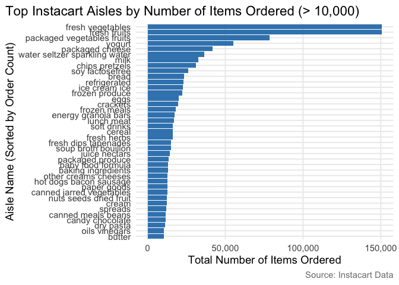
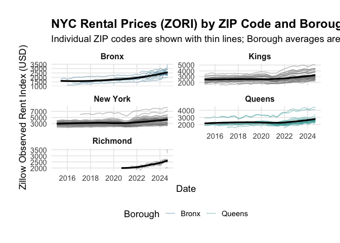

p8105_hw3_zn2220
================
Ziang Niu
2025-10-02

``` r
library(tidyverse)
library(p8105.datasets)
library(lubridate)
library(janitor)
library(knitr)
library(ggplot2)
library(forcats)
library(dplyr)
```

# Problem 1

## 1.0

### To that end, write a short description of the dataset, noting the size and structure of the data, describing some key variables, and giving illstrative examples of observations.

Introducing data.

``` r
data("instacart")
instacart <- janitor::clean_names(instacart)
```

Monitor the data. It has 1384617 rows and 15 cols. Let’s glimpse at it
and make a slice. Some key variables and example are shown in the kable.

``` r
glimpse(instacart)
```

    ## Rows: 1,384,617
    ## Columns: 15
    ## $ order_id               <int> 1, 1, 1, 1, 1, 1, 1, 1, 36, 36, 36, 36, 36, 36,…
    ## $ product_id             <int> 49302, 11109, 10246, 49683, 43633, 13176, 47209…
    ## $ add_to_cart_order      <int> 1, 2, 3, 4, 5, 6, 7, 8, 1, 2, 3, 4, 5, 6, 7, 8,…
    ## $ reordered              <int> 1, 1, 0, 0, 1, 0, 0, 1, 0, 1, 0, 1, 1, 1, 1, 1,…
    ## $ user_id                <int> 112108, 112108, 112108, 112108, 112108, 112108,…
    ## $ eval_set               <chr> "train", "train", "train", "train", "train", "t…
    ## $ order_number           <int> 4, 4, 4, 4, 4, 4, 4, 4, 23, 23, 23, 23, 23, 23,…
    ## $ order_dow              <int> 4, 4, 4, 4, 4, 4, 4, 4, 6, 6, 6, 6, 6, 6, 6, 6,…
    ## $ order_hour_of_day      <int> 10, 10, 10, 10, 10, 10, 10, 10, 18, 18, 18, 18,…
    ## $ days_since_prior_order <int> 9, 9, 9, 9, 9, 9, 9, 9, 30, 30, 30, 30, 30, 30,…
    ## $ product_name           <chr> "Bulgarian Yogurt", "Organic 4% Milk Fat Whole …
    ## $ aisle_id               <int> 120, 108, 83, 83, 95, 24, 24, 21, 2, 115, 53, 1…
    ## $ department_id          <int> 16, 16, 4, 4, 15, 4, 4, 16, 16, 7, 16, 4, 16, 2…
    ## $ aisle                  <chr> "yogurt", "other creams cheeses", "fresh vegeta…
    ## $ department             <chr> "dairy eggs", "dairy eggs", "produce", "produce…

``` r
set.seed(235)
instacart_examples <- instacart %>% 
  slice_sample(n = 5) %>% 
  select(order_id, product_name, aisle, department, order_dow, order_hour_of_day)

knitr::kable(instacart_examples, caption = "Illustrative sample of Instacart orders")
```

| order_id | product_name | aisle | department | order_dow | order_hour_of_day |
|---:|:---|:---|:---|---:|---:|
| 3258129 | Organic Extra Firm Tofu | tofu meat alternatives | deli | 0 | 15 |
| 2741482 | Organic Powdered Sugar | baking ingredients | pantry | 3 | 11 |
| 651769 | Special K Protein Milk Chocolate Protein Shakes | protein meal replacements | personal care | 3 | 17 |
| 859477 | Variety Pack | food storage | household | 2 | 9 |
| 1788253 | Organic Grape Tomatoes | packaged vegetables fruits | produce | 0 | 16 |

Illustrative sample of Instacart orders

Important variables include order_id (unique identifier for each order),
product_name (the specific item purchased), aisle (store aisle),
department (broader store department), order_dow (day of week; 0 =
Sunday, 6 = Saturday), and order_hour_of_day (hour of day). Illustrative
examples highlight how these variables describe customer behavior:

In order 3258129, the customer purchased Organic Extra Firm Tofu from
the tofu meat alternatives aisle in the deli department, placed on
Sunday (day 0) at 3 PM.

In order 2741482, Organic Powdered Sugar was bought from the baking
ingredients aisle in the pantry department, placed on Wednesday (day 3)
at 11 AM.

In order 651769, Special K Protein Milk Chocolate Protein Shakes came
from the protein meal replacements aisle in the personal care
department, placed on Wednesday (day 3) at 5 PM.

In order 859477, Variety Pack was purchased from the food storage aisle
in the household department, placed on Tuesday (day 2) at 9 AM.

In order 1788253, Organic Grape Tomatoes came from the packaged
vegetables fruits aisle in the produce department, placed on Sunday (day
0) at 4 PM.

## 1.1

### How many aisles are there, and which aisles are the most items ordered from?

Count the total number of aisles and identify the one with the most
items ordered.

``` r
aisle_counts <- instacart %>%
  count(aisle, name = "n_items") %>%
  arrange(desc(n_items))

n_aisles <- nrow(aisle_counts)

top_aisle <- aisle_counts %>%
  slice(1)
```

It has 134 aisles, the tibble below shows the the one with the most
items ordered.

``` r
top_aisle
```

    ## # A tibble: 1 × 2
    ##   aisle            n_items
    ##   <chr>              <int>
    ## 1 fresh vegetables  150609

## 1.2

### Make a plot that shows the number of items ordered in each aisle, limiting this to aisles with more than 10000 items ordered. Arrange aisles sensibly, and organize your plot so others can read it.

``` r
aisle_counts %>%
  filter(n_items > 10000) %>%
  ggplot(aes(
    x = fct_reorder(aisle, n_items), 
    y = n_items
  )) +
  geom_col(fill = "#1f77b4", alpha = 0.9) +
  coord_flip() +
  labs(
    title = "Top Instacart Aisles by Number of Items Ordered (> 10,000)",
    x = "Aisle Name (Sorted by Order Count)",
    y = "Total Number of Items Ordered",
    caption = "Source: Instacart Data"
  ) +
  scale_y_continuous(labels = scales::comma) +
  theme_minimal(base_size = 14) +
  theme(
    plot.title.position = "plot",
    panel.grid.minor = element_blank(),
    plot.caption = element_text(color = "grey50")
  )
```

<!-- -->

## 1.3

### Make a table showing the three most popular items in each of the aisles “baking ingredients”, “dog food care”, and “packaged vegetables fruits”. Include the number of times each item is ordered in your table.

``` r
target_aisles <- c("baking ingredients", "dog food care", "packaged vegetables fruits")

popular_items <- instacart %>%
  filter(aisle %in% target_aisles) %>%
  count(aisle, product_name, name = "order_count") %>%
  group_by(aisle) %>%
  slice_max(order_count, n = 3, with_ties = FALSE) %>%
  ungroup() %>%
  arrange(aisle, desc(order_count))

kable(popular_items, caption = "Top 3 Most Popular Items in Selected Aisles")
```

| aisle | product_name | order_count |
|:---|:---|---:|
| baking ingredients | Light Brown Sugar | 499 |
| baking ingredients | Pure Baking Soda | 387 |
| baking ingredients | Cane Sugar | 336 |
| dog food care | Snack Sticks Chicken & Rice Recipe Dog Treats | 30 |
| dog food care | Organix Chicken & Brown Rice Recipe | 28 |
| dog food care | Small Dog Biscuits | 26 |
| packaged vegetables fruits | Organic Baby Spinach | 9784 |
| packaged vegetables fruits | Organic Raspberries | 5546 |
| packaged vegetables fruits | Organic Blueberries | 4966 |

Top 3 Most Popular Items in Selected Aisles

## 1.4

### Make a table showing the mean hour of the day at which Pink Lady Apples and Coffee Ice Cream are ordered on each day of the week; format this table for human readers (i.e. produce a 2 x 7 table).

``` r
target_products <- c("Pink Lady Apples", "Coffee Ice Cream")

mean_hour_table <- instacart %>%
  filter(product_name %in% target_products) %>%
  group_by(product_name, order_dow) %>%
  summarize(mean_order_hour = mean(order_hour_of_day, na.rm = TRUE), .groups = 'drop') %>%
  pivot_wider(
    names_from = order_dow,
    values_from = mean_order_hour
  ) %>%
  # --- FIX IS HERE: Apply round only to numeric columns ---
  mutate(across(where(is.numeric), ~round(., 2)))

day_names <- c("Sun", "Mon", "Tue", "Wed", "Thu", "Fri", "Sat")
# Note: You might need to adjust the column indexing [2:8] if the product_name column is implicitly kept as the first column.
# The `pivot_wider` output will have 'product_name' followed by the 7 'order_dow' columns.
colnames(mean_hour_table)[2:8] <- day_names

kable(mean_hour_table, caption = "Mean Order Hour of Day by Product and Day of Week")
```

| product_name     |   Sun |   Mon |   Tue |   Wed |   Thu |   Fri |   Sat |
|:-----------------|------:|------:|------:|------:|------:|------:|------:|
| Coffee Ice Cream | 13.77 | 14.32 | 15.38 | 15.32 | 15.22 | 12.26 | 13.83 |
| Pink Lady Apples | 13.44 | 11.36 | 11.70 | 14.25 | 11.55 | 12.78 | 11.94 |

Mean Order Hour of Day by Product and Day of Week

# Problem 2

## 2.1

### There are 116 months between January 2015 and August 2024. How many ZIP codes are observed 116 times? How many are observed fewer than 10 times? Why are some ZIP codes are observed rarely and others observed in each month?

``` r
df_zori <- read_csv("zillow_data/Zip_zori_uc_sfrcondomfr_sm_month_NYC.csv")
```

    ## Rows: 149 Columns: 125
    ## ── Column specification ────────────────────────────────────────────────────────
    ## Delimiter: ","
    ## chr   (6): RegionType, StateName, State, City, Metro, CountyName
    ## dbl (119): RegionID, SizeRank, RegionName, 2015-01-31, 2015-02-28, 2015-03-3...
    ## 
    ## ℹ Use `spec()` to retrieve the full column specification for this data.
    ## ℹ Specify the column types or set `show_col_types = FALSE` to quiet this message.

``` r
metadata_cols_count <- 9
data_cols <- (metadata_cols_count + 1):ncol(df_zori)
total_months <- length(data_cols)

df_zori$Observation_Count <- rowSums(!is.na(df_zori[, data_cols]))

zip_codes_116 <- sum(df_zori$Observation_Count == total_months)
zip_codes_less_than_10 <- sum(df_zori$Observation_Count < 10)

cat("Total Months in Analysis Period:", total_months, "\n")
```

    ## Total Months in Analysis Period: 116

``` r
cat("----------------------------------\n")
```

    ## ----------------------------------

``` r
cat("Number of ZIP codes observed", total_months, "times (every month):", zip_codes_116, "\n")
```

    ## Number of ZIP codes observed 116 times (every month): 48

``` r
cat("Number of ZIP codes observed fewer than 10 times:", zip_codes_less_than_10, "\n")
```

    ## Number of ZIP codes observed fewer than 10 times: 26

``` r
df_results <- df_zori %>% 
  select(RegionName, CountyName, Observation_Count) %>%
  arrange(desc(Observation_Count))

print("\nSample of ZIP Codes and their Observation Counts:")
```

    ## [1] "\nSample of ZIP Codes and their Observation Counts:"

``` r
print(head(df_results))
```

    ## # A tibble: 6 × 3
    ##   RegionName CountyName      Observation_Count
    ##        <dbl> <chr>                       <dbl>
    ## 1      11226 Kings County                  116
    ## 2      11207 Kings County                  116
    ## 3      10025 New York County               116
    ## 4      11206 Kings County                  116
    ## 5      11221 Kings County                  116
    ## 6      11235 Kings County                  116

ZIP codes observed fewer than 10 times, representing a small, illiquid
rental market or an area dominated by non-rental housing (e.g.,
single-family owned homes). Reasons for rare observations include low
rental volume (not enough listings for a valid index), data
sparsity/suppression (failing to meet minimum transaction thresholds set
to ensure data quality or protect privacy), and housing type (the area
primarily consists of single-family homes or other non-rental
properties).

## 2.2

### Create a reader-friendly table showing the average rental price in each borough and year (not month). Comment on trends in this table.

``` r
borough_mapping <- c(
  "Kings County" = "Brooklyn",
  "Queens County" = "Queens",
  "New York County" = "Manhattan",
  "Bronx County" = "Bronx",
  "Richmond County" = "Staten Island"
)

df_long_zori <- df_zori %>%
  select(CountyName, starts_with("20")) %>%
  pivot_longer(
    cols = starts_with("20"),
    names_to = "Date",
    values_to = "ZORI"
  ) %>%
  mutate(
    Date = as.Date(Date, format = "%Y-%m-%d"),
    Year = as.integer(format(Date, "%Y")),
    Borough = str_replace(CountyName, " County", ""),
    Borough = recode(Borough, !!!borough_mapping)
  ) %>%
  filter(!is.na(Borough) & !is.na(ZORI))

average_rent_by_borough_year <- df_long_zori %>%
  group_by(Borough, Year) %>%
  summarise(
    Average_Rental_Price = mean(ZORI, na.rm = TRUE),
    .groups = 'drop'
  ) %>%
  mutate(Average_Rental_Price = round(Average_Rental_Price, 2)) %>%
  pivot_wider(
    names_from = Year,
    values_from = Average_Rental_Price
  ) %>%
  arrange(desc(`2024`)) 

print("Average Annual Rental Price (ZORI) by Borough (USD):")
```

    ## [1] "Average Annual Rental Price (ZORI) by Borough (USD):"

``` r
print(average_rent_by_borough_year)
```

    ## # A tibble: 5 × 11
    ##   Borough  `2015` `2016` `2017` `2018` `2019` `2020` `2021` `2022` `2023` `2024`
    ##   <chr>     <dbl>  <dbl>  <dbl>  <dbl>  <dbl>  <dbl>  <dbl>  <dbl>  <dbl>  <dbl>
    ## 1 New York  3022.  3039.  3134.  3184.  3310.  3107.  3137.  3778.  3933.  4078.
    ## 2 Kings     2493.  2520.  2546.  2547.  2630.  2555.  2550.  2868.  3015.  3127.
    ## 3 Queens    2215.  2272.  2263.  2292.  2388.  2316.  2211.  2406.  2562.  2694.
    ## 4 Richmond    NA     NA     NA     NA     NA   1978.  2045.  2147.  2333.  2536.
    ## 5 Bronx     1760.  1520.  1544.  1639.  1706.  1811.  1858.  2054.  2285.  2497.

The rental market analysis for NYC boroughs from 2015 to 2024 reveals
stark contrasts and rapid changes: Manhattan consistently commands the
highest rent, surpassing \$4,000 by 2024, while the Bronx remains the
most affordable. During the initial pandemic years (2020–2021), rents in
the denser boroughs (Manhattan and Brooklyn) stalled or decreased, but
the Bronx saw a slight increase, suggesting a shift toward lower-cost
and less-dense areas. Critically, starting in 2022, all boroughs
experienced a sharp, rapid rebound in rent growth, indicating a strong
post-pandemic resurgence in demand across the entire NYC rental market.

## 2.3

### Make a plot showing NYC Rental Prices within ZIP codes for all available years. Your plot should facilitate comparisons across boroughs. Comment on any significant elements of this plot.

``` r
borough_mapping <- c(
  "Kings County" = "Brooklyn",
  "Queens County" = "Queens",
  "New York County" = "Manhattan",
  "Bronx County" = "Bronx",
  "Richmond County" = "Staten Island"
)

df_plot <- df_zori %>%
  select(CountyName, RegionName, starts_with("20")) %>%
  pivot_longer(
    cols = starts_with("20"),
    names_to = "Date",
    values_to = "ZORI"
  ) %>%
  mutate(
    Date = as.Date(Date, format = "%Y-%m-%d"),
    Borough = str_replace(CountyName, " County", ""),
    Borough = recode(Borough, !!!borough_mapping)
  ) %>%
  filter(!is.na(Borough) & !is.na(ZORI))

rental_price_plot <- ggplot(df_plot, aes(x = Date, y = ZORI, group = RegionName, color = Borough)) +
  geom_line(alpha = 0.5) +
  geom_smooth(aes(group = Borough), method = "loess", se = FALSE, linewidth = 1.2, color = "black") +
  labs(
    title = "NYC Rental Prices (ZORI) by ZIP Code and Borough (2015-2024)",
    subtitle = "Individual ZIP codes are shown with thin lines; Borough averages are shown with thick black lines.",
    x = "Date",
    y = "Zillow Observed Rent Index (USD)",
    color = "Borough"
  ) +
  facet_wrap(~ Borough, scales = "free_y", ncol = 2) +
  theme_minimal(base_size = 14) +
  theme(
    plot.title = element_text(face = "bold", size = 18),
    legend.position = "bottom",
    strip.text = element_text(face = "bold", size = 12),
    panel.grid.minor = element_blank(),
    plot.margin = unit(c(1, 1, 1, 1), "cm")
  ) +
  scale_color_manual(values = c("Manhattan" = "#E37222", "Brooklyn" = "#5D576F", "Queens" = "#48A9A6", "Bronx" = "#4B88A2", "Staten Island" = "#B1A7A6"))

rental_price_plot
```

    ## `geom_smooth()` using formula = 'y ~ x'

<!-- -->
