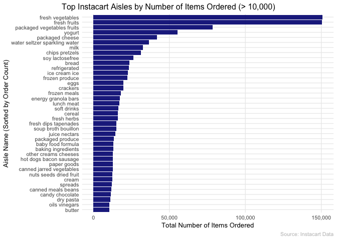
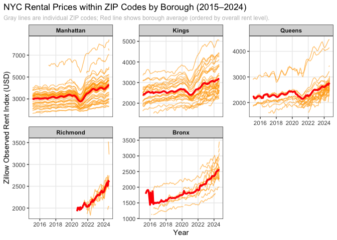

p8105_hw3_zn2220
================
Ziang Niu
2025-10-02

``` r
library(tidyverse)
library(p8105.datasets)
library(lubridate)
library(janitor)
library(knitr)
library(patchwork)
library(RNHANES)
```

# Problem 1

## 1.0

### To that end, write a short description of the dataset, noting the size and structure of the data, describing some key variables, and giving illstrative examples of observations.

Introducing data.

``` r
data("instacart")
instacart <- janitor::clean_names(instacart)
```

Monitor the data. It has 1384617 rows and 15 cols. Let’s glimpse at it
and make a slice. Some key variables and example are shown in the kable.

``` r
glimpse(instacart)
```

    ## Rows: 1,384,617
    ## Columns: 15
    ## $ order_id               <int> 1, 1, 1, 1, 1, 1, 1, 1, 36, 36, 36, 36, 36, 36,…
    ## $ product_id             <int> 49302, 11109, 10246, 49683, 43633, 13176, 47209…
    ## $ add_to_cart_order      <int> 1, 2, 3, 4, 5, 6, 7, 8, 1, 2, 3, 4, 5, 6, 7, 8,…
    ## $ reordered              <int> 1, 1, 0, 0, 1, 0, 0, 1, 0, 1, 0, 1, 1, 1, 1, 1,…
    ## $ user_id                <int> 112108, 112108, 112108, 112108, 112108, 112108,…
    ## $ eval_set               <chr> "train", "train", "train", "train", "train", "t…
    ## $ order_number           <int> 4, 4, 4, 4, 4, 4, 4, 4, 23, 23, 23, 23, 23, 23,…
    ## $ order_dow              <int> 4, 4, 4, 4, 4, 4, 4, 4, 6, 6, 6, 6, 6, 6, 6, 6,…
    ## $ order_hour_of_day      <int> 10, 10, 10, 10, 10, 10, 10, 10, 18, 18, 18, 18,…
    ## $ days_since_prior_order <int> 9, 9, 9, 9, 9, 9, 9, 9, 30, 30, 30, 30, 30, 30,…
    ## $ product_name           <chr> "Bulgarian Yogurt", "Organic 4% Milk Fat Whole …
    ## $ aisle_id               <int> 120, 108, 83, 83, 95, 24, 24, 21, 2, 115, 53, 1…
    ## $ department_id          <int> 16, 16, 4, 4, 15, 4, 4, 16, 16, 7, 16, 4, 16, 2…
    ## $ aisle                  <chr> "yogurt", "other creams cheeses", "fresh vegeta…
    ## $ department             <chr> "dairy eggs", "dairy eggs", "produce", "produce…

``` r
set.seed(235)
instacart_examples <- instacart %>% 
  slice_sample(n = 5) %>% 
  select(order_id, product_name, aisle, department, order_dow, order_hour_of_day)

knitr::kable(instacart_examples, caption = "Illustrative sample of Instacart orders")
```

| order_id | product_name | aisle | department | order_dow | order_hour_of_day |
|---:|:---|:---|:---|---:|---:|
| 3258129 | Organic Extra Firm Tofu | tofu meat alternatives | deli | 0 | 15 |
| 2741482 | Organic Powdered Sugar | baking ingredients | pantry | 3 | 11 |
| 651769 | Special K Protein Milk Chocolate Protein Shakes | protein meal replacements | personal care | 3 | 17 |
| 859477 | Variety Pack | food storage | household | 2 | 9 |
| 1788253 | Organic Grape Tomatoes | packaged vegetables fruits | produce | 0 | 16 |

Illustrative sample of Instacart orders

Important variables include order_id (unique identifier for each order),
product_name (the specific item purchased), aisle (store aisle),
department (broader store department), order_dow (day of week; 0 =
Sunday, 6 = Saturday), and order_hour_of_day (hour of day). Illustrative
examples highlight how these variables describe customer behavior:

In order 3258129, the customer purchased Organic Extra Firm Tofu from
the tofu meat alternatives aisle in the deli department, placed on
Sunday (day 0) at 3 PM.

In order 2741482, Organic Powdered Sugar was bought from the baking
ingredients aisle in the pantry department, placed on Wednesday (day 3)
at 11 AM.

In order 651769, Special K Protein Milk Chocolate Protein Shakes came
from the protein meal replacements aisle in the personal care
department, placed on Wednesday (day 3) at 5 PM.

In order 859477, Variety Pack was purchased from the food storage aisle
in the household department, placed on Tuesday (day 2) at 9 AM.

In order 1788253, Organic Grape Tomatoes came from the packaged
vegetables fruits aisle in the produce department, placed on Sunday (day
0) at 4 PM.

## 1.1

### How many aisles are there, and which aisles are the most items ordered from?

Count the total number of aisles and identify the one with the most
items ordered.

``` r
aisle_counts <- instacart %>%
  count(aisle, name = "n_items") %>%
  arrange(desc(n_items))

n_aisles <- nrow(aisle_counts)

top_aisle <- aisle_counts %>%
  slice(1)
```

It has 134 aisles, the tibble below shows the the one with the most
items ordered.

``` r
top_aisle
```

    ## # A tibble: 1 × 2
    ##   aisle            n_items
    ##   <chr>              <int>
    ## 1 fresh vegetables  150609

## 1.2

### Make a plot that shows the number of items ordered in each aisle, limiting this to aisles with more than 10000 items ordered. Arrange aisles sensibly, and organize your plot so others can read it.

``` r
aisle_counts %>%
  filter(n_items > 10000) %>%
  ggplot(aes(
    x = fct_reorder(aisle, n_items), 
    y = n_items
  )) +
  geom_col(fill = "navy", alpha = 0.9) +
  coord_flip() +
  labs(
    title = "Top Instacart Aisles by Number of Items Ordered (> 10,000)",
    x = "Aisle Name (Sorted by Order Count)",
    y = "Total Number of Items Ordered",
    caption = "Source: Instacart Data"
  ) +
  scale_y_continuous(labels = scales::comma) +
  theme_minimal(base_size = 10) +
  theme(
    plot.title.position = "plot",
    panel.grid.minor = element_blank(),
    plot.caption = element_text(color = "grey50")
  )
```

<!-- -->

## 1.3

### Make a table showing the three most popular items in each of the aisles “baking ingredients”, “dog food care”, and “packaged vegetables fruits”. Include the number of times each item is ordered in your table.

``` r
target_aisles <- c("baking ingredients", "dog food care", "packaged vegetables fruits")

popular_items <- instacart %>%
  filter(aisle %in% target_aisles) %>%
  count(aisle, product_name, name = "order_count") %>%
  group_by(aisle) %>%
  slice_max(order_count, n = 3, with_ties = FALSE) %>%
  ungroup() %>%
  arrange(aisle, desc(order_count))

kable(popular_items, caption = "Top 3 Most Popular Items in Selected Aisles")
```

| aisle | product_name | order_count |
|:---|:---|---:|
| baking ingredients | Light Brown Sugar | 499 |
| baking ingredients | Pure Baking Soda | 387 |
| baking ingredients | Cane Sugar | 336 |
| dog food care | Snack Sticks Chicken & Rice Recipe Dog Treats | 30 |
| dog food care | Organix Chicken & Brown Rice Recipe | 28 |
| dog food care | Small Dog Biscuits | 26 |
| packaged vegetables fruits | Organic Baby Spinach | 9784 |
| packaged vegetables fruits | Organic Raspberries | 5546 |
| packaged vegetables fruits | Organic Blueberries | 4966 |

Top 3 Most Popular Items in Selected Aisles

## 1.4

### Make a table showing the mean hour of the day at which Pink Lady Apples and Coffee Ice Cream are ordered on each day of the week; format this table for human readers (i.e. produce a 2 x 7 table).

``` r
target_products <- c("Pink Lady Apples", "Coffee Ice Cream")

mean_hour_table <- instacart %>%
  filter(product_name %in% target_products) %>%
  group_by(product_name, order_dow) %>%
  summarize(mean_order_hour = mean(order_hour_of_day, na.rm = TRUE), .groups = 'drop') %>%
  pivot_wider(
    names_from = order_dow,
    values_from = mean_order_hour
  ) %>%
  mutate(across(where(is.numeric), ~round(., 2)))

day_names <- c("Sun", "Mon", "Tue", "Wed", "Thu", "Fri", "Sat")

colnames(mean_hour_table)[2:8] <- day_names

kable(mean_hour_table, caption = "Mean Order Hour of Day by Product and Day of Week")
```

| product_name     |   Sun |   Mon |   Tue |   Wed |   Thu |   Fri |   Sat |
|:-----------------|------:|------:|------:|------:|------:|------:|------:|
| Coffee Ice Cream | 13.77 | 14.32 | 15.38 | 15.32 | 15.22 | 12.26 | 13.83 |
| Pink Lady Apples | 13.44 | 11.36 | 11.70 | 14.25 | 11.55 | 12.78 | 11.94 |

Mean Order Hour of Day by Product and Day of Week

# Problem 2

## 2.0

Clean and see, Transformation and Combination.

``` r
zillow_rent_data <- read_csv("zillow_data/Zip_zori_uc_sfrcondomfr_sm_month_NYC.csv")
zip_code_info <- read_csv("zillow_data/Zip Codes.csv")

glimpse(zillow_rent_data)
```

    ## Rows: 149
    ## Columns: 125
    ## $ RegionID     <dbl> 62080, 62093, 62019, 62046, 61807, 62085, 62037, 62018, 6…
    ## $ SizeRank     <dbl> 4, 7, 9, 16, 17, 18, 19, 20, 29, 32, 36, 39, 40, 43, 47, …
    ## $ RegionName   <dbl> 11368, 11385, 11208, 11236, 10467, 11373, 11226, 11207, 1…
    ## $ RegionType   <chr> "zip", "zip", "zip", "zip", "zip", "zip", "zip", "zip", "…
    ## $ StateName    <chr> "NY", "NY", "NY", "NY", "NY", "NY", "NY", "NY", "NY", "NY…
    ## $ State        <chr> "NY", "NY", "NY", "NY", "NY", "NY", "NY", "NY", "NY", "NY…
    ## $ City         <chr> "New York", "New York", "New York", "New York", "New York…
    ## $ Metro        <chr> "New York-Newark-Jersey City, NY-NJ-PA", "New York-Newark…
    ## $ CountyName   <chr> "Queens County", "Queens County", "Kings County", "Kings …
    ## $ `2015-01-31` <dbl> NA, NA, NA, NA, NA, NA, 1919.726, 1943.311, 3054.576, NA,…
    ## $ `2015-02-28` <dbl> NA, NA, NA, NA, NA, NA, 1947.088, 1851.295, 3053.302, NA,…
    ## $ `2015-03-31` <dbl> NA, NA, NA, NA, NA, NA, 2038.567, 1851.512, 3049.818, NA,…
    ## $ `2015-04-30` <dbl> NA, NA, NA, NA, NA, NA, 2041.355, 1876.733, 3073.585, NA,…
    ## $ `2015-05-31` <dbl> NA, NA, NA, NA, NA, NA, 2053.751, 1972.097, 3093.156, NA,…
    ## $ `2015-06-30` <dbl> NA, NA, NA, NA, NA, NA, 2033.709, 2025.955, 3120.443, NA,…
    ## $ `2015-07-31` <dbl> NA, NA, NA, NA, NA, NA, 2056.747, 2034.935, 3130.740, NA,…
    ## $ `2015-08-31` <dbl> NA, NA, NA, NA, NA, NA, 2071.559, 2016.905, 3128.406, NA,…
    ## $ `2015-09-30` <dbl> NA, NA, NA, NA, NA, NA, 2092.795, 2046.119, 3125.705, NA,…
    ## $ `2015-10-31` <dbl> NA, NA, NA, NA, NA, NA, 2093.826, 2052.770, 3126.853, NA,…
    ## $ `2015-11-30` <dbl> NA, NA, NA, NA, NA, NA, 2095.349, 2108.550, 3129.706, NA,…
    ## $ `2015-12-31` <dbl> NA, NA, NA, NA, NA, NA, 2088.164, 2062.484, 3125.624, NA,…
    ## $ `2016-01-31` <dbl> NA, NA, NA, NA, NA, NA, 2089.653, 2068.113, 3115.547, NA,…
    ## $ `2016-02-29` <dbl> NA, NA, NA, NA, NA, NA, 2082.460, 2075.443, 3111.635, NA,…
    ## $ `2016-03-31` <dbl> NA, NA, NA, NA, NA, NA, 2131.828, 2166.531, 3126.976, NA,…
    ## $ `2016-04-30` <dbl> NA, NA, NA, NA, NA, NA, 2151.524, 2198.191, 3134.421, NA,…
    ## $ `2016-05-31` <dbl> NA, 2266.140, NA, NA, 1349.679, NA, 2171.467, 2163.246, 3…
    ## $ `2016-06-30` <dbl> NA, 2292.023, NA, NA, 1327.656, NA, 2195.605, 2134.050, 3…
    ## $ `2016-07-31` <dbl> NA, 2320.788, NA, NA, 1351.738, NA, 2235.378, 2125.281, 3…
    ## $ `2016-08-31` <dbl> NA, 2343.339, NA, NA, 1313.098, NA, 2240.782, 2149.885, 3…
    ## $ `2016-09-30` <dbl> NA, 2337.120, NA, NA, 1331.150, NA, 2202.912, 2132.201, 3…
    ## $ `2016-10-31` <dbl> NA, 2345.339, NA, NA, 1317.193, NA, 2175.157, 2131.459, 3…
    ## $ `2016-11-30` <dbl> NA, 2320.083, NA, NA, 1307.569, NA, 2203.503, 2144.048, 3…
    ## $ `2016-12-31` <dbl> NA, 2326.450, NA, NA, 1294.087, NA, 2220.357, 2150.612, 3…
    ## $ `2017-01-31` <dbl> NA, 2310.855, NA, NA, 1354.713, NA, 2230.477, 2149.877, 3…
    ## $ `2017-02-28` <dbl> NA, 2313.101, NA, NA, 1381.230, NA, 2222.774, 2119.797, 3…
    ## $ `2017-03-31` <dbl> NA, 2316.134, NA, NA, 1443.584, NA, 2227.372, 2114.796, 3…
    ## $ `2017-04-30` <dbl> NA, 2309.757, NA, NA, 1427.754, NA, 2217.893, 2124.847, 3…
    ## $ `2017-05-31` <dbl> NA, 2336.220, NA, NA, NA, NA, 2224.578, 2113.990, 3146.90…
    ## $ `2017-06-30` <dbl> NA, 2327.477, NA, NA, 1419.295, NA, 2246.103, 2110.918, 3…
    ## $ `2017-07-31` <dbl> NA, 2349.503, NA, NA, 1427.326, NA, 2268.897, 2113.950, 3…
    ## $ `2017-08-31` <dbl> NA, 2354.110, NA, NA, 1391.902, NA, 2266.585, 2154.685, 3…
    ## $ `2017-09-30` <dbl> NA, 2393.023, NA, NA, 1388.167, NA, 2253.781, 2190.012, 3…
    ## $ `2017-10-31` <dbl> NA, 2363.952, NA, NA, 1402.915, NA, 2233.249, 2209.270, 3…
    ## $ `2017-11-30` <dbl> NA, 2360.901, NA, NA, 1443.141, NA, 2214.707, 2197.699, 3…
    ## $ `2017-12-31` <dbl> NA, 2336.269, NA, NA, 1448.317, NA, 2203.283, 2195.972, 3…
    ## $ `2018-01-31` <dbl> NA, 2331.220, NA, NA, 1415.071, NA, 2212.000, 2173.922, 3…
    ## $ `2018-02-28` <dbl> NA, 2314.654, NA, NA, 1447.512, NA, 2242.629, 2161.329, 3…
    ## $ `2018-03-31` <dbl> NA, 2317.821, NA, NA, 1475.749, NA, 2265.593, 2164.720, 3…
    ## $ `2018-04-30` <dbl> NA, 2337.118, NA, NA, 1550.592, NA, 2292.588, 2225.315, 3…
    ## $ `2018-05-31` <dbl> NA, 2352.811, NA, NA, 1557.876, NA, 2295.173, 2250.959, 3…
    ## $ `2018-06-30` <dbl> NA, 2362.330, NA, NA, 1554.092, NA, 2304.912, 2259.032, 3…
    ## $ `2018-07-31` <dbl> NA, 2367.660, NA, NA, 1551.874, NA, 2320.557, 2230.589, 3…
    ## $ `2018-08-31` <dbl> NA, 2376.613, NA, NA, 1552.840, NA, 2349.465, 2259.636, 3…
    ## $ `2018-09-30` <dbl> NA, 2380.886, NA, NA, 1580.368, NA, 2369.397, 2260.747, 3…
    ## $ `2018-10-31` <dbl> NA, 2402.277, NA, NA, 1576.065, NA, 2351.768, 2241.267, 3…
    ## $ `2018-11-30` <dbl> NA, 2393.917, NA, NA, 1554.715, NA, 2334.290, 2241.702, 3…
    ## $ `2018-12-31` <dbl> NA, 2397.149, NA, NA, 1593.641, NA, 2306.881, 2241.726, 3…
    ## $ `2019-01-31` <dbl> NA, 2374.795, NA, NA, 1588.411, NA, 2322.166, 2267.492, 3…
    ## $ `2019-02-28` <dbl> NA, 2397.457, NA, NA, 1600.744, NA, 2310.874, 2262.747, 3…
    ## $ `2019-03-31` <dbl> NA, 2381.838, NA, NA, 1578.046, NA, 2337.374, 2300.330, 3…
    ## $ `2019-04-30` <dbl> NA, 2398.852, NA, NA, 1572.738, NA, 2320.309, 2282.050, 3…
    ## $ `2019-05-31` <dbl> NA, 2381.123, NA, NA, 1587.081, NA, 2348.144, 2312.998, 3…
    ## $ `2019-06-30` <dbl> NA, 2440.723, NA, NA, 1568.751, NA, 2347.740, 2308.482, 3…
    ## $ `2019-07-31` <dbl> NA, 2471.034, NA, NA, 1613.196, NA, 2377.157, 2344.878, 3…
    ## $ `2019-08-31` <dbl> NA, 2495.005, NA, NA, 1620.662, NA, 2401.689, 2341.534, 3…
    ## $ `2019-09-30` <dbl> NA, 2476.095, NA, NA, 1685.971, NA, 2419.742, 2348.960, 3…
    ## $ `2019-10-31` <dbl> NA, 2464.924, NA, NA, 1699.779, NA, 2413.602, 2356.870, 3…
    ## $ `2019-11-30` <dbl> NA, 2488.450, NA, NA, 1695.050, NA, 2378.537, 2385.016, 3…
    ## $ `2019-12-31` <dbl> NA, 2498.628, NA, NA, 1669.128, NA, 2348.024, 2409.248, 3…
    ## $ `2020-01-31` <dbl> NA, 2509.859, NA, NA, 1649.561, NA, 2357.056, 2418.346, 3…
    ## $ `2020-02-29` <dbl> NA, 2515.646, NA, NA, 1665.102, NA, 2354.012, 2406.290, 3…
    ## $ `2020-03-31` <dbl> NA, 2501.732, NA, NA, 1668.471, NA, 2390.353, 2384.940, 3…
    ## $ `2020-04-30` <dbl> NA, 2475.083, NA, NA, 1653.317, NA, 2384.131, 2397.553, 3…
    ## $ `2020-05-31` <dbl> NA, 2475.563, NA, NA, 1612.794, NA, 2394.843, 2400.946, 3…
    ## $ `2020-06-30` <dbl> NA, 2469.365, NA, NA, 1598.750, NA, 2372.863, 2390.648, 3…
    ## $ `2020-07-31` <dbl> NA, 2475.826, NA, NA, 1655.226, NA, 2375.547, 2357.104, 3…
    ## $ `2020-08-31` <dbl> NA, 2427.843, NA, NA, 1699.814, NA, 2352.791, 2326.858, 3…
    ## $ `2020-09-30` <dbl> NA, 2401.526, NA, NA, 1745.707, NA, 2321.016, 2270.901, 2…
    ## $ `2020-10-31` <dbl> NA, 2368.533, NA, NA, 1724.810, NA, 2286.740, 2224.135, 2…
    ## $ `2020-11-30` <dbl> NA, 2337.224, NA, NA, 1774.450, NA, 2268.131, 2167.380, 2…
    ## $ `2020-12-31` <dbl> NA, 2305.878, NA, NA, 1725.417, NA, 2223.454, 2164.536, 2…
    ## $ `2021-01-31` <dbl> NA, 2292.884, NA, NA, 1744.514, NA, 2180.768, 2142.852, 2…
    ## $ `2021-02-28` <dbl> NA, 2277.712, NA, NA, 1701.264, NA, 2182.021, 2121.733, 2…
    ## $ `2021-03-31` <dbl> NA, 2282.339, NA, NA, 1737.235, NA, 2209.309, 2102.816, 2…
    ## $ `2021-04-30` <dbl> NA, 2278.929, NA, NA, 1690.341, 1872.391, 2254.320, 2111.…
    ## $ `2021-05-31` <dbl> NA, 2322.021, NA, NA, 1715.512, 1875.980, 2278.554, 2191.…
    ## $ `2021-06-30` <dbl> NA, 2368.377, NA, NA, 1725.934, 1908.656, 2310.224, 2261.…
    ## $ `2021-07-31` <dbl> NA, 2420.586, NA, NA, 1751.695, 1930.109, 2349.893, 2316.…
    ## $ `2021-08-31` <dbl> NA, 2449.848, NA, NA, 1742.938, 1949.615, 2367.497, 2336.…
    ## $ `2021-09-30` <dbl> NA, 2482.230, NA, NA, 1772.303, 1966.494, 2398.880, 2364.…
    ## $ `2021-10-31` <dbl> NA, 2518.714, NA, NA, 1807.374, 1910.506, 2397.910, 2412.…
    ## $ `2021-11-30` <dbl> NA, 2556.784, NA, NA, 1812.226, 1934.053, 2409.960, 2413.…
    ## $ `2021-12-31` <dbl> NA, 2580.724, NA, NA, 1747.475, 1923.586, 2411.932, 2448.…
    ## $ `2022-01-31` <dbl> NA, 2592.727, NA, NA, 1728.976, 1927.948, 2437.651, 2452.…
    ## $ `2022-02-28` <dbl> NA, 2591.473, NA, NA, 1785.026, 1969.994, 2473.804, 2473.…
    ## $ `2022-03-31` <dbl> NA, 2607.010, 2432.634, NA, 1831.988, 2023.199, 2515.255,…
    ## $ `2022-04-30` <dbl> NA, 2657.466, 2468.666, NA, 1886.640, 2100.825, 2547.030,…
    ## $ `2022-05-31` <dbl> NA, 2727.357, 2553.099, 2328.869, 1881.483, 2107.368, 259…
    ## $ `2022-06-30` <dbl> NA, 2830.789, 2571.974, 2376.032, 1904.170, 2138.288, 264…
    ## $ `2022-07-31` <dbl> NA, 2893.427, 2541.777, 2347.321, 1937.096, 2166.511, 267…
    ## $ `2022-08-31` <dbl> NA, 2951.086, 2549.192, 2400.155, 1944.353, 2151.894, 268…
    ## $ `2022-09-30` <dbl> NA, 2957.775, 2533.571, 2397.660, 1931.878, 2144.004, 268…
    ## $ `2022-10-31` <dbl> NA, 2966.494, 2596.307, 2524.344, 1893.956, 2141.909, 269…
    ## $ `2022-11-30` <dbl> NA, 2937.695, 2624.750, 2502.490, 1891.447, 2163.435, 268…
    ## $ `2022-12-31` <dbl> NA, 2898.732, 2660.759, 2582.495, 1899.311, 2181.641, 265…
    ## $ `2023-01-31` <dbl> NA, 2851.205, 2683.873, 2432.282, 1929.648, 2213.842, 265…
    ## $ `2023-02-28` <dbl> NA, 2847.664, 2685.560, 2429.336, 1945.849, 2226.211, 264…
    ## $ `2023-03-31` <dbl> NA, 2865.429, 2657.591, 2391.820, 1958.650, 2214.526, 267…
    ## $ `2023-04-30` <dbl> NA, 2908.589, 2672.800, 2451.315, 1909.791, 2217.911, 268…
    ## $ `2023-05-31` <dbl> NA, 2950.697, 2699.051, 2501.957, 1963.970, 2218.745, 270…
    ## $ `2023-06-30` <dbl> NA, 2986.174, 2825.592, 2598.722, 2049.137, 2253.525, 272…
    ## $ `2023-07-31` <dbl> NA, 3004.259, 2817.253, 2642.102, 2084.984, 2261.120, 274…
    ## $ `2023-08-31` <dbl> NA, 3021.107, 2797.145, 2672.396, 2100.269, 2295.725, 275…
    ## $ `2023-09-30` <dbl> NA, 3039.225, 2773.578, 2715.256, 2182.744, 2275.544, 274…
    ## $ `2023-10-31` <dbl> NA, 3042.726, 2815.385, 2700.885, 2238.053, 2302.135, 272…
    ## $ `2023-11-30` <dbl> NA, 3022.294, 2934.593, 2743.458, 2317.342, 2293.275, 271…
    ## $ `2023-12-31` <dbl> NA, 2985.509, 2977.254, 2753.950, 2243.914, 2290.069, 271…
    ## $ `2024-01-31` <dbl> NA, 2976.598, 3015.684, 2848.811, 2269.451, 2283.986, 274…
    ## $ `2024-02-29` <dbl> NA, 2971.280, 2987.130, 2899.215, 2233.032, 2273.511, 274…
    ## $ `2024-03-31` <dbl> NA, 3022.816, 2963.105, 2977.176, 2244.841, 2281.456, 273…
    ## $ `2024-04-30` <dbl> NA, 3032.851, 2895.445, 2935.365, 2303.026, 2302.458, 272…
    ## $ `2024-05-31` <dbl> NA, 3102.032, 2817.406, 2959.498, 2282.180, 2377.143, 275…
    ## $ `2024-06-30` <dbl> NA, 3132.088, 2858.719, 2847.246, 2309.057, 2439.551, 276…
    ## $ `2024-07-31` <dbl> 2322.418, 3203.117, 2816.037, 2862.954, 2294.031, 2491.62…
    ## $ `2024-08-31` <dbl> 2282.500, 3199.751, 2895.667, 2976.389, 2271.611, 2476.33…

``` r
summary(zillow_rent_data)
```

    ##     RegionID         SizeRank       RegionName     RegionType       
    ##  Min.   : 61615   Min.   :    4   Min.   :10001   Length:149        
    ##  1st Qu.: 61657   1st Qu.:  142   1st Qu.:10044   Class :character  
    ##  Median : 62005   Median : 1025   Median :10473   Mode  :character  
    ##  Mean   : 66415   Mean   : 2533   Mean   :10737                     
    ##  3rd Qu.: 62045   3rd Qu.: 3485   3rd Qu.:11233                     
    ##  Max.   :399546   Max.   :30490   Max.   :11693                     
    ##                                                                     
    ##   StateName            State               City              Metro          
    ##  Length:149         Length:149         Length:149         Length:149        
    ##  Class :character   Class :character   Class :character   Class :character  
    ##  Mode  :character   Mode  :character   Mode  :character   Mode  :character  
    ##                                                                             
    ##                                                                             
    ##                                                                             
    ##                                                                             
    ##   CountyName          2015-01-31     2015-02-28     2015-03-31     2015-04-30  
    ##  Length:149         Min.   :1621   Min.   :1668   Min.   :1682   Min.   :1702  
    ##  Class :character   1st Qu.:2174   1st Qu.:2141   1st Qu.:2184   1st Qu.:2184  
    ##  Mode  :character   Median :2736   Median :2724   Median :2683   Median :2676  
    ##                     Mean   :2739   Mean   :2739   Mean   :2735   Mean   :2737  
    ##                     3rd Qu.:3235   3rd Qu.:3242   3rd Qu.:3251   3rd Qu.:3296  
    ##                     Max.   :4024   Max.   :4022   Max.   :4040   Max.   :4118  
    ##                     NA's   :95     NA's   :94     NA's   :92     NA's   :90    
    ##    2015-05-31     2015-06-30     2015-07-31     2015-08-31     2015-09-30  
    ##  Min.   :1709   Min.   :1722   Min.   :1723   Min.   :1700   Min.   :1707  
    ##  1st Qu.:2186   1st Qu.:2169   1st Qu.:2203   1st Qu.:2221   1st Qu.:2221  
    ##  Median :2706   Median :2742   Median :2753   Median :2779   Median :2786  
    ##  Mean   :2746   Mean   :2752   Mean   :2769   Mean   :2781   Mean   :2788  
    ##  3rd Qu.:3326   3rd Qu.:3331   3rd Qu.:3327   3rd Qu.:3333   3rd Qu.:3353  
    ##  Max.   :4172   Max.   :4236   Max.   :4220   Max.   :4186   Max.   :4170  
    ##  NA's   :89     NA's   :88     NA's   :88     NA's   :88     NA's   :88    
    ##    2015-10-31     2015-11-30     2015-12-31     2016-01-31     2016-02-29  
    ##  Min.   :1740   Min.   :1766   Min.   :1102   Min.   :1726   Min.   :1142  
    ##  1st Qu.:2218   1st Qu.:2238   1st Qu.:2193   1st Qu.:2213   1st Qu.:2168  
    ##  Median :2763   Median :2771   Median :2687   Median :2741   Median :2687  
    ##  Mean   :2785   Mean   :2787   Mean   :2724   Mean   :2752   Mean   :2715  
    ##  3rd Qu.:3343   3rd Qu.:3318   3rd Qu.:3282   3rd Qu.:3308   3rd Qu.:3309  
    ##  Max.   :4094   Max.   :4108   Max.   :4073   Max.   :4113   Max.   :4033  
    ##  NA's   :88     NA's   :89     NA's   :87     NA's   :87     NA's   :85    
    ##    2016-03-31     2016-04-30     2016-05-31     2016-06-30     2016-07-31  
    ##  Min.   :1122   Min.   :1732   Min.   :1116   Min.   :1132   Min.   :1135  
    ##  1st Qu.:2191   1st Qu.:2248   1st Qu.:2124   1st Qu.:2150   1st Qu.:2155  
    ##  Median :2685   Median :2701   Median :2677   Median :2694   Median :2717  
    ##  Mean   :2729   Mean   :2769   Mean   :2690   Mean   :2708   Mean   :2724  
    ##  3rd Qu.:3321   3rd Qu.:3329   3rd Qu.:3266   3rd Qu.:3283   3rd Qu.:3278  
    ##  Max.   :4038   Max.   :4081   Max.   :4184   Max.   :4240   Max.   :4272  
    ##  NA's   :85     NA's   :86     NA's   :78     NA's   :78     NA's   :78    
    ##    2016-08-31     2016-09-30     2016-10-31     2016-11-30     2016-12-31  
    ##  Min.   :1139   Min.   :1164   Min.   :1166   Min.   :1182   Min.   :1201  
    ##  1st Qu.:2179   1st Qu.:2168   1st Qu.:2161   1st Qu.:2174   1st Qu.:2143  
    ##  Median :2718   Median :2724   Median :2702   Median :2678   Median :2657  
    ##  Mean   :2733   Mean   :2734   Mean   :2726   Mean   :2710   Mean   :2675  
    ##  3rd Qu.:3296   3rd Qu.:3281   3rd Qu.:3272   3rd Qu.:3249   3rd Qu.:3212  
    ##  Max.   :4286   Max.   :4268   Max.   :4224   Max.   :4148   Max.   :4065  
    ##  NA's   :78     NA's   :78     NA's   :78     NA's   :78     NA's   :77    
    ##    2017-01-31     2017-02-28     2017-03-31     2017-04-30     2017-05-31  
    ##  Min.   :1218   Min.   :1238   Min.   :1230   Min.   :1252   Min.   :1264  
    ##  1st Qu.:2142   1st Qu.:2129   1st Qu.:2135   1st Qu.:2161   1st Qu.:2199  
    ##  Median :2652   Median :2670   Median :2688   Median :2720   Median :2739  
    ##  Mean   :2700   Mean   :2703   Mean   :2715   Mean   :2733   Mean   :2773  
    ##  3rd Qu.:3201   3rd Qu.:3208   3rd Qu.:3225   3rd Qu.:3268   3rd Qu.:3304  
    ##  Max.   :6041   Max.   :6088   Max.   :6005   Max.   :6095   Max.   :6170  
    ##  NA's   :74     NA's   :74     NA's   :74     NA's   :74     NA's   :75    
    ##    2017-06-30     2017-07-31     2017-08-31     2017-09-30     2017-10-31  
    ##  Min.   :1246   Min.   :1249   Min.   :1231   Min.   :1237   Min.   :1219  
    ##  1st Qu.:2195   1st Qu.:2207   1st Qu.:2209   1st Qu.:2206   1st Qu.:2204  
    ##  Median :2736   Median :2744   Median :2773   Median :2758   Median :2731  
    ##  Mean   :2777   Mean   :2789   Mean   :2792   Mean   :2788   Mean   :2768  
    ##  3rd Qu.:3336   3rd Qu.:3325   3rd Qu.:3324   3rd Qu.:3298   3rd Qu.:3273  
    ##  Max.   :6234   Max.   :6175   Max.   :6165   Max.   :6245   Max.   :6229  
    ##  NA's   :74     NA's   :74     NA's   :74     NA's   :74     NA's   :74    
    ##    2017-11-30     2017-12-31     2018-01-31     2018-02-28     2018-03-31  
    ##  Min.   :1225   Min.   :1228   Min.   :1241   Min.   :1257   Min.   :1292  
    ##  1st Qu.:2191   1st Qu.:2200   1st Qu.:2170   1st Qu.:2163   1st Qu.:2182  
    ##  Median :2700   Median :2705   Median :2709   Median :2700   Median :2730  
    ##  Mean   :2744   Mean   :2735   Mean   :2700   Mean   :2693   Mean   :2711  
    ##  3rd Qu.:3223   3rd Qu.:3181   3rd Qu.:3158   3rd Qu.:3168   3rd Qu.:3209  
    ##  Max.   :6175   Max.   :6047   Max.   :6013   Max.   :5954   Max.   :5947  
    ##  NA's   :74     NA's   :74     NA's   :72     NA's   :71     NA's   :71    
    ##    2018-04-30     2018-05-31     2018-06-30     2018-07-31     2018-08-31  
    ##  Min.   :1283   Min.   :1317   Min.   :1310   Min.   :1333   Min.   :1293  
    ##  1st Qu.:2205   1st Qu.:2211   1st Qu.:2220   1st Qu.:2232   1st Qu.:2241  
    ##  Median :2715   Median :2728   Median :2754   Median :2781   Median :2809  
    ##  Mean   :2737   Mean   :2762   Mean   :2786   Mean   :2801   Mean   :2814  
    ##  3rd Qu.:3241   3rd Qu.:3272   3rd Qu.:3324   3rd Qu.:3346   3rd Qu.:3365  
    ##  Max.   :6071   Max.   :6205   Max.   :6333   Max.   :6347   Max.   :6356  
    ##  NA's   :71     NA's   :71     NA's   :71     NA's   :71     NA's   :71    
    ##    2018-09-30     2018-10-31     2018-11-30     2018-12-31     2019-01-31  
    ##  Min.   :1318   Min.   :1349   Min.   :1384   Min.   :1372   Min.   :1320  
    ##  1st Qu.:2234   1st Qu.:2236   1st Qu.:2223   1st Qu.:2205   1st Qu.:2219  
    ##  Median :2808   Median :2781   Median :2753   Median :2737   Median :2759  
    ##  Mean   :2816   Mean   :2804   Mean   :2783   Mean   :2763   Mean   :2784  
    ##  3rd Qu.:3356   3rd Qu.:3344   3rd Qu.:3323   3rd Qu.:3312   3rd Qu.:3308  
    ##  Max.   :6454   Max.   :6431   Max.   :6383   Max.   :6113   Max.   :6143  
    ##  NA's   :71     NA's   :71     NA's   :71     NA's   :71     NA's   :70    
    ##    2019-02-28     2019-03-31     2019-04-30     2019-05-31     2019-06-30  
    ##  Min.   :1309   Min.   :1312   Min.   :1347   Min.   :1355   Min.   :1373  
    ##  1st Qu.:2243   1st Qu.:2261   1st Qu.:2273   1st Qu.:2283   1st Qu.:2301  
    ##  Median :2776   Median :2777   Median :2808   Median :2823   Median :2852  
    ##  Mean   :2797   Mean   :2811   Mean   :2848   Mean   :2861   Mean   :2887  
    ##  3rd Qu.:3324   3rd Qu.:3341   3rd Qu.:3377   3rd Qu.:3407   3rd Qu.:3433  
    ##  Max.   :6299   Max.   :6442   Max.   :6507   Max.   :6504   Max.   :6616  
    ##  NA's   :70     NA's   :69     NA's   :70     NA's   :69     NA's   :69    
    ##    2019-07-31     2019-08-31     2019-09-30     2019-10-31     2019-11-30  
    ##  Min.   :1367   Min.   :1376   Min.   :1368   Min.   :1374   Min.   :1379  
    ##  1st Qu.:2298   1st Qu.:2297   1st Qu.:2293   1st Qu.:2281   1st Qu.:2289  
    ##  Median :2875   Median :2893   Median :2898   Median :2894   Median :2863  
    ##  Mean   :2910   Mean   :2922   Mean   :2927   Mean   :2923   Mean   :2907  
    ##  3rd Qu.:3475   3rd Qu.:3481   3rd Qu.:3475   3rd Qu.:3436   3rd Qu.:3423  
    ##  Max.   :6661   Max.   :6643   Max.   :6668   Max.   :6633   Max.   :6492  
    ##  NA's   :69     NA's   :69     NA's   :69     NA's   :69     NA's   :69    
    ##    2019-12-31     2020-01-31     2020-02-29     2020-03-31     2020-04-30  
    ##  Min.   :1380   Min.   :1376   Min.   :1377   Min.   :1653   Min.   :1418  
    ##  1st Qu.:2297   1st Qu.:2238   1st Qu.:2257   1st Qu.:2281   1st Qu.:2278  
    ##  Median :2837   Median :2755   Median :2774   Median :2795   Median :2726  
    ##  Mean   :2890   Mean   :2863   Mean   :2881   Mean   :2903   Mean   :2872  
    ##  3rd Qu.:3418   3rd Qu.:3421   3rd Qu.:3435   3rd Qu.:3449   3rd Qu.:3432  
    ##  Max.   :6373   Max.   :6334   Max.   :6446   Max.   :6526   Max.   :6554  
    ##  NA's   :69     NA's   :67     NA's   :67     NA's   :67     NA's   :65    
    ##    2020-05-31     2020-06-30     2020-07-31     2020-08-31     2020-09-30  
    ##  Min.   :1439   Min.   :1436   Min.   :1433   Min.   :1426   Min.   :1425  
    ##  1st Qu.:2245   1st Qu.:2229   1st Qu.:2227   1st Qu.:2194   1st Qu.:2172  
    ##  Median :2619   Median :2576   Median :2546   Median :2482   Median :2422  
    ##  Mean   :2825   Mean   :2780   Mean   :2747   Mean   :2664   Mean   :2603  
    ##  3rd Qu.:3399   3rd Qu.:3341   3rd Qu.:3273   3rd Qu.:3168   3rd Qu.:3077  
    ##  Max.   :6552   Max.   :6509   Max.   :6357   Max.   :6098   Max.   :5936  
    ##  NA's   :60     NA's   :59     NA's   :59     NA's   :61     NA's   :60    
    ##    2020-10-31     2020-11-30     2020-12-31     2021-01-31     2021-02-28  
    ##  Min.   :1418   Min.   :1417   Min.   :1422   Min.   :1420   Min.   :1451  
    ##  1st Qu.:2129   1st Qu.:2098   1st Qu.:2074   1st Qu.:2056   1st Qu.:2037  
    ##  Median :2393   Median :2351   Median :2311   Median :2294   Median :2303  
    ##  Mean   :2565   Mean   :2530   Mean   :2495   Mean   :2480   Mean   :2479  
    ##  3rd Qu.:3020   3rd Qu.:2935   3rd Qu.:2888   3rd Qu.:2878   3rd Qu.:2911  
    ##  Max.   :5923   Max.   :5773   Max.   :5616   Max.   :5422   Max.   :5538  
    ##  NA's   :58     NA's   :57     NA's   :55     NA's   :54     NA's   :52    
    ##    2021-03-31     2021-04-30     2021-05-31     2021-06-30     2021-07-31  
    ##  Min.   :1455   Min.   :1477   Min.   :1467   Min.   :1471   Min.   :1470  
    ##  1st Qu.:2046   1st Qu.:2058   1st Qu.:2062   1st Qu.:2085   1st Qu.:2103  
    ##  Median :2328   Median :2310   Median :2331   Median :2369   Median :2401  
    ##  Mean   :2499   Mean   :2529   Mean   :2574   Mean   :2629   Mean   :2699  
    ##  3rd Qu.:2955   3rd Qu.:3005   3rd Qu.:3086   3rd Qu.:3180   3rd Qu.:3276  
    ##  Max.   :5753   Max.   :5966   Max.   :6235   Max.   :6440   Max.   :6740  
    ##  NA's   :51     NA's   :50     NA's   :50     NA's   :49     NA's   :49    
    ##    2021-08-31     2021-09-30     2021-10-31     2021-11-30     2021-12-31  
    ##  Min.   :1444   Min.   :1441   Min.   :1453   Min.   :1445   Min.   :1431  
    ##  1st Qu.:2147   1st Qu.:2171   1st Qu.:2119   1st Qu.:2123   1st Qu.:2095  
    ##  Median :2441   Median :2481   Median :2444   Median :2468   Median :2461  
    ##  Mean   :2761   Mean   :2822   Mean   :2851   Mean   :2873   Mean   :2850  
    ##  3rd Qu.:3381   3rd Qu.:3477   3rd Qu.:3557   3rd Qu.:3607   3rd Qu.:3598  
    ##  Max.   :6936   Max.   :7074   Max.   :7147   Max.   :7151   Max.   :7168  
    ##  NA's   :49     NA's   :50     NA's   :46     NA's   :46     NA's   :42    
    ##    2022-01-31     2022-02-28     2022-03-31     2022-04-30     2022-05-31  
    ##  Min.   :1439   Min.   :1458   Min.   :1501   Min.   :1533   Min.   :1568  
    ##  1st Qu.:2125   1st Qu.:2147   1st Qu.:2178   1st Qu.:2178   1st Qu.:2188  
    ##  Median :2481   Median :2519   Median :2553   Median :2562   Median :2591  
    ##  Mean   :2875   Mean   :2904   Mean   :2925   Mean   :2958   Mean   :2984  
    ##  3rd Qu.:3640   3rd Qu.:3659   3rd Qu.:3665   3rd Qu.:3685   3rd Qu.:3772  
    ##  Max.   :7120   Max.   :7231   Max.   :7272   Max.   :7382   Max.   :7385  
    ##  NA's   :42     NA's   :42     NA's   :38     NA's   :37     NA's   :34    
    ##    2022-06-30     2022-07-31     2022-08-31     2022-09-30     2022-10-31  
    ##  Min.   :1568   Min.   :1549   Min.   :1522   Min.   :1552   Min.   :1568  
    ##  1st Qu.:2204   1st Qu.:2213   1st Qu.:2221   1st Qu.:2258   1st Qu.:2281  
    ##  Median :2672   Median :2729   Median :2739   Median :2773   Median :2794  
    ##  Mean   :3034   Mean   :3082   Mean   :3109   Mean   :3121   Mean   :3113  
    ##  3rd Qu.:3813   3rd Qu.:3868   3rd Qu.:3933   3rd Qu.:3925   3rd Qu.:3928  
    ##  Max.   :7517   Max.   :7565   Max.   :7631   Max.   :7646   Max.   :7664  
    ##  NA's   :34     NA's   :34     NA's   :34     NA's   :34     NA's   :34    
    ##    2022-11-30     2022-12-31     2023-01-31     2023-02-28     2023-03-31  
    ##  Min.   :1603   Min.   :1585   Min.   :1585   Min.   :1605   Min.   :1632  
    ##  1st Qu.:2318   1st Qu.:2303   1st Qu.:2363   1st Qu.:2367   1st Qu.:2358  
    ##  Median :2738   Median :2725   Median :2720   Median :2709   Median :2723  
    ##  Mean   :3088   Mean   :3075   Mean   :3075   Mean   :3054   Mean   :3083  
    ##  3rd Qu.:3879   3rd Qu.:3842   3rd Qu.:3840   3rd Qu.:3784   3rd Qu.:3831  
    ##  Max.   :7605   Max.   :7478   Max.   :7481   Max.   :7483   Max.   :7720  
    ##  NA's   :33     NA's   :34     NA's   :34     NA's   :29     NA's   :30    
    ##    2023-04-30     2023-05-31     2023-06-30     2023-07-31     2023-08-31  
    ##  Min.   :1645   Min.   :1632   Min.   :1638   Min.   :1654   Min.   :1694  
    ##  1st Qu.:2353   1st Qu.:2354   1st Qu.:2380   1st Qu.:2394   1st Qu.:2407  
    ##  Median :2728   Median :2752   Median :2791   Median :2817   Median :2809  
    ##  Mean   :3104   Mean   :3124   Mean   :3159   Mean   :3174   Mean   :3192  
    ##  3rd Qu.:3863   3rd Qu.:3897   3rd Qu.:3949   3rd Qu.:3941   3rd Qu.:3978  
    ##  Max.   :7834   Max.   :8022   Max.   :7996   Max.   :7956   Max.   :7936  
    ##  NA's   :29     NA's   :28     NA's   :28     NA's   :26     NA's   :26    
    ##    2023-09-30     2023-10-31     2023-11-30     2023-12-31     2024-01-31  
    ##  Min.   :1663   Min.   :1729   Min.   :1715   Min.   :1778   Min.   :1755  
    ##  1st Qu.:2431   1st Qu.:2397   1st Qu.:2450   1st Qu.:2458   1st Qu.:2495  
    ##  Median :2795   Median :2810   Median :2771   Median :2757   Median :2774  
    ##  Mean   :3203   Mean   :3192   Mean   :3167   Mean   :3149   Mean   :3153  
    ##  3rd Qu.:3971   3rd Qu.:4000   3rd Qu.:3912   3rd Qu.:3891   3rd Qu.:3919  
    ##  Max.   :7906   Max.   :7905   Max.   :7863   Max.   :7749   Max.   :7682  
    ##  NA's   :26     NA's   :27     NA's   :26     NA's   :24     NA's   :23    
    ##    2024-02-29     2024-03-31     2024-04-30     2024-05-31     2024-06-30  
    ##  Min.   :1813   Min.   :1955   Min.   :1935   Min.   :1916   Min.   :1963  
    ##  1st Qu.:2505   1st Qu.:2523   1st Qu.:2525   1st Qu.:2557   1st Qu.:2547  
    ##  Median :2782   Median :2816   Median :2824   Median :2817   Median :2827  
    ##  Mean   :3183   Mean   :3220   Mean   :3249   Mean   :3268   Mean   :3273  
    ##  3rd Qu.:3986   3rd Qu.:4016   3rd Qu.:4034   3rd Qu.:4038   3rd Qu.:4054  
    ##  Max.   :7714   Max.   :7991   Max.   :8103   Max.   :8183   Max.   :8195  
    ##  NA's   :24     NA's   :23     NA's   :22     NA's   :19     NA's   :16    
    ##    2024-07-31     2024-08-31  
    ##  Min.   :1995   Min.   :2017  
    ##  1st Qu.:2539   1st Qu.:2566  
    ##  Median :2842   Median :2869  
    ##  Mean   :3291   Mean   :3279  
    ##  3rd Qu.:4052   3rd Qu.:3951  
    ##  Max.   :8214   Max.   :8423  
    ##  NA's   :6

``` r
sum(is.na(zillow_rent_data$RegionName))
```

    ## [1] 0

``` r
glimpse(zip_code_info)
```

    ## Rows: 322
    ## Columns: 7
    ## $ County        <chr> "Bronx", "Bronx", "Bronx", "Bronx", "Bronx", "Bronx", "B…
    ## $ `State FIPS`  <dbl> 36, 36, 36, 36, 36, 36, 36, 36, 36, 36, 36, 36, 36, 36, …
    ## $ `County Code` <chr> "005", "005", "005", "005", "005", "005", "005", "005", …
    ## $ `County FIPS` <dbl> 36005, 36005, 36005, 36005, 36005, 36005, 36005, 36005, …
    ## $ ZipCode       <dbl> 10451, 10452, 10453, 10454, 10455, 10456, 10457, 10458, …
    ## $ `File Date`   <chr> "7/25/07", "7/25/07", "7/25/07", "7/25/07", "7/25/07", "…
    ## $ Neighborhood  <chr> "High Bridge and Morrisania", "High Bridge and Morrisani…

``` r
sum(duplicated(zip_code_info$ZipCode))
```

    ## [1] 2

``` r
sum(is.na(zip_code_info$Neighborhood))
```

    ## [1] 142

``` r
final_zillow_data <- zillow_rent_data %>%
  pivot_longer(
    cols = starts_with("20"),
    names_to = "period",
    values_to = "value"
  ) %>%
  clean_names() %>%
  mutate(
    county = str_remove(county_name, " County$"),
    postal_code = as.character(region_name),
    period = ymd(period)
  ) %>%
  left_join(
    zip_code_info %>%
      clean_names() %>%
      mutate(postal_code = as.character(zip_code)),
    by = c("postal_code", "county")
  ) %>%
  select(
    postal_code,
    borough = county,
    area = neighborhood,
    period,
    value
  ) %>%
  arrange(postal_code, period)

write_csv(final_zillow_data, "final_zillow_data.csv")
```

## 2.1

### There are 116 months between January 2015 and August 2024. How many ZIP codes are observed 116 times? How many are observed fewer than 10 times? Why are some ZIP codes are observed rarely and others observed in each month?

``` r
fz_df <- read_csv("final_zillow_data.csv")
```

    ## Rows: 17284 Columns: 5
    ## ── Column specification ────────────────────────────────────────────────────────
    ## Delimiter: ","
    ## chr  (2): borough, area
    ## dbl  (2): postal_code, value
    ## date (1): period
    ## 
    ## ℹ Use `spec()` to retrieve the full column specification for this data.
    ## ℹ Specify the column types or set `show_col_types = FALSE` to quiet this message.

``` r
counts <- fz_df %>%
  group_by(postal_code) %>%
  summarize(n_months = n_distinct(period), .groups = "drop")

n_116 <- sum(counts$n_months == 116)
n_less_10 <- sum(counts$n_months < 10)

n_116
```

    ## [1] 149

``` r
n_less_10
```

    ## [1] 0

Some ZIP codes are observed in all 116 months because Zillow
consistently tracks rental data for those stable, well-established
areas. Others appear rarely because data collection began later, ended
earlier, or the ZIP codes represent small, newly developed, or
discontinued regions. Missing or incomplete data may also result from
changes in ZIP boundaries or limited housing market activity.

## 2.2

### Create a reader-friendly table showing the average rental price in each borough and year (not month). Comment on trends in this table.

``` r
borough_year_table <- fz_df %>%
  mutate(year = year(period)) %>%
  group_by(borough, year) %>%
  summarize(mean_rent = mean(value, na.rm = TRUE), .groups = "drop") %>%
  arrange(borough, year)

kable(
  borough_year_table,
  digits = 0,
  caption = "Average Rental Price by Borough and Year"
)
```

| borough  | year | mean_rent |
|:---------|-----:|----------:|
| Bronx    | 2015 |      1760 |
| Bronx    | 2016 |      1520 |
| Bronx    | 2017 |      1544 |
| Bronx    | 2018 |      1639 |
| Bronx    | 2019 |      1706 |
| Bronx    | 2020 |      1811 |
| Bronx    | 2021 |      1858 |
| Bronx    | 2022 |      2054 |
| Bronx    | 2023 |      2285 |
| Bronx    | 2024 |      2497 |
| Kings    | 2015 |      2493 |
| Kings    | 2016 |      2520 |
| Kings    | 2017 |      2546 |
| Kings    | 2018 |      2547 |
| Kings    | 2019 |      2631 |
| Kings    | 2020 |      2555 |
| Kings    | 2021 |      2550 |
| Kings    | 2022 |      2868 |
| Kings    | 2023 |      3015 |
| Kings    | 2024 |      3127 |
| New York | 2015 |      3022 |
| New York | 2016 |      3039 |
| New York | 2017 |      3134 |
| New York | 2018 |      3184 |
| New York | 2019 |      3310 |
| New York | 2020 |      3107 |
| New York | 2021 |      3137 |
| New York | 2022 |      3778 |
| New York | 2023 |      3933 |
| New York | 2024 |      4078 |
| Queens   | 2015 |      2215 |
| Queens   | 2016 |      2272 |
| Queens   | 2017 |      2263 |
| Queens   | 2018 |      2292 |
| Queens   | 2019 |      2388 |
| Queens   | 2020 |      2316 |
| Queens   | 2021 |      2211 |
| Queens   | 2022 |      2406 |
| Queens   | 2023 |      2562 |
| Queens   | 2024 |      2694 |
| Richmond | 2015 |       NaN |
| Richmond | 2016 |       NaN |
| Richmond | 2017 |       NaN |
| Richmond | 2018 |       NaN |
| Richmond | 2019 |       NaN |
| Richmond | 2020 |      1978 |
| Richmond | 2021 |      2045 |
| Richmond | 2022 |      2147 |
| Richmond | 2023 |      2333 |
| Richmond | 2024 |      2536 |

Average Rental Price by Borough and Year

Across boroughs, rental prices generally show a gradual upward trend
from 2015 to early 2020, reflecting steady market growth. Many areas
exhibit a noticeable dip around 2020–2021, likely due to the COVID-19
pandemic’s economic effects. After 2021, prices rebound sharply,
reaching their highest levels by 2023–2024, indicating post-pandemic
recovery and renewed demand, especially in central boroughs like
Manhattan and Brooklyn.

## 2.3

### Make a plot showing NYC Rental Prices within ZIP codes for all available years. Your plot should facilitate comparisons across boroughs. Comment on any significant elements of this plot.

``` r
ggplot(fz_df, aes(x = period, y = value, group = postal_code, color = borough)) +
  geom_line(alpha = 0.3) +
  labs(
    title = "NYC Rental Prices by ZIP Code (2015–2024)",
    x = "Year",
    y = "Rental Price ($)",
    color = "Borough",
    caption = "Source: Zillow Observed Rent Index (ZORI)"
  ) +
  theme_minimal(base_size = 10) +
  theme(
    legend.position = "bottom",
    plot.title.position = "plot"
  ) +
  scale_color_brewer(palette = "Set1")
```

    ## Warning: Removed 6804 rows containing missing values or values outside the scale range
    ## (`geom_line()`).

<!-- -->

The plot shows distinct borough-level differences in rental prices.
Manhattan maintains the highest rent levels throughout the period,
followed by Brooklyn and Queens. A sharp decline is visible around
2020–2021 across most ZIP codes, reflecting the pandemic-driven drop in
housing demand. Afterward, rents rise steadily again, with a pronounced
rebound in 2022–2024. Outer boroughs such as the Bronx and Staten Island
display lower but more stable price trajectories compared to central
boroughs.

## 2.4

### Compute the average rental price within each ZIP code over each month in 2023. Make a reader-friendly plot showing the distribution of ZIP-code-level rental prices across boroughs; put differently, your plot should facilitate the comparison of the distribution of average rental prices across boroughs. Comment on this plot.

``` r
rent_2023 <- fz_df %>%
  filter(year(period) == 2023) %>%
  group_by(borough, postal_code) %>%
  summarize(avg_rent_2023 = mean(value, na.rm = TRUE), .groups = "drop")

ggplot(rent_2023, aes(x = borough, y = avg_rent_2023, fill = borough)) +
  geom_boxplot(alpha = 0.8, outlier.alpha = 0.3) +
  labs(
    title = "Distribution of ZIP-Code-Level Average Rental Prices by Borough (2023)",
    x = "Borough",
    y = "Average Monthly Rent ($)",
    caption = "Source: Zillow Observed Rent Index (ZORI)"
  ) +
  theme_minimal(base_size = 10) +
  theme(
    legend.position = "none",
    plot.title.position = "plot"
  )
```

    ## Warning: Removed 24 rows containing non-finite outside the scale range
    ## (`stat_boxplot()`).

<!-- -->

The 2023 distribution plot reveals clear rent disparities among
boroughs. Manhattan shows the highest median and widest spread of rents,
indicating both high overall costs and large variability between ZIP
codes. Brooklyn follows with moderately high rents and a narrower
spread. Queens displays mid-range prices with moderate variation, while
the Bronx and Staten Island have distinctly lower medians and tighter
distributions, suggesting more affordable and homogeneous rental
markets. Overall, the figure highlights the strong geographic
stratification of housing costs within New York City.

## 2.5

### Combine the two previous plots into a single graphic, and export this to a results folder in your repository.

``` r
fz_df <- read_csv("final_zillow_data.csv")
```

    ## Rows: 17284 Columns: 5
    ## ── Column specification ────────────────────────────────────────────────────────
    ## Delimiter: ","
    ## chr  (2): borough, area
    ## dbl  (2): postal_code, value
    ## date (1): period
    ## 
    ## ℹ Use `spec()` to retrieve the full column specification for this data.
    ## ℹ Specify the column types or set `show_col_types = FALSE` to quiet this message.

``` r
p1 <- ggplot(fz_df, aes(x = period, y = value, group = postal_code, color = borough)) +
  geom_line(alpha = 0.3) +
  labs(
    title = "NYC Rental Prices by ZIP Code (2015–2024)",
    x = "Year",
    y = "Rental Price ($)",
    color = "Borough"
  ) +
  theme_minimal(base_size = 10) +
  theme(
    legend.position = "bottom",
    plot.title.position = "plot"
  ) +
  scale_color_brewer(palette = "Set1")

rent_2023 <- fz_df %>%
  filter(year(period) == 2023) %>%
  group_by(borough, postal_code) %>%
  summarize(avg_rent_2023 = mean(value, na.rm = TRUE), .groups = "drop")

p2 <- ggplot(rent_2023, aes(x = borough, y = avg_rent_2023, fill = borough)) +
  geom_boxplot(alpha = 0.8, outlier.alpha = 0.3) +
  labs(
    title = "Distribution of ZIP-Code-Level Average Rental Prices by Borough (2023)",
    x = "Borough",
    y = "Average Monthly Rent ($)"
  ) +
  theme_minimal(base_size = 10) +
  theme(
    legend.position = "none",
    plot.title.position = "plot"
  ) 

combined_plot <- p1 / p2
ggsave("results/nyc_rent_combined_plot.png", combined_plot, width = 10, height = 10, dpi = 300)
```

    ## Warning: Removed 6804 rows containing missing values or values outside the scale range
    ## (`geom_line()`).

    ## Warning: Removed 24 rows containing non-finite outside the scale range
    ## (`stat_boxplot()`).

# Problem 3

## 3.1

### Load, tidy, merge, and otherwise organize the data sets. Your final dataset should include all originally observed variables; exclude participants less than 21 years of age, and those with missing demographic data; and encode data with reasonable variable classes (i.e. not numeric, and using factors with the ordering of tables and plots in mind).

``` r
covar <- read_csv("https://p8105.com/data/nhanes_covar.csv", skip = 4) %>%
  clean_names() %>%
  mutate(
    sex = factor(sex,
                 levels = c(1, 2),
                 labels = c("male", "female")),
    education = factor(education,
                       levels = c(1, 2, 3),
                       labels = c("less than high school",
                                  "high school equivalent",
                                  "more than high school"))
  ) %>%
  filter(age >= 21) %>%
  drop_na(sex, age, bmi, education)
```

    ## Rows: 250 Columns: 5
    ## ── Column specification ────────────────────────────────────────────────────────
    ## Delimiter: ","
    ## dbl (5): SEQN, sex, age, BMI, education
    ## 
    ## ℹ Use `spec()` to retrieve the full column specification for this data.
    ## ℹ Specify the column types or set `show_col_types = FALSE` to quiet this message.

``` r
accel <- read_csv("https://p8105.com/data/nhanes_accel.csv") %>%
  clean_names()
```

    ## Rows: 250 Columns: 1441
    ## ── Column specification ────────────────────────────────────────────────────────
    ## Delimiter: ","
    ## dbl (1441): SEQN, min1, min2, min3, min4, min5, min6, min7, min8, min9, min1...
    ## 
    ## ℹ Use `spec()` to retrieve the full column specification for this data.
    ## ℹ Specify the column types or set `show_col_types = FALSE` to quiet this message.

``` r
nhanes <- left_join(covar, accel, by = "seqn")
```

## 3.2

### Produce a reader-friendly table for the number of men and women in each education category, and create a visualization of the age distributions for men and women in each education category. Comment on these items.

``` r
edu_sex_table <- nhanes %>%
  count(education, sex, name = "n") %>%
  pivot_wider(names_from = sex, values_from = n) %>%
  mutate(total = male + female) %>%
  kable(
    caption = "Number of Men and Women in Each Education Category",
    col.names = c("Education Level", "Men", "Women", "Total")
  )

edu_sex_table
```

| Education Level        | Men | Women | Total |
|:-----------------------|----:|------:|------:|
| less than high school  |  27 |    28 |    55 |
| high school equivalent |  35 |    23 |    58 |
| more than high school  |  56 |    59 |   115 |

Number of Men and Women in Each Education Category

``` r
age_plot <- nhanes %>%
  ggplot(aes(x = age, fill = sex)) +
  geom_histogram(alpha = 0.7, position = "identity", bins = 20) +
  facet_wrap(~education, nrow = 1) +
  scale_fill_manual(values = c("steelblue", "tomato")) +
  labs(
    title = "Age Distributions of Men and Women by Education Level",
    x = "Age (years)",
    y = "Count",
    fill = "Sex"
  ) +
  theme_minimal(base_size = 10) +
  theme(
    plot.title = element_text(face = "bold", hjust = 0.5),
    strip.text = element_text(face = "bold"),
    panel.grid.minor = element_blank()
  )

age_plot
```

<!-- -->

The table shows that the number of men and women is fairly balanced
across education levels, with a slightly higher count in the “more than
high school” group for both sexes (56 men, 59 women). This suggests that
participants with higher education are more prevalent in the sample.

From the histogram, we can see clear age differences across education
categories. Participants with less than a high school education tend to
be older on average, while those with higher education levels show a
broader spread including many younger adults. The male and female age
distributions are generally similar within each education level, though
women appear slightly more represented in older age ranges, particularly
in the high-education category. Overall, both the table and the plot
highlight that educational attainment in this NHANES sample is
associated with age structure differences.

## 3.3

### Traditional analyses of accelerometer data focus on the total activity over the day. Using your tidied dataset, aggregate across minutes to create a total activity variable for each participant. Plot these total activities (y-axis) against age (x-axis); your plot should compare men to women and have separate panels for each education level. Include a trend line or a smooth to illustrate differences. Comment on your plot.

``` r
total_activity <- nhanes %>%
  mutate(total_activity = rowSums(select(., starts_with("min")))) %>%
  select(seqn, sex, age, bmi, education, total_activity)

activity_plot <- total_activity %>%
  ggplot(aes(x = age, y = total_activity, color = sex)) +
  geom_point(alpha = 0.6, size = 1.5) +
  geom_smooth(se = FALSE) +
  facet_wrap(~education, nrow = 1) +
  scale_color_manual(values = c("steelblue", "tomato")) +
  labs(
    title = "Total Daily Activity vs Age by Sex and Education Level",
    x = "Age (years)",
    y = "Total Daily Activity",
    color = "Sex"
  ) +
  theme_minimal(base_size = 10) +
  theme(
    plot.title = element_text(face = "bold", hjust = 0.5),
    strip.text = element_text(face = "bold"),
    panel.grid.minor = element_blank()
  )

activity_plot
```

    ## `geom_smooth()` using method = 'loess' and formula = 'y ~ x'

<!-- -->

The plot shows that total daily activity tends to decline with age
across all education levels, although there is substantial variability
among individuals. Men generally show slightly higher total activity
than women, but the difference narrows as age increases. Among
participants with higher education, both men and women maintain
relatively higher activity levels across the lifespan. In contrast,
those with less than a high school education exhibit lower overall
activity and a sharper decline with aging.

These patterns suggest that both age and education are associated with
physical activity, and that higher educational attainment may correspond
to more consistent engagement in daily movement.

## 3.4

### Accelerometer data allows the inspection activity over the course of the day. Make a three-panel plot that shows the 24-hour activity time courses for each education level and use color to indicate sex. Describe in words any patterns or conclusions you can make based on this graph; including smooth trends may help identify differences.

``` r
activity_by_minute <- nhanes %>%
  pivot_longer(
    cols = starts_with("min"),
    names_to = "minute",
    names_prefix = "min",
    values_to = "activity"
  ) %>%
  mutate(
    minute = as.numeric(minute),
    hour = minute / 60
  )

activity_timecourse <- activity_by_minute %>%
  group_by(education, sex, minute) %>%
  summarize(mean_activity = mean(activity, na.rm = TRUE), .groups = "drop") %>%
  mutate(hour = minute / 60)

activity_timecourse %>%
  ggplot(aes(x = hour, y = mean_activity, color = sex)) +
  geom_line(size = 1) +
  geom_smooth(se = FALSE, method = "loess", span = 0.1, linewidth = 0.8) +
  facet_wrap(~education, nrow = 1) +
  scale_color_manual(values = c("steelblue", "tomato")) +
  labs(
    title = "Average 24-Hour Activity Profiles by Education Level and Sex",
    x = "Hour of Day",
    y = "Mean Activity Intensity",
    color = "Sex"
  ) +
  theme_minimal(base_size = 10) +
  theme(
    plot.title = element_text(face = "bold", hjust = 0.5),
    strip.text = element_text(face = "bold"),
    panel.grid.minor = element_blank()
  )
```

    ## Warning: Using `size` aesthetic for lines was deprecated in ggplot2 3.4.0.
    ## ℹ Please use `linewidth` instead.
    ## This warning is displayed once every 8 hours.
    ## Call `lifecycle::last_lifecycle_warnings()` to see where this warning was
    ## generated.

    ## `geom_smooth()` using formula = 'y ~ x'

<!-- -->

The 24-hour activity profiles show clear daily cycles: activity levels
rise sharply in the morning, peak around mid-day, and decline in the
evening before reaching very low levels at night. Across all education
levels, both men and women follow this pattern, reflecting typical
wake–sleep rhythms.

Participants with more than a high school education have slightly higher
and more stable daytime activity levels, suggesting more structured
daily routines or higher engagement in consistent physical activity.
Those with less than high school education show lower overall intensity
and less distinct peaks, implying more irregular daily movement.

Between sexes, women tend to maintain marginally higher mean activity
across most of the day in each education group, though the overall
temporal patterns are very similar. These results indicate that both
education level and sex are modestly associated with differences in
activity magnitude, but daily rhythmicity remains consistent across
groups.
